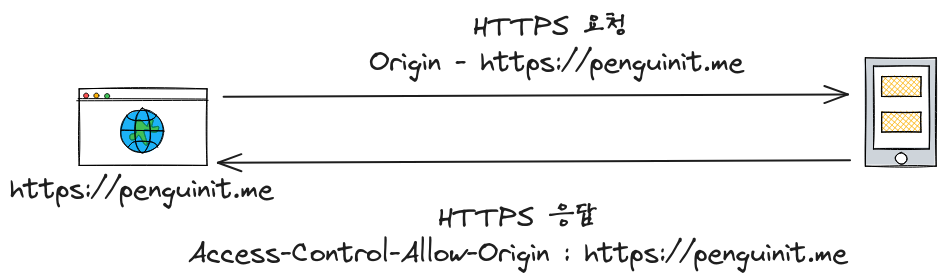

+++
author = "penguinit"
title = "What is CORS?"
date = "2024-01-24"
description = "In web development, you may come across the message \"CORS error\". In this article, we'll take a look at what CORS is, why it's important, and how it applies to web development."
tags = [
    "cors", "browser"
]

categories = [
    "security"
]
+++

## Overview

In web development, you may come across the message "CORS error". In this article, we'll take a look at what CORS is, why it's important, and how it applies to web development.

## CORS?

CORS stands for Cross-Origin Resource Sharing and is a security mechanism that allows resources from different origins to be shared. When a web page requests a resource from another domain, the browser follows the Same-Origin Policy. This policy restricts access to resources from different sources for security reasons. CORS allows you to relax some of these restrictions.



The web browser checks the headers of the response coming from the server and spits out a CORS error if **`Access-Control-Allow-Origin** has a different origin.


### Same-origin policy (SOP)

The same-origin policy is one of the core principles of web security. This policy essentially prohibits web pages from accessing resources from different origins. Here, "**origin" is a concept that includes the **protocol**, **host (domain), and **port**.

### URL components

A URL has the following components

- Schema (Scheme, Protocol)
- Authority, Host : Domain Name + Port
- Resource Path (Resource Path)
- Parameter (Parameter, Query Param)
- 앵커 (Anchor)


## CORS Workaround

### Setting the CORS header on the server side

- You can set to allow requests from specific origins by including the **`Access-Control-Allow-Origin`** header in the server response.
- Example: **`Access-Control-Allow-Origin: *`** will allow requests from any origin. This may not be recommended for security reasons, so we recommend explicitly specifying specific domains if necessary.

### Using a proxy server

- Place a proxy server between your web application and the API server to relay requests. The proxy server forwards the client's request to the API server by setting the CORS header.
- This method is useful when the client and API server are in different domains.

### Preflight request processing

- For complex HTTP requests (such as PUT, DELETE, or requests that use specific HTTP headers), the browser must send a preflight request and the server must authorize it.
- The server can authorize these preflight requests using the `Access-Control-Allow-Methods` and `Access-Control-Allow-Headers` headers.

## CORS Practice

Let's try to implement the CORS workaround mentioned above in code. First, we're going to create a simple NODE server and HTML client page.

### Preparation

There are various ways to install the below, so please refer to them.

- node - [https://nodejs.org/ko/download/](https://nodejs.org/ko/download/)
- express - https://expressjs.com/en/starter/installing.html

### Reproducing CORS errors

If you installed the express package using node server and npm, it will write the server code.

This is really simple code that receives and responds to requests with GET and PUT methods. In the case of PUT requests, it receives them in text/plain and outputs them as they are.

- server.js

```jsx
const express = require('express');
const app = express();

app.use(express.text())

app.get('/data', (req, res) => {
    res.json({ message: 'Hello from server!' });
});

app.put('/register', (req, res) => {
    const requestData = req.body;
    res.json({ message: 'message is ' + requestData });
});

app.listen(3000, () => {
    console.log('Server running on port 3000');
});
```

Here's a simple web page to request from the server. It's a simple page with two buttons, each of which, when pressed, displays a corresponding message in an Alert window.

- client.html

```html
<!DOCTYPE html>
<html>
<head>
    <title>CORS Test</title>
</head>
<body>
<h1>CORS Test</h1>
<button id="fetchButton">Fetch Data</button>
<button id="putButton">Send PUT Request</button> <!-- 추가된 버튼 -->
<script>
    document.getElementById('fetchButton').addEventListener('click', () => {
        fetch('http://localhost:3000/data')
                .then(response => response.json())
                .then(data => alert(JSON.stringify(data)))
                .catch(error => alert('CORS Error: ' + error));
    });

    document.getElementById('putButton').addEventListener('click', () => {
        const requestOptions = {
            method: 'PUT',
            headers: {
                'Content-Type': 'text/plain',
            },
            body: 'Hello World',
        };

        fetch('http://localhost:3000/register', requestOptions)
                .then(response => response.json())
                .then(data => alert(JSON.stringify(data)))
                .catch(error => alert('CORS Error: ' + error));
    });
</script>
</body>
</html>
```


When we hit `Fetch Data` and `Send PUT Request` with this setup, we get a CORS error. Not surprisingly, the browser throws a CORS error because the server isn't pointing us to any headers.


### Solved by setting response headers on the server

Now that we know when CORS is throwing errors, we need to work on adjusting the header values on the server to prevent CORS errors from occurring. First, add the CORS middleware to your node to add an origin and specify the methods that should be allowed. To see the difference between the two, we'll only allow GET.

First, install the cors package from npm.

```bash
$ npm install cors                                      INT  3m 12s 

added 2 packages, and audited 65 packages in 434ms

11 packages are looking for funding
  run `npm fund` for details

found 0 vulnerabilities
```

Then, modify the server.js you've already written to look like this

```jsx
const express = require('express');
const cors = require('cors');

const app = express();

app.use(express.text())

const corsOptions = {
    origin: 'http://localhost:8080', // Set which sources to allow
    methods: ['GET'] // Set HTTP methods to allow
};

app.use(cors(corsOptions));

app.get('/data', (req, res) => {
    res.json({ message: 'Hello from server!' });
});

app.put('/register', (req, res) => {
    const requestData = req.body;
    res.json({ message: 'message is ' + requestData });
});

app.listen(3000, () => {
    console.log('Server running on port 3000');
});
```

We'll set Origin to port 8080 and only allow the GET method. One thing to consider when testing is that if you open the html as a file, the Origin header will be set to null, so it's best to test by serving the html page through a separate http server. In my case, I started a static server using node's `http-server` package in the folder with client.html.

```bash
http-server                                                ok  3s 
Starting up http-server, serving ./

http-server version: 14.1.1

http-server settings: 
CORS: disabled
Cache: 3600 seconds
Connection Timeout: 120 seconds
Directory Listings: visible
AutoIndex: visible
Serve GZIP Files: false
Serve Brotli Files: false
Default File Extension: none

Available on:
  http://127.0.0.1:8080
  http://192.168.0.29:8080
  http://10.250.0.4:8080
Hit CTRL-C to stop the server
```

This way, you can serve the client.html we created above on the server, and when you do, you can see that the GET method passes, but the PUT method still throws a CORS error, as shown below.


So let's modify it again, this time to allow the PUT method, and do something like this.

```jsx
const corsOptions = {
    origin: 'http://localhost:8080', // Set which sources to allow
    methods: ['GET', 'PUT'] // Set HTTP methods to allow
};
```


When you actually run it, you'll see that it works fine. But here's the weird part: when you filter on `All` in DevTools, you'll see that there's only one type (other than `Fetch/XHR`), which is `Preflight`.

As mentioned above, certain methods or headers will make an `OPTION` request to the server before actually requesting the method, and the browser will determine whether or not to make the actual request by looking at the response header value coming back from that request.


## Conclusion

In this article, I've summarized what CORS is and what you can do to solve the problem.

I've also implemented an example code to help you understand it better, and if you don't want to bother with it too much, you can use proxy middleware in node itself or a proxy server like nginx to bypass the CORS issue. However, this is not the intended direction of the browser, and it's one more step to communicate, so you need to be careful when making this decision based on the context of your current project.