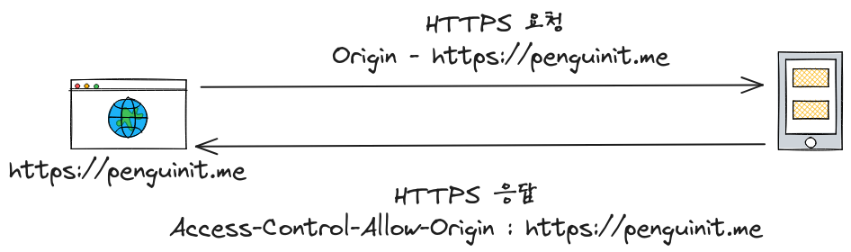

+++
author = "penguinit"
title = "CORS 란 무엇인가?"
date = "2024-01-24"
description = "웹 개발을 하다 보면, \"CORS 오류\"라는 메시지를 마주칠 때가 있습니다. 이 글에서는 CORS 가 무엇인지, 왜 중요한지 그리고 웹 개발에 어떻게 적용되는지에 대해 알아보겠습니다."
tags = [
    "cors", "browser"
]

categories = [
    "security"
]
+++

## 개요

웹 개발을 하다 보면, "CORS 오류"라는 메시지를 마주칠 때가 있습니다. 이 글에서는 CORS 가 무엇인지, 왜 중요한지, 그리고 웹 개발에 어떻게 적용되는지에 대해 알아보겠습니다.

## CORS?

CORS 는 Cross-Origin Resource Sharing 의 약자로, 다른 출처 (origin) 의 자원을 공유할 수 있도록 허용하는 보안 메커니즘입니다. 웹 페이지가 다른 도메인의 자원을 요청할 때, 브라우저는 동일 출처 정책 (Same-Origin Policy) 을 따릅니다. 이 정책은 보안을 위해 다른 출처의 자원에 대한 접근을 제한합니다. CORS 는 이러한 제한을 일부 완화할 수 있도록 해줍니다.



웹 브라우저는 서버로부터 오는 응답의 헤더를 확인하고 **`Access-Control-Allow-Origin`** 의 출처가 (origin) 이 다를 경우에 CORS 에러를 뱉습니다.


### 동일 출처 정책 (SOP)

동일 출처 정책은 웹 보안의 핵심 원칙 중 하나입니다. 이 정책은 웹 페이지가 다른 출처의 자원에 접근하는 것을 기본적으로 금지합니다. 여기서 '**출처 (origin)**'는 **프로토콜**, **호스트 (도메인),** **포트**를 모두 포함한 개념입니다.

### URL 구성요소

URL 은 아래와 같은 구성요소들을 가지고 있습니다.

- 스키마 (Scheme, Protocol)
- 권한 (Authority, Host) : Domain Name + Port
- 리소스 경로 (Resource Path)
- 매개변수 (Parameter, Query Param)
- 앵커 (Anchor)


## CORS 해결방법

### 서버 측에서의 CORS 헤더 설정

- 서버 응답에 **`Access-Control-Allow-Origin`** 헤더를 포함시켜 특정 출처의 요청을 허용하도록 설정할 수 있습니다.
- 예: **`Access-Control-Allow-Origin: *`** 는 모든 출처에서 오는 요청을 허용합니다. 이는 보안 상의 이유로 권장되지 않을 수 있으므로, 필요한 경우 특정 도메인을 명시적으로 지정하는 것이 좋습니다.

### 프록시 서버 사용

- 웹 애플리케이션과 API 서버 사이에 프록시 서버를 두어 요청을 중계합니다. 프록시 서버에서 CORS 헤더를 설정하여 클라이언트의 요청을 API 서버로 전달합니다.
- 이 방법은 클라이언트와 API 서버가 다른 도메인에 있을 때 유용합니다.

### 사전 요청 (Preflight Request) 처리

- 복잡한 HTTP 요청(예: PUT, DELETE, 또는 특정 HTTP 헤더를 사용하는 요청)에 대해서는 브라우저가 사전 요청을 보내고 서버가 이를 승인해야 합니다.
- 서버는 `Access-Control-Allow-Methods`와 `Access-Control-Allow-Headers` 헤더를 사용하여 이러한 사전 요청을 승인할 수 있습니다.

## CORS 실습

위에 언급했던 CORS 해결방법을 실제로 코드를 통해 구현해보려고 합니다. 우선 간단한 node 서버와 html 클라이언트 페이지를 만들어 보려고합니다.

### 사전준비

밑에 설치하는 방법들은 인터넷에 다양하게 있으니 참고해주시길 바랍니다.

- node - [https://nodejs.org/ko/download/](https://nodejs.org/ko/download/)
- express - https://expressjs.com/en/starter/installing.html

### CORS 에러재현

노드서버와 npm 을 이용해서 express 패키지를 설치하셨다면 서버코드를 작성해줍니다.

정말 간단하게 GET, PUT 메소드로 요청을 받고 응답하는 코드입니다. PUT 요청의 경우에는 text/plain로 받아서 그대로 출력해줍니다.

- server.js

```jsx
const express = require('express');
const app = express();

app.use(express.text())

app.get('/data', (req, res) => {
    res.json({ message: 'Hello from server!' });
});

app.put('/register', (req, res) => {
    const requestData = req.body;
    res.json({ message: 'message is ' + requestData });
});

app.listen(3000, () => {
    console.log('Server running on port 3000');
});
```

다음은 해당서버에 요청할 웹페이지를 간한하게 만들어 보려고 합니다. 버튼이 2 개가 있고 각 버튼을 누르면 해당하는 메세지를 Alert 창으로 띄워주는 간단한 페이지 입니다.

- client.html

```html
<!DOCTYPE html>
<html>
<head>
    <title>CORS Test</title>
</head>
<body>
<h1>CORS Test</h1>
<button id="fetchButton">Fetch Data</button>
<button id="putButton">Send PUT Request</button> <!-- 추가된 버튼 -->
<script>
    document.getElementById('fetchButton').addEventListener('click', () => {
        fetch('http://localhost:3000/data')
                .then(response => response.json())
                .then(data => alert(JSON.stringify(data)))
                .catch(error => alert('CORS Error: ' + error));
    });

    document.getElementById('putButton').addEventListener('click', () => {
        const requestOptions = {
            method: 'PUT',
            headers: {
                'Content-Type': 'text/plain',
            },
            body: 'Hello World',
        };

        fetch('http://localhost:3000/register', requestOptions)
                .then(response => response.json())
                .then(data => alert(JSON.stringify(data)))
                .catch(error => alert('CORS Error: ' + error));
    });
</script>
</body>
</html>
```


이렇게 준비를 하고 `Fetch Data`와 `Send PUT Request` 를 누르면 CORS 에러가 발생합니다. 당연한 것이 서버에서는 아무런 헤더도 안내려주고 있기 때문에 브라우저에서 CORS 에러를 발생시킵니다.


### 서버의 응답 헤더 설정을 통해서 해결

그럼 이제 CORS 가 어떤 상황에서 에러가 나는지를 알았으니 서버에서 헤더값을 조절해서 CORS 에러가 나지 않도록 작업을 해야합니다. 우선 node 에 cors 미들웨어를 추가해서 출처 (origin) 를 추가하고 허용해야할 메소드들에 대해서 명세를 한다. 두개의 차이를 보기위해서 GET 만 허용하게 작업을 하겠습니다.

우선 cors 패키지를 npm 에서 install 합니다.

```bash
$ npm install cors                                      INT  3m 12s 

added 2 packages, and audited 65 packages in 434ms

11 packages are looking for funding
  run `npm fund` for details

found 0 vulnerabilities
```

그리고 기존에 작성했던 server.js 를 다음과 같이 수정합니다.

```jsx
const express = require('express');
const cors = require('cors');

const app = express();

app.use(express.text())

const corsOptions = {
    origin: 'http://localhost:8080', // 허용할 출처 설정
    methods: ['GET'] // 허용할 HTTP 메소드 설정
};

app.use(cors(corsOptions));

app.get('/data', (req, res) => {
    res.json({ message: 'Hello from server!' });
});

app.put('/register', (req, res) => {
    const requestData = req.body;
    res.json({ message: 'message is ' + requestData });
});

app.listen(3000, () => {
    console.log('Server running on port 3000');
});
```

Origin 은 8080 포트로 설정해주고 GET 메소드만 허용을 하겠습니다. 테스트 때 고려해 보셔야 하는 부분은 만약에 html 을 파일로 열게 되시면 Origin 헤더가 null 로 설정이 됩니다. 그렇기 때문에 별도의 http 서버를 통해서 html 페이지를 서빙하는 형태로 테스트 하시는게 적합합니다. 저 같은 경우에는 client.html 이 있는 폴더에 node 의 `http-server` 패키지를 이용해서 정적 서버를 하나 띄웠습니다.

```bash
http-server                                                ok  3s 
Starting up http-server, serving ./

http-server version: 14.1.1

http-server settings: 
CORS: disabled
Cache: 3600 seconds
Connection Timeout: 120 seconds
Directory Listings: visible
AutoIndex: visible
Serve GZIP Files: false
Serve Brotli Files: false
Default File Extension: none

Available on:
  http://127.0.0.1:8080
  http://192.168.0.29:8080
  http://10.250.0.4:8080
Hit CTRL-C to stop the server
```

이렇게 하시면 위에서 만들었던 client.html 을 서버에서 서빙할 수 있습니다. 그러면 실제 수행했을 때 아래 처럼 GET 메소드는 통과가 되고 PUT 메소드는 여전히 CORS 에러가 나는 것을 확인하실 수 있습니다.


그럼 다시 수정해서 이번에는 PUT 메소드를 허용해보겠습니다. 아래처럼 작업해주시면 됩니다.

```jsx
const corsOptions = {
    origin: 'http://localhost:8080', // 허용할 출처 설정
    methods: ['GET', 'PUT'] // 허용할 HTTP 메소드 설정
};
```


실제로 수행을 하게되면 정상적으로 수행되는 것을 확인하실 수 있습니다. 하지만 여기서 특이한 부분이 있는데요 개발자도구에서 `All` 필터를 걸었을 때 (`Fetch/XHR` 말고) 타입이 `Preflight` 가 하나 있는 것을 보실 수 있습니다.

위에서 언급했듯이 특정 메소드나 헤더에서는 서버에 실제 메소드로 요청하기전에 `OPTION` 요청을 하게 됩니다. 그리고 해당 요청에서 내려오는 응답헤더값을 보고 브라우저는 실제 요청을 할지 말지를 판단하게 됩니다.


## 결론

해당 글을 통해서 CORS 가 무엇인지에 대해서 정리를 해보았고 해당 문제를 해결하기 위해서는 어떤 방법들을 할 수 있는지에 대해서 정리를 해보았습니다.

예제코드도 구현을 해서 이해 좀 더 도울 수 있게 작성해봤고 크게 신경쓰고 싶지않다면 node 자체에서 proxy 미들웨어를 사용하거나 nginx 같은 proxy 서버를 두고 CORS 이슈를 우회할 수도 있습니다. 하지만 이건 브라우저에서 의도한 방향성은 아니고 통신을 위해서 한 단계를 더 거치는 것이기 때문에 이런 판단을 할 때는 현재 프로젝트의 상황에 맞게 신중하게 선택할 필요가 있습니다.