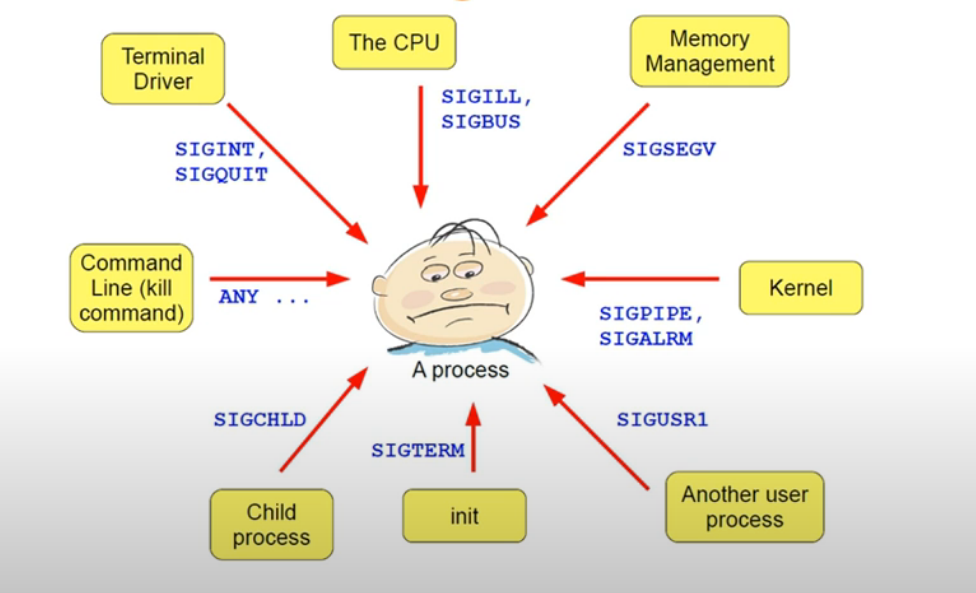

+++
author = "penguinit"
Title = "Signal to find out through Golang"
date = "2024-01-25"
Description = "I recently had a short talk with people at the company about Signal, and I think there are more things I don't know than I thought, so I'm going to learn more about what Signal is and how it is used through Golang."
tags = [
"golang", "signal"
]

categories = [
"linux", "language"
]
+++

## Overview

Recently, I had a short talk with people at the company about Signal, and I think there are more things I don't know than I thought, so I'm going to learn more about what Signal is and how it is used through Golang.

## What is Signal?

Signal is used to communicate between an operating system (OS) and a process, or between processes. It is widely used in Unix and Unix-like systems (Linux, BSD, macOS, etc.) and signals are collectively referred to as macanisms that tell a process that an event has occurred.



### Signal List

If you are currently using a Mac or Linux desktop, you can check the list of signals through kill -l.

```bash
kill -l
HUP INT QUIT ILL TRAP ABRT BUS FPE KILL USR1 SEGV USR2 PIPE ALRM TERM STKFLT
CHLD CONT STOP TSTP TTIN TTOU URG XCPU XFSZ VTALRM PROF WINCH POLL PWR SYS
```

### kill command

First of all, there are some parts that can be misinterpreted, so if we sort it out a little bit, we usually end it a lot in the form of 'kill -9 [pid]' when we end a particular process, so there are people who know that the command 'kill' is the command to end the process. (I was one of them…)

One of the misunderstandings is that if you type the 'man' command, you know, but the default value is supposed to exceed 'SIGTERM', so if you don't give a separate signal, the process will be terminated.

```
man kill

KILL(1) User Commands KILL(1)

NAME
kill - send a signal to a process

SYNOPSIS
kill [options] <pid> [...]

DESCRIPTION
The default signal for kill is TERM. Use -l or -L to list available
signals. Particularly useful signals include HUP, INT, KILL, STOP,
CONT, and 0. Alternate signals may be specified in three ways: -9,
-SIGKILL or -KILL. Negative PID values may be used to choose whole
process groups; see the PGID column in ps command output. A PID of -1
is special; it indicates all processes except the kill process itself
and init.
```

In summary, the kill command is a command that sends a particular signal to a particular process.

### Termination Signal

I think SIGINT, SIGTERM, and SIGKILL are the ones I use the most often and encounter while developing signals.

- **SIGTERM (Signal Terminate)**

It has the number 15 and is a signal that asks the program to shut down, which allows the process to decide how to shut down because it can be treated as an exception or ignored by the process.

- **SIGKILL (Signal Kill)**

It has the number 9 and immediately shuts down the process when it receives the corresponding signal. SIGKILL cannot be excepted and ignored unlike SIGTERM.

- **SIGINT (Signal Interrupt)**

It has the number 2 and occurs when the user presses Ctrl+C as an interrupt signal to interrupt the process. It works the same as SIGTERM for the process, but it differs from SIGTERM in that the signal can be generated asynchronously by the user.

In actual development, we receive these signals and process **Graceful Shutdown** at the end of the program.

Graceful Shutdown, in a nutshell, means handling the program as well as possible without side effects. If it is an HTTP server, all actions such as waiting for the current request to be executed properly, or ending the process by waiting if there is logic being performed inside are all applicable to Graceful Shutdown.

## Golang Practice

Then we'd like to learn about how these signals are captured and processed in the actual process through a simple Golang example.
### Graceful Shutdown

First of all, among the signals mentioned above, I would like to write an example of receiving the actual signals for SIGTERM and SIGINT, which correspond to normal termination, and post-processing through Golang.

```go
package main

import (
"fmt"
"os"
"os/signal"
"syscall"
"time"
)

func main() {
    // Outputs the PID of the current process.
    pid := os.Getpid()
    fmt.Printf("My PID is: %d\n", pid)
    
    // Creates a channel for processing SIGINT (Ctrl+C) and SIGTERM signals.
    signals := make(chan os.Signal, 1)
    
    // Use the Notify function to receive SIGINT and SIGTERM signals.
    signal.Notify(signals, syscall.SIGINT, syscall.SIGTERM)
    
    // Wait for the signal in a separate go routine.
    go func() {
    sig := <-signals
    fmt.Printf("Received signal: %s\n", sig)
    fmt.Println("Performing cleanup...")
    // Perform the necessary cleanup operations.
    
    fmt.Println("Exiting.")
    os.Exit(0)
    }()
    
    // The main routine continues to perform other tasks.
    for {
        fmt.Println("Running...")
        time.Sleep(2 * time.Second)
        }
    }
```

The code is working to print the character "Running…" every two seconds, and when the relevant signal comes in the middle, it catches the signal and performs all necessary tasks before implementing the logic of "Exit(0)" normally.

- Results of performance (Ctrl + C while running)

```go
go run main.go
My PID is: 285853
Running...
Running...
Running...
^CReceived signal: interrupt
Performing cleanup...
Exiting.
```

### Signaling via Kill Command

This time, let's pass the SIGTERM on the corresponding command. In general, SIGTERM is called when it is terminated normally, but you can also send the signal directly through the kill command. The code above shows your PID when you perform it.

- Results of performance


The 'SIGTERM' signal was delivered through the kill command, and if you look at the log, you can see that it is terminated and terminated normally.

Then what if I send 'SIGKILL' this time? Perhaps as explained above, it is expected to be terminated immediately without handling exceptions. This time, I will make a request through the signal number.

- Results of performance


As you can see on the left, we received the killed signal, but there is no log of related post-processing.

## conclusion

Signal processing allows programs to receive and take appropriate action in response to important information from the operating system. Communication between processes and operating systems, or between processes, can also be transmitted and communicated, and through these signals, more stable and efficient software can be made.

We also looked at how to process signals using the Go language. In my personal opinion, I think that simultaneous processing using Goroutine and channel in Go language provides **a great advantage in effectively processing signals. It's not that other languages can't do it, but I think we can process these signals more easily and efficiently.