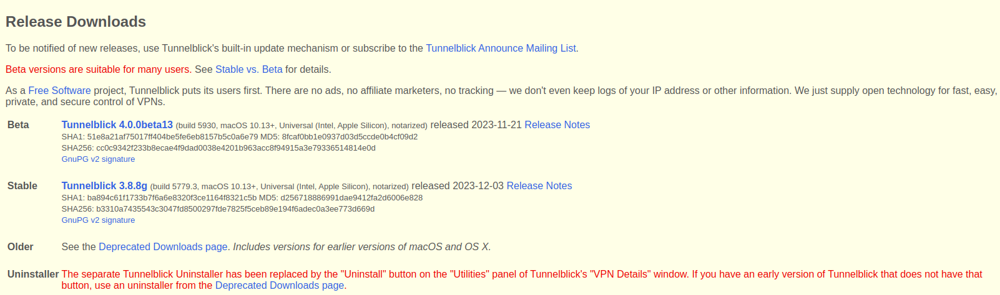
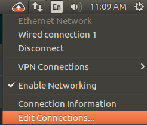
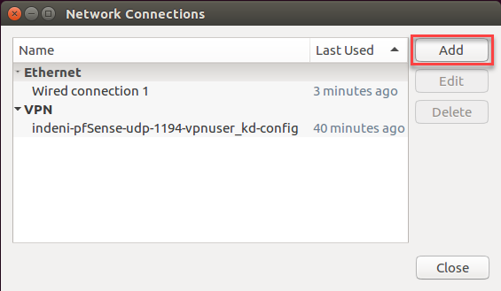
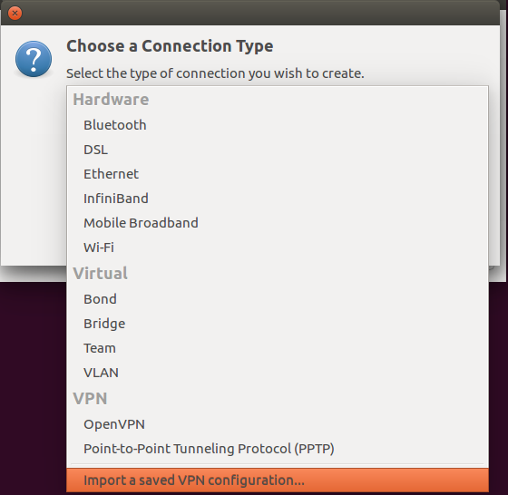
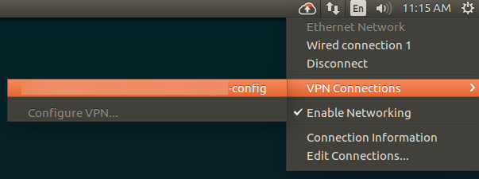

+++
author = "penguinit"
Title = "OpenVPN Client Connection"
date = "2024-01-06"
description = "VPN client refers to a terminal device or software used to establish a secure connection between a user and a VPN server."
tags = [
"vpn",
]

categories = [
"infra",
]
+++

## Overview

A VPN client is a terminal device or software used to establish a secure connection between a user and a VPN server.

## Pre-preparation

- The VPN server that needs to be connected is already in place.
- The .ovpn extension file has been prepared.

### What is an .OVPN file

The ovpn file is a configuration file used by **OpenVPN**, a popular open source virtual private network (VPN) software, which contains the settings and instructions required for OpenVPN clients to connect to the VPN server.

- IP address or hostname of the VPN server
- Port number to use for VPN connections
- Protocol to use (TCP or UDP)
- Encryption and authentication algorithms to use
- Location of the user's certificate and private key files
- Additional settings or instructions related to the VPN service provider.

## Installing and Using the Client

There are many options for that, and each can be used according to their situation. Currently, I'm using Ubuntu when developing it, so I mainly explain Ubuntu, but I also briefly explain other OSs.

### Mac

1. [https://tunnelblick.net/downloads.html](https://tunnelblick.net/downloads.html) Download stable version 

2. When the installation is complete properly and you double-click the .ovpn extension, a pop-up pops up asking if you want to add to Tunnelblick, and you can add it if you continue.
3. If you connect the VPN information you just connected to from the menu bar, enter the issued **Password** and the connection will be successful.

### Window

1. [https://openvpn.net/community-downloads/ ] (https://openvpn.net/community-downloads/) will install a version of the architecture that fits your current PC.
2. When the installation is complete, right-click the OpenVPN GUI icon in the lower right Tray and click Import File to select the .ovpn extension file.
3. If you successfully import the file and press the right-click again, you will see a connection menu that was previously invisible, but if you press it, a Password input window will appear and you will be able to enter it, so you will be connected normally.

### Ubuntu

There was a poor explanation for Linux users, and at first, I tried to make a script because it was a little uncomfortable doing it with the CLI, but I wanted to organize it in the process of turning to the GUI, so I wrote this article.

#### CLI

1. Installation


sudo apt-get install openvpn


2. If you enter the password after executing the connection command, the VPN connection will be successful.


sudo openvpn --config /path/to/OpenVPN Client Connection-config.ovpn

Sat Jan 6 14:07:54 2024 OpenVPN 2.4.12 x86_64-pc-linux-gnu [SSL (OpenSSL)] [LZO] [LZ4] [EPOLL] [PKCS11] [MH/PKTINFO] [AEAD] built on Aug 21 2023
Sat Jan 6 14:07:54 2024 library versions: OpenSSL 1.1.1f 31 Mar 2020, LZO 2.10
Enter Private Key Password: (press TAB for no echo)


#### GUI

Although there were some comfortable parts of the CLI, at a time when I thought it was inconvenient to receive the password every time, I use the network manager to organize the parts that can connect to the VPN similar to the OpenVPN GUI and TunnelBlick mentioned above.

1. Installing OpenVPN and installing OpenVPN Network Manager


sudo apt-get install openvpn
sudo apt-get install network-manager-openvpn
sudo apt-get install network-manager-openvpn-gnome


2. Right-click the network icon in the tray in the top right-hand corner and click **Edit Connections**
   

3. **Press add**(Add) and drop-down to **Import saved VPN configuration** to get the .ovpn extension.

4. If you check the network tray again, you'll see a tab called Virtual Private Network Connection. If you check, you've registered
5. You'll see the VPN. Click on that part to connect.

## Conclusion

Many people who use Linux environments prefer CLI, so they often use it as a command.