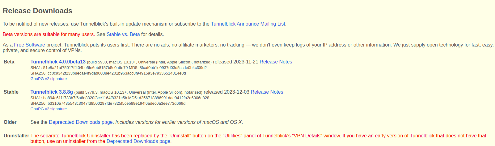
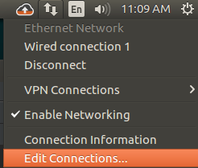
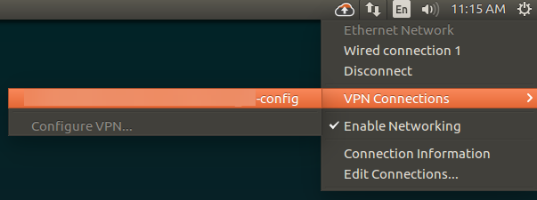

+++
author = "penguinit"
title = "OpenVPN 클라이언트 연결"
date = "2024-01-06"
description = "VPN 클라이언트란 사용자와 VPN 서버 간의 보안 연결을 구축하는데 사용되는 터미널 장치 또는 소프트웨어를 말합니다."
tags = [
    "vpn",
]

categories = [
    "infra",
]
+++

## 개요

VPN 클라이언트란 사용자와 VPN 서버 간의 보안 연결을 구축하는데 사용되는 터미널 장치 또는 소프트웨어를 말합니다.

## 사전준비

- 연결해야할 VPN 서버가 이미 구축이 되어있다.
- .ovpn 확장자 파일이 준비되었다.

### .OVPN파일이란

ovpn 파일은 널리 사용되는 오픈 소스 VPN(가상 사설망) 소프트웨어인 **OpenVPN**에서 사용하는 구성 파일입니다. 여기에는 OpenVPN 클라이언트가 VPN 서버에 연결하는 데 필요한 설정 및 지침이 포함되어 있습니다.

- VPN 서버의 IP 주소 또는 호스트 이름
- VPN 연결에 사용할 포트 번호
- 사용할 프로토콜(TCP 또는 UDP)
- 사용할 암호화 및 인증 알고리즘
- 사용자의 인증서와 개인키 파일의 위치
- VPN 서비스 제공업체와 관련된 추가 설정 또는 지시문.

## 클라이언트 설치 및 사용법

해당 부분은 다양한 선택지가 있으며 각자 상황에 맞게 사용하면됩니다. 현재는 우분투를 개발할 때 사용하고 있어서 우분투를 위주로 설명하지만 다른 OS도 간략하게 설명합니다.

### Mac

1. [https://tunnelblick.net/downloads.html](https://tunnelblick.net/downloads.html) 에서 Stable 버전을 다운로드
    
    
    
2. 설치가 제대로 완료되고 .ovpn 확장자를 더블 클릭했을 때 Tunnelblick에 추가를 하겠냐는 팝업이 나오고 그대로 진행하면 추가가 됩니다.
3. 메뉴바에서 방금 연결한 VPN 정보를 연결하면 발급받은 **Password**를 입력하면 정상적으로 연결이 됩니다.

### Window

1. [https://openvpn.net/community-downloads/](https://openvpn.net/community-downloads/) 에서 현재 사용자의 PC에 맞는 아키텍쳐를 버전으로 설치를 합니다.
2. 설치가 완료되면 우측하단 Tray에 있는 OpenVPN GUI 아이콘을 우클릭해서 파일 불러오기를 눌러서 .ovpn 확장자 파일을 선택합니다.
3. 파일불러오기를 성공하고 다시 우클릭을 누르면 이전에 안보이던 연결메뉴가 보이게 되는데 누르게되면 Password 입력창이 나오고 입력하게 됨녀 정상적으로 연결이 됩니다.

### Ubuntu

아무래도 리눅스 유저를 위한 설명이 부실하게 있던것도 있었고 처음에는 CLI로 하다가 좀 불편해서 스크립트를 만드는 시도를 했었는데 이렇게까지 해야하나 싶어서 GUI로 선회하는 과정에서 정리를 하고 싶어서 이글을 썼던 것도 있습니다.

#### CLI

1. 설치


sudo apt-get install openvpn


2. 연결명령어 수행후에 패스워드 입력하면 정상적으로 VPN 연결이 됩니다.


sudo openvpn --config /path/to/OpenVPN 클라이언트 연결-config.ovpn

Sat Jan  6 14:07:54 2024 OpenVPN 2.4.12 x86_64-pc-linux-gnu [SSL (OpenSSL)] [LZO] [LZ4] [EPOLL] [PKCS11] [MH/PKTINFO] [AEAD] built on Aug 21 2023
Sat Jan  6 14:07:54 2024 library versions: OpenSSL 1.1.1f  31 Mar 2020, LZO 2.10
Enter Private Key Password: (press TAB for no echo)


#### GUI

CLI가 편한부분도 있었지만 비밀번호를 매번 입력받는게 불편하다고 생각을 했던 시점에 네트워크 매니저를 이용해서 위에 언급했던 OpenVPN GUI, TunnelBlick와 유사하게 VPN에 연결할 수 있는 부분을 정리한다.

1. Open VPN 설치 & Open VPN 네트워크 매니저 설치


sudo apt-get install openvpn  
sudo apt-get install network-manager-openvpn  
sudo apt-get install network-manager-openvpn-gnome

 
2. 오른쪽 상단에 트레이에 네트워크 아이콘을 오른쪽 클릭해서 **연결편집** (Edit Connections) 클릭 
    
    
    
    
3. **추가**(Add)를 누르고 드롭다운해서 **저장된 VPN 구성 가져오기** (Import a saved VPN configuration) 클릭하여 .ovpn 확장자를 가져옵니다.
    
    
    
    
    
4. 다시 네트워크 트레이를 확인해보면 가상 사설망 연결이라는 탭이 보이게 되는데 확인해보면 등록한 
5. VPN이 보이게됩니다. 해당 부분을 클릭하면 연결이 됩니다. 
    
    
    

## 정리

리눅스 환경을 사용하는 사람들은 CLI를 선호하는 사람들이 많다보니 커맨드로 하는 경우도 종종보인다. 실제로 나조차도 직전회사에서는 스크립트를 만들어서 자동화 했었으니… 그런데 이번에 오게된 회사에서는 가장 결정적으로 이렇게 돌리게 된 이유중에 하나가 계정정보가 아니라 사전에 발급받은 패스워드를 사용해야 했던 부분 때문에 그런 것 같다. 계정 정보야 수번 칠 수 있지만 패스워드의 경우에는 매번 외울수 있는 부분도 아니고 심지어 환경마다 다르니 이렇게 미리 등록하고 사용하는게 속이 편한 것 같다.

---

> 참조

- [https://docs.fileformat.com/ko/settings/ovpn/#ovpn-파일이란](https://docs.fileformat.com/ko/settings/ovpn/#ovpn-%ed%8c%8c%ec%9d%bc%ec%9d%b4%eb%9e%80)
- [https://askubuntu.com/questions/508250/openvpn-gui-client-for-udp-tcp](https://askubuntu.com/questions/508250/openvpn-gui-client-for-udp-tcp)