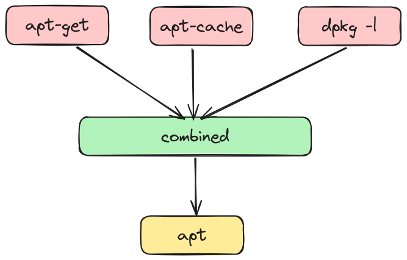

+++
author = "penguinit"
Title = "What is Snap"
date = "2024-01-11"
Description = "When installing a package using Ubuntu, there are times when installing it with apt and installing it with snap, but I was using it without knowing what characteristics the two have, but I would like to take this opportunity to summarize exactly what snap is."
tags = [
"package","apt", "snap"
]

categories = [
"linux",
]
+++

## Overview

When installing a package using Ubuntu, there are times when installing it with apt and installing it with snap, but I was using it without knowing what characteristics the two have, but I would like to take this opportunity to summarize exactly what snap is.

## APT

Before I talk about snapping, I'd like to talk about apt

The Advanced Package Tool (APT) is a tool for managing software packages in Debian-based Linux distributions, including Debian and Ubuntu. This tool helps you easily install, upgrade, configure, and uninstall software.

### Key features of APT

1. **Package install**: Users can use the APT to retrieve and install software packages from the repository.
2. **Auto dependency resolution**: APT automatically identifies and installs all required dependent packages, ensuring that the software works properly.
3. **Package updates and upgrades**: To keep packages installed on your system up-to-date, APT updates the list of packages and applies the available upgrades.
4. **Remove packages**: Users can easily remove software they no longer need from the system.

### apt vs apt-get

If you install the package while Googling, some will be installed as **apt** and some will be installed using **apt-get**. To explain the background first, apt is a more recent version and apt-get is a command that was used in the past. Nevertheless, I think a lot of people still use it. (I also habitually use apt-get.)



- apt and apt-get, dpkg command correspondence points

| apt update | apt-get update | Refreshes repository index |
| --- | --- | --- |
| apt install [package] | apt-get install [package] | Install a package |
| apt upgrade | apt-get upgrade | Upgrade available package updates |
| apt remove [package] | apt-get remove[package] | Remove a package |
| apt purge [package] | apt-get purge [package] | Remove a package with configuration |
| apt autoremove | apt-get autoremove | Remove unnecessary dependencies |
| apt full-upgrade | apt-get dist-upgrade | Update all packages and remove unnecessary dependencies |
| apt search [package] | apt-cache search [package] | Search for a package |
| apt show [package] | apt-cache show [package] | Show package details |
| apt policy | apt-cache policy | Show active repo information |
| apt policy [package | apt-cache policy [package] | Show installed and available package version |
| apt list --installed | dpkg --list | Show installed package |

- Commands added to apt

| apt command      | Description                                     |
|------------------|-------------------------------------------------|
| apt list         | List installed packages and upgradable packages |
| apt edit-sources | Edits sources list                              |

## Snap

### Snap Key Features

1. **Isolated environments**: Snap packages run in isolated environments to prevent conflicts with other parts of the system.
2. **Auto Update**: Snap packages are automatically updated, always up to date.
3. **Enhance security**: Snap is designed to make applications run more secure.
4. **Platform independence**: The same Snap package is available for different Linux distributions.

The main commands are 'find', 'info', 'install', 'remove', and 'list', and so on. For more information, refer to help. For example, if you want to download a slack package, you can type it into the shell as shown below to install it.
``` bash
> sudo snap install slack

## Installation confirmation
> sudo snap list slack

Name Version Revision Track Publisher Notes
slack 4.35.131 118
```

### Snap Components

- - **Snapd**
- **Definition**: Snapd is a background service (demon) that manages Snap packages, which is responsible for installing, updating, removing, and managing Snap packages.
- **Function**: Snapd communicates with **SnapStore** to discover, install, and update packages at your request.
- **Compatibility**: Snapd runs on a variety of Linux distributions, including Ubuntu, enabling the platform independence of Snap packages.
- - **Snap Store**
- **Definition**: The Snap Store is an official repository of Snap packages.
- **Role**: Developers can publish their applications to the Snap Store, where users can find and install the software they need.
- **Security**: Packages offered by SnapStore go through a **security validation process so** users can use them with confidence.
- - **Snapcraft**
- **Definition**: Snapcraft is a tool to create Snap packages.
- **Function**: Developers can use Snapcraft to package their applications in Snap format, which defines the configuration and dependency of the software through the **`snapcraft.yaml`** file.
- **Flexibility**: Snapcraft supports a wide range of programming languages and frameworks, making it applicable to a wide range of applications.

## Snap vs APT

If you've used apt before, you may relate, but you've experienced a lot of trouble due to dependence issues when installing certain software. For example, I tried to download A, but when I asked to download B, or when I tried to download B, a message asking me to get C came out, which is an experience that users who have used Linux will try at least once.

Instead, Snap tried to make dependency easier by using a sandbox-type application format, and unlike APT, it does not have information about dependence, but includes dependence itself, so it can be used without any need for dependence.

In addition, since it is grouped into a single sandbox, it is allocated and executed with an isolated space, which communicates with the outside in a more limited form, which has the advantage of security in preventing the system from interfering with other external systems.


### Snap Reminder

There may be some things to consider when comparing Snap and APT methods. In fact, it would be good to keep in mind that the benefits are larger and that may not be enough.

- **Use disk space:** Snap packages can take up more disk space than packages installed with APT, because Snap packages contain libraries with dependencies, as explained above. Also, even if multiple Snap packages use the same library, each package contains a separate copy of that library, so many overlapping libraries are not running disk space efficiently compared to APT.
- **Memory and CPU usage**: Because of the isolated environment and its own dependencies, apps installed with Snap may use more memory and CPU resources, and apps launched with Snap may be a little slower than APT.
- **Auto Update**: Snap is convenient because it has automatic updates, but users are less flexible to control updates. For example, it can be inconvenient for users who want to keep the software version at a certain point in time. Instead, if a developer posts multiple versions separately to the Snap Store, you can install a specific version, but since Snap itself recommends using the latest version, there may be some restrictions if you want to stay in a specific version.

## Let's wrap this up

While Snap is lacking, it offers several advantages to offset it. Especially considering its dependency and security compatibility with various Linux distributions, I think more and more packages will be managed with Snap in the future.