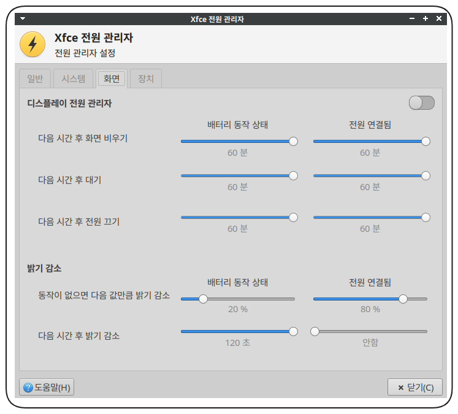

+++
author = "penguinit"
title = "xfce 데스크톱 모니터 절전모드 제어"
date = "2024-01-21"
description = "최근에는 대부분 리눅스 노트북을 사용해서 개발을 합니다. 그 중에서 Xfce 기반의 Xubuntu 를 사용하는데 예전에는 GUI 에서 절전모드를 제거하면 잘 됬던 걸로 기억을 하고 있는데 설정을 모두 껐음에도 계속 절전모드로 들어가는 현상이 있어서 해결과정을 기록합니다."
tags = [
    "xfce", "xubuntu"
]

categories = [
    "linux",
]
+++

## 개요

저는 노트북이 여러 대 있지만 최근에는 대부분 리눅스 노트북을 사용해서 개발을 합니다. 그 중에서 Xfce 기반의 [Xubuntu](https://xubuntu.org/)를 사용하는데 예전에는 GUI 에서 절전모드를 제거하면 잘 됬던 걸로 기억을 하고 있는데 설정을 모두 껐음에도 계속 절전모드로 들어가는 현상이 있어서 해결과정을 기록합니다.

## 문제점

원인은 모르겠지만 디스플레이 전원관리자를 껐음에도 5 분마다 모니터가 절전모드에 들어가는 현상이 있었습니다.



## 해결과정

일단 여러가지 찾아본 결과 x 윈도우 설정을 보는게 가장 정확할 것 같아서 아래처럼 확인해보았습니다.

```bash
xset -q
```

```bash
Keyboard Control:
  auto repeat:  on    key click percent:  0    LED mask:  00000000
  XKB indicators:
    00: Caps Lock:   off    01: Num Lock:    off    02: Scroll Lock: off
    03: Compose:     off    04: Kana:        off    05: Sleep:       off
    06: Suspend:     off    07: Mute:        off    08: Misc:        off
    09: Mail:        off    10: Charging:    off    11: Shift Lock:  off
    12: Group 2:     off    13: Mouse Keys:  off
  auto repeat delay:  500    repeat rate:  20
  auto repeating keys:  00ffffffdffffbbf
                        fadfffefffffffff
                        9fffffffffffffff
                        fff7ffffffffffff
  bell percent:  50    bell pitch:  400    bell duration:  100
Pointer Control:
  acceleration:  2/1    threshold:  4
Screen Saver:
  prefer blanking:  no    allow exposures:  no
  timeout:  300    cycle:  300
Colors:
  default colormap:  0x20    BlackPixel:  0x0    WhitePixel:  0xffffff
Font Path:
  /usr/share/fonts/X11/misc,/usr/share/fonts/X11/Type1,built-ins
DPMS (Energy Star):
  Standby: 600    Suspend: 600    Off: 600
  DPMS is Enabled
  Monitor is On
```

확인을 해보니 **Screen Saver**가 5 분마다 절전이 되도록 설정이 되어있어서 아래처럼 명령어를 수행해줬습니다.

```bash
xset s off
xset -q
```

```bash
Keyboard Control:
  auto repeat:  on    key click percent:  0    LED mask:  00000000
  XKB indicators:
    00: Caps Lock:   off    01: Num Lock:    off    02: Scroll Lock: off
    03: Compose:     off    04: Kana:        off    05: Sleep:       off
    06: Suspend:     off    07: Mute:        off    08: Misc:        off
    09: Mail:        off    10: Charging:    off    11: Shift Lock:  off
    12: Group 2:     off    13: Mouse Keys:  off
  auto repeat delay:  500    repeat rate:  20
  auto repeating keys:  00ffffffdffffbbf
                        fadfffefffffffff
                        9fffffffffffffff
                        fff7ffffffffffff
  bell percent:  50    bell pitch:  400    bell duration:  100
Pointer Control:
  acceleration:  2/1    threshold:  4
Screen Saver:
  prefer blanking:  no    allow exposures:  no
  timeout:  0    cycle:  300
Colors:
  default colormap:  0x20    BlackPixel:  0x0    WhitePixel:  0xffffff
Font Path:
  /usr/share/fonts/X11/misc,/usr/share/fonts/X11/Type1,built-ins
DPMS (Energy Star):
  Standby: 600    Suspend: 600    Off: 600
  DPMS is Enabled
  Monitor is On
```

위에 명령어 후에 Screen Saver 를 확인해보면 timeout 이 0 으로 설정되어있는 것을 확인할 수 있습니다.

적용 이후에는 5 분마다 디스플레이가 절전되는 현상은 발생하지 않았습니다.

### xset s off 명령어란?

`xset`은 X 윈도우 시스템의 사용자 설정을 변경하는 도구입니다. `xset s off` 명령은 화면 보호기와 화면 꺼짐 기능을 비활성화합니다. 이 설정은 세션마다 수동으로 적용해야 하므로, 컴퓨터를 재부팅할 때마다 다시 실행해야 하는 번거로움이 있습니다.

## ****부팅 시 자동 실행 설정 방법****

### .desktop 파일 생성

Xfce 환경에서 제공하는 '애플리케이션 자동 시작' 기능을 사용하여 `xset s off` 명령을 부팅 시 자동으로 실행하도록 설정할 수 있습니다. 이를 위해 `.desktop` 파일을 생성합니다
(ex. **disable_screensaver.desktop**)

```bash
[Desktop Entry]
Type=Application
Exec=bash -c "sleep 10; xset s off"
Name=Disable Screen Saver
Comment=Disables the screen saver at startup with a delay
X-GNOME-Autostart-enabled=true
```

이 파일은 Xfce 시작 시 실행되며, **bash -c "sleep 10; xset s off"** 명령을 통해 부팅 후 10 초 지연 후 화면 보호기를 비활성화합니다.

### 왜 10 초의 지연을 설정하는가?

부팅 과정에서 `xset s off` 명령을 바로 실행하는 것이 이상적으로 보일 수 있지만, 실제로는 몇 가지 제약이 있습니다. Xubuntu 또는 다른 리눅스 배포판에서 부팅 시에는 여러 프로세스와 서비스가 순차적으로 또는 동시에 시작됩니다. 특히 X 윈도우 시스템은 그래픽 환경을 초기화하는 데 중요한 역할을 하며, 이는 부팅 과정에서 시간이 다소 걸립니다.

`xset s off` 명령은 X 서버와 직접적으로 상호작용합니다. 만약 X 서버가 완전히 초기화되지 않은 상태에서 이 명령이 실행된다면, 명령은 올바르게 작동하지 않거나 설정이 나중에 다른 프로세스에 의해 덮어쓰여질 수 있습니다. 이를 방지하기 위해, 우리는 10 초의 지연 시간을 설정합니다.

원래는 X 윈도우 시스템이 시작할 때 사용되는 스크립트 파일인 `.xinitrc` 을 활용해보려고 했지는 잘 적용되지 않아서 (이유는 모르겠음) 다음 처럼 작업을 하였습니다. 이렇게 Sleep 주는 방식이 아니라 좀 더 우아하게 처리한다고 한다면 **`xinitrc`** 을 활용하는게 맞을 것 같습니다.

### autostart 에 등록

생성한 .desktop 파일은 **~/.config/autostart/** 디렉토리 하위에 위치시켜야 합니다. 파일을 해당 위치에 저장하면, Xubuntu 가 부팅될 때마다 자동으로 해당 명령을 실행합니다. 실제로 gui 에서도 해당 작업이 등록되어있는 것을 확인하실 수 있습니다.


## 결론

xfce 데스크톱 환경에서 설정을 했음에도 자동으로 절전 모드로 전환되는 문제가 있을 때 직접 명령어를 통해서 X 윈도우의 스크린세이버 관련 옵션들을 끄고 부팅시 자동으로 해당값이 적용되도록 정리를 해보았습니다.