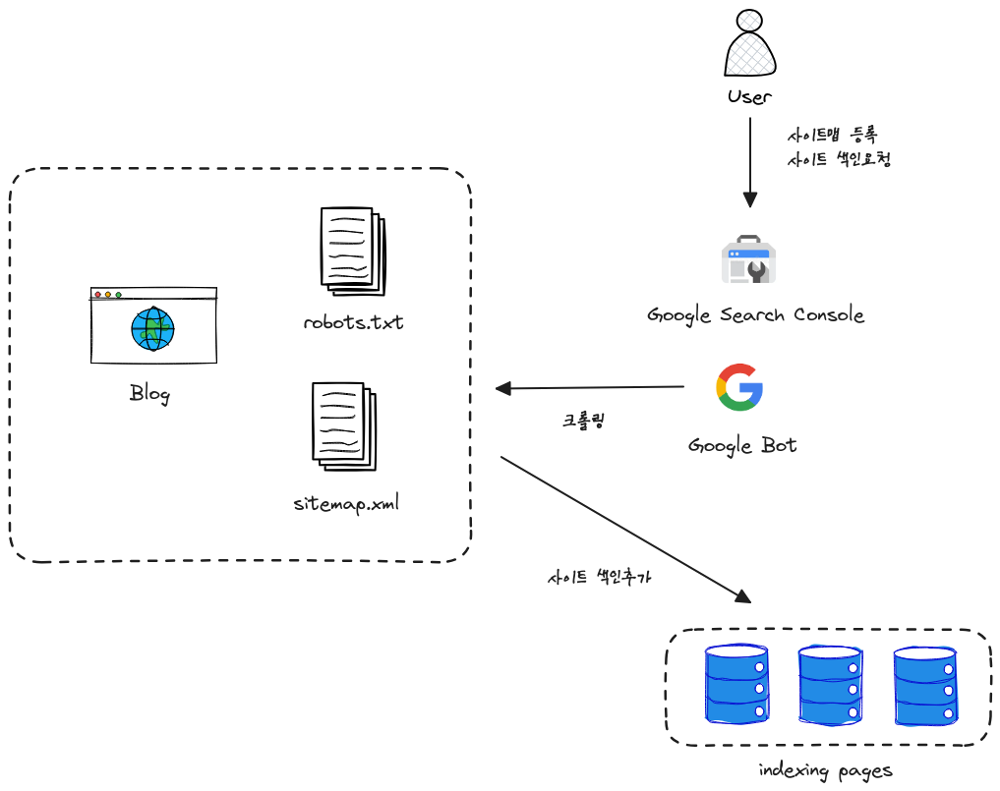

+++
author = "penguinit"
title = "검색엔진에 사이트 등록"
date = "2024-01-17"
description = "검색엔진이 어떻게 웹 사이트를 찾고 색인을 하는지에 대해서 알아보고 국내에서 주로 사용하는 검색엔진에 사이트를 등록하는 방법을 알아봅니다."
tags = [
    "google",
    "naver",
    "daum"
]

categories = [
    "search"
]
+++

## 개요

이번에 [Hugo](https://gohugo.io/)를 이용해서 블로그를 직접 만들게 되었는데 그 과정에서 블로그가 구글이나 네이버 다음등의 검색포털에서 검색이 되도록 하는 과정들을 기록하려고합니다. 

> 시간여유가 있다면 Hugo 를 이용해서 블로그를 만들었던 과정도 시리즈물로 기록하려고 합니다.

## 검색엔진에서 사이트를 찾는 원리

회사마다 검색엔진 동작방식은 전부 다르겠지만 대표적으로 구글이 어떻게 웹사이트를 찾고 색인을 하는지에 대해서 알아보고자 합니다.

### 크롤링

구글은 '**구글봇**'이라 불리는 웹 크롤러를 사용하여 인터넷상의 웹사이트를 방문합니다. 이 크롤러는 새로운 웹사이트, 업데이트된 콘텐츠, 또는 변경된 링크를 찾기 위해 인터넷을 지속적으로 탐색합니다.

### 링크를 통한 발견

구글봇은 기존에 색인화된 페이지에 있는 링크를 따라가며 새로운 페이지를 발견합니다. 웹사이트가 다른 사이트에 링크되어 있으면 구글이 해당 사이트를 더 쉽게 찾을 수 있습니다.

### 사이트맵 제출

**Google Search Console**을 통해 사이트맵을 제출할 수 있습니다. 사이트맵은 웹사이트의 모든 중요한 페이지를 목록으로 나열하며, 구글에게 어떤 콘텐츠가 있고 어디에서 찾을 수 있는지 알려줍니다.

### robots.txt 파일

웹사이트는 robots.txt 파일을 사용하여 **구글봇**이 크롤링해야 할 페이지와 피해야 할 페이지를 지정할 수 있습니다. 이 파일은 크롤러가 웹사이트의 특정 부분을 방문하지 못하도록 막는 역할을 합니다.

요약하자면 아래처럼 도식화를 해볼 수 있을 것 같습니다.



## 검색엔진별 등록

### 구글

1. [Google Search Console](https://search.google.com/search-console/about)에 접속합니다.
2. 아래 그림처럼 **Start Now**를 클릭


3. 주소등록과 해당페이지에 대한 소유권 등록을 위한 작업을 처리합니다.


구글에서는 여러가지 방법으로 **자격증명**을 할 수 있습니다.

저는 사전에 **Google Analytics**를 연동해둔 상태였기 때문에 바로 인증이 되었습니다. 

해당 경우가 아니라고 한다면 html 파일을 가이드한 경로에 넣어두거나 루트 페이지의 헤더에 메타태그를 추가하면 됩니다.


아무래도 네이버 블로그나 티스토리의 경우에는 해당 방식을 가장 많이 사용할 것 같습니다.


제대로 등록이 되면 위와 같은 화면이 노출

4. Sitemap 등록

1~3 까지하면 **Google Search Console**에는 등록이 마무리 되고 콘솔 페이지에 접근할 수 있습니다. 위에 언급했듯이 웹 페이지가 더 효율적으로 수집될 수 있도록 사이트 맵을 제출해야합니다.


Hugo 에서는 웹을 빌드하면서 sitemap 도 같이 만들어줍니다. 그래서 별도 작업이 필요없이 sitemap.xml 을 등 제출하였을때 문제없이 처리가 되었습니다.

5. 색인요청

사이트맵을 제출했기 때문에 일정 시간이 지나면 구글봇이 알아서 색인을 만들어주지만 색인요청을 하면 좀 더 빨리 진행된다고 합니다. 여러번 요청하더라도 최초에 요청된 색인 생성 요청이 있다면 뒤에 요청들은 모두 무시가 된다고하니 참고하시길 바랍니다.


## 네이버

국내에서 구글이 시장점유를 많이 하고 있지만 아직까지는 네이버 검색을 따라잡지는 못한 것 같습니다. 블로그가 최대한 노출되는게 목적이기 떄문에 네이버도 작업을 해주었습니다.

1. [네이버 서치어드바이저 접속](https://searchadvisor.naver.com/)


웹마스터 도구 사용하기를 클릭합니다.

2. 등록하고자 하는 웹 사이트주소를 입력하고 사이트 소유확인 작업을 해줍니다.


Hugo 의 경우에는 라우팅을 자유롭게 할 수 있기때문에 static 하위에 **html 파일**을 다운로드 받아서 가장 상위 폴더에 저장해두었습니다. 


3. 소유권 확인이 되면 콘솔이 활성화되고 왼쪽탭에 요청 → 사이트맵 제출을 해줍니다.


4. 검색결과 확인


### 다음 (검색등록)

최근에는 많이 죽긴했지만 그래도 블로그 노출을 위해서 다음까지는 해주는게 좋다고 생각해서 작업하였습니다. 

1. [검색등록 페이지 접속](https://register.search.daum.net/index.daum)


신규등록하기를 누르고 웹 페이지 주소를 등록해줍니다. 그 후에는 웹 페이지 관련 정보들을 입력하게 됩니다.


2. 검색등록확인


다음의 경우에는 구글과 네이버와 다르게 현재 운영중인 사이트를 다음에 등록해준다는 느낌이었습니다. 사이트맵이나 기타 정보들이 없음에도 불구하고 블로그 컨텐츠 중에서 하나를 입력해보면 노출되는걸 확인할 수 있었는데 어떤 방식인지는 잘 모르곘습니다. 아무래도 검색색인이 되는 방식이 네이버와 구글과는 달라보였습니다.


### 다음 (웹 마스터 도구)

다음에는 검색등록만 있는줄 알았는데 네이버와 구글과 비슷하게 웹 마스터 도구가 존재하였습니다. 대신 베타버전으로 아직까지 정식 출시된 버전으로 보이지는 않습니다.

1. [다음 웹 마스터 도구 접속](https://webmaster.daum.net/)


우선 PIN 코드 발급받기를 누르고 설정을 하면 아래와 같은 화면이 나오는데


각자 환경에 맞게 robots.txt 하단에 추가해주면 됩니다. Hugo 를 사용하고 있었고 수집관련해서 따로 작업을 하지 않았기에 기본값으로 두었는데 다음은 해당 파일에 대한 수정이 필요해서 아래처럼 작업하였습니다.

- Hugo config.toml 파일에 `enableRobotsTXT = true` 설정추가
- /layout 하위에 robots.txt 파일추가

```
User-agent: *

#DaumWebMasterTool:dca50d15cee286e46645f199be54408e45e4979ecbf867fa7877a90a881be4fd:/lJDYpNEQ78RnQXN/HqAlA==
```

2. 콘솔에서 사이트맵등록


콘솔상단에 수집요청에 들어가게 되면 사이트맵을 등록할수 있는 창이 있습니다. 여기에 주소를 입력해주면 됩니다. 다른 검색엔진과 비슷하게 직접 문서등록을 할수도 있습니다.


3. 노출결과 확인


네이버랑 구글은 등록해도 잘 보이지도 않고 해당페이지가 색인이 됬는지 아닌지도 확인이 어려웠는데 다음은 바로 보였습니다. 아무래도 두 검색엔진과 비교해서는 다음이 좀 부족해서가 아닌가 싶지만 해당 키워드를 치니깐 가장 상단에 나와서 신기하면서 다른 한편으로는 조금 씁쓸한 마음도 있었습니다.


## 정리

 검색엔진은 웹 페이지를 어떻게 알고 검색하는지 그 원리에 대해서 정리를 하였고 국내에서 검색엔진은 구글/네이버/다음 삼파전인데 해당 포털들을 중점으로 검색엔진에 등록하는 법들을 정리했습니다.

 작업을 하면서 놀랐던 부분이 있다면 **다음**의 웹 마스터 도구가 베타라는 점과 색인의 등록과 적용이 엄청빨랐다는 점이 있었는데 정작 네이버와 구글은 등록에 시간이 걸려서 바로 확인이 어려웠습니다. 이게 반대로 생각해보면 다음은 너무 널널한 상태이고 네이버나 구글은 워낙 양이 많다보니 시간이 걸리는게 아닐까라는 생각이 들었습니다.