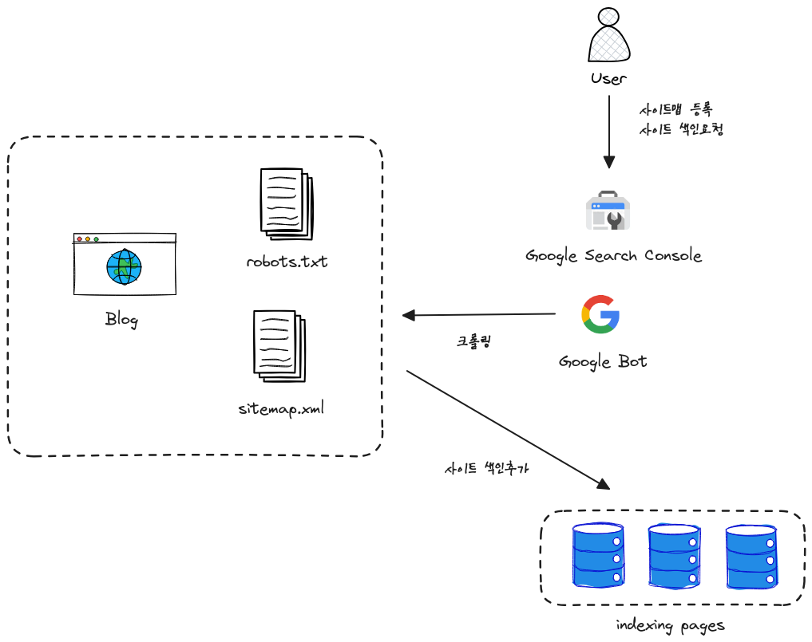

+++
author = "penguinit"
Title = "Register Site in Search Engine"
date = "2024-01-17"
Description = "Learn how search engines find and index websites, and learn how to register sites with the most popular search engines in the country."
tags = [
"google",
"naver",
"daum"
]

categories = [
"search"
]
+++

## Overview

This time, I made a blog using [https://gohugo.io/) ] and in the process, I would like to record the process of making the blog search in search portals such as Google or Naver.

> If I have time, I would like to record the process of creating a blog using Hugo as a series.

## How to find a site in a search engine

Each company operates different search engines, but we would like to find out how Google finds and indexes websites.

### Crawling

Google visits websites on the Internet using a web crawler called **GoogleBot**. The crawler constantly searches the Internet for new websites, updated content, or changed links.

### Discovery via link

GoogleBot discovers new pages by following links on existing indexed pages. If a website is linked to another site, it will be easier for Google to find that site.

### Submit Site Map

**You can submit a site map via Google Search Console**. The site map lists all the important pages on the website and tells Google what content is available and where to find it.

### robots.txt file

The website can use the robots.txt file to specify which pages **GoogleBot** should crawl and which should be avoided. This file prevents crawlers from visiting certain parts of the website.

In summary, I think we can do a schematic diagram as below.



## Register by search engine

### Google

1. 1. [Google Search Console](https://search.google.com/search-console/about)에 접속합니다.
2. Click **StartNow** as shown below


3. Processes for address registration and ownership registration for that page.


In Google, you can **certify** in a number of ways.

I had **Google Analytics** linked in advance, so it was certified right away.

If this is not the case, you can either put the html file in the guided path or add a meta tag to the header of the root page.


In the case of Naver blogs and T-Stories, I think that method will be used the most.


If registered properly, the above screen will be exposed

4. Register Sitemap

After 1 to 3, **Google Search Console** will be signed up and the console page will be accessible. As mentioned above, you will need to submit a site map so that web pages can be collected more efficiently.


Hugo also creates sitemap while building the web. So, it was handled without any problems when submitting sitemap.xml.

5. Index Request

Since I submitted a site map, Google Bot creates indexes for me after a certain period of time, but it will proceed faster if I ask for an index. Please note that even if you request multiple times, if there is an initial request for index generation, all subsequent requests will be ignored.


## Naver

Although Google has a lot of market share in Korea, I don't think it has caught up with Naver's search so far. Naver also worked on it because the purpose is to expose the blog as much as possible.

1. [Connect to Naver Search Advisor] (https://searchadvisor.naver.com/)


Click Use the Web Master tool.

2. Enter the website address you want to register and verify the site ownership.


In case of Hugo, I downloaded the **html file** under static and saved it in the top folder because of the free routing.


3. Once ownership is confirmed, the console will be activated and the request → site map will be submitted on the left tab.


4. Check search results


### Daum (search registration)

Recently, I've died a lot, but I thought it would be better to do it until next time to expose my blog.

1. [Access Search Registration Page] (https://register.search.daum.net/index.daum)


Click New Registration and register the web page address. After that, you will enter information related to the web page.


2. Search registration verification


In the following cases, unlike Google and Naver, it felt like registering a currently operating site next time. Even though there was no site map or other information, I could see that it was exposed by entering one of the blog contents, but I didn't know how. The way to search index was different from Naver and Google.


### Daum (Web Master Tool)

In case of Daum, I thought there was only search registration, but similar to Naver and Google, there was a web master tool. Instead, it is a beta version, which does not appear to be an official release yet.

1. Access the following Web Master Tools (https://webmaster.daum.net/)


First of all, if you press get PIN code and set it up, you'll see the screen as below


You can add it to the bottom of robots.txt according to your environment. I was using Hugo and didn't work separately on collection, so I set it as the default, but I worked on it as below because the file needed to be modified.

- Add 'enableRobotsTXT = true' setting to Hugo config.toml file
- Add robots.txt file under /layout

```
User-agent: *

#DaumWebMasterTool:dca50d15cee286e46645f199be54408e45e4979ecbf867fa7877a90a881be4fd:/lJDYpNEQ78RnQXN/HqAlA==
```

2. Register site map from console


When you enter a collection request at the top of the console, there is a window where you can register your site map. Just enter your address here. You can also register your documents directly, similar to other search engines.


3. Confirmation of exposure results


Naver and Google couldn't see well even if they registered, and it was difficult to check whether the page was indexed or not, but I saw the next one right away. I think it's because the following is a little lacking compared to the two search engines, but when I typed the keyword, it was surprising that it came out at the top, and on the other hand, it was a little bit bitter.


## Clean up

The search engine summarized the principle of how to know and search web pages, and the search engine in Korea is Google/Naver/Daum Three-way, and the methods of registering these portals to the search engine are summarized.

What surprised me while working was that **Daum**'s web master tool was beta and that the index was registered and applied very quickly, but Naver and Google took time to register, so it was difficult to check it right away. If I think about it the other way around, I thought it would take time because Daum is too spacious and Naver and Google have so many.