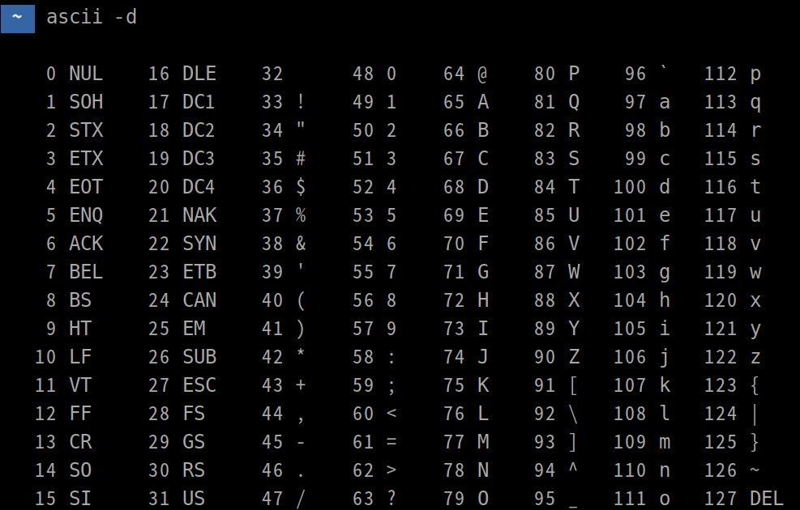

+++
author = "penguinit"
title = "아스키코드, EUC-KR, 유니코드 정리"
date = "2024-01-22"
description = "프로그래밍을 하다보면 인코딩에 대해서 골치를 겪는 일들이 있습니다. 요즘에야 대부분 인코딩을 UTF-8 로 기계적으로 작업을 하지만 옛날에는 잘못된 인코딩으로 한글이 들어갔을 때 문제가 생기는 실수들도 있었고 실무에서 개발을 하다보면 ..."
tags = [
    "ascii", "euc-kr", "unicode"
]

categories = [
    "encoding",
]
+++

## 개요

프로그래밍을 하다보면 인코딩에 대해서 골치를 겪는 일들이 있습니다. 요즘에야 대부분 인코딩을 `UTF-8`로 기계적으로 작업을 하지만 옛날에는 잘못된 인코딩으로 한글이 들어갔을 때 문제가 생기는 실수들도 있었고 실무에서 개발을 하다보면 인코딩을 잘 이해하지 못해서 생겼던 경험들도 있었습니다. 해당 글을 통해서 인코딩의 개념과 아스키코드, EUC-KR 유니코드까지의 변천사를 정리해보려고 합니다.

## 인코딩이란

인코딩은 데이터를 특정 포맷이나 형식으로 변환하는 것을 말합니다. 여기서의 변환은 컴퓨터가 이해하고 처리할 수 있는 형태로의 변환을 얘기합니다.

인코딩이란 용어는 다양하게 사용되며 문자열, 이미지, 비디오등 특정 데이터를 컴퓨터가 이해할 수 있는 형태로 변환하는 것을 말합니다. 그리고 반대로 컴퓨터가 이해하고 있는 형태의 데이터를 원래 데이터로 변환하는 과정을 **디코딩**이라고 합니다.

## 아스키코드

아스키코드는 최초의 문자열 인코딩으로 7 비트 (비트는 이진 숫자, 0 또는 1) 를 사용하여 문자를 표현합니다.

7 비트는 최대 128 개의 다른 문자 (2^7 = 128) 를 나타낼 수 있습니다. 예를 들어서 65 번은 대문자‘A’를 나타내는데 **01000001** 로 표현됩니다. 아스키코드는 간결하고 단순하지만 영어와 기본적인 제어 문자를 넘어서는 다양한 언어와 기호를 표현하는데는 한계점이 있었습니다.



## EUC-KR

아스키 코드 이후에 여러나라가 독자적인 인코딩 체계를 개발하기 시작했습니다. 가장 큰 이유중에 하나는 기존 아스키코드의 제한 때문입니다. 같은 알파벳을 사용하더라도 특정 문화권에서는 여러가지 제약이 있었습니다. 예를 들어서 프랑스어, 독일어, 스페인어등은 악센트가 있는 문자를 사용하며 영어권 외에서는 전혀 다른 문자체계를 가지고 있었습니다.

유럽의 언어들은 기존 아스키코드를 확장한 개념의 **ISO-8859** 시리즈가 나오기 시작했고 중국의 **GB2312** 일본의 **Shift_JIS** 한국의 **EUC-KR** 등 각각의 언어가 가진 독특한 문자 체계를 표현하기 위해서 독자적인 인코딩체계들이 만들어지기 시작했습니다.

### EUC-KR 구조

EUC-KR 은 8 비트 (1 바이트) 기반의 인코딩 시스템으로, 2 바이트 (16 비트) 를 사용해서 한개의 음절을 표현합니다. 2 바이트 (16 비트) 는 2^16 = 65,536 개의 다른 상태를 표현할 수 있습니다. 기존에 ASCII 문자 집합과 호환이 되었기에 알파벳과 한글이 혼합되는 문서를 처리할 수 있었습니다. 하지만 한계도 있었는데 EUC-KR 인코딩 방식으로 총 2,350 개 정도의 한글음절과 한자를 포함해서 8000 개 정도의 문자를 표현할 수 있었습니다.

한글은 이론적으로는 약 11,172 개 (초성 19 개 x 중성 21 개 x 종성 28 개, 종성이 없는 경우 포함) 의 음절 조합을 만들 수 있습니다. 하지만 ECU-KR 은 모든 조합을 지원하지 않았고 이로 인해서 한계점을 명확히 가지고 있던 인코딩 방식입니다.

### EUC-KR 인코딩 실제수행

펭귄이라는 단어가 EUC-KR 에서 어떻게 표현되는지 확인해보려고 합니다.

```bash
echo "펭귄" | iconv -t euc-kr | hexdump -C

00000000  c6 eb b1 cf 0a                                    |.....|
00000005
```

- **`c6 eb`**: "펭"이라는 글자에 해당하는 EUC-KR 인코딩입니다.
- **`b1 cf`**: "귄"이라는 글자에 해당하는 EUC-KR 인코딩입니다.
- **`0a`**: 이는 개행 문자 (Line Feed, 줄바꿈) 를 나타냅니다. 텍스트 출력에서 종종 사용되는 제어 문자입니다.

EUC-KR 표를 확인해보면 좀 더 확인이 쉽습니다. [EUC-KR 문자표](https://www.fileformat.info/info/charset/EUC-KR/grid.htm)

### 완전형 인코딩

EUC-KR 은 완전형 인코딩 (Complete Type) 체계를 따르고 있습니다. 한글의 각 글자 (음절) 는 이미 조합된 형태로 인코딩되며, 사용자가 각각의 초성, 중성, 종성을 따로 조합하는 형태가 아닙니다.

## 유니코드

이런 여러가지 문제점을 안고 있다가 모든 것을 통합한 문자열체계가 바로 유니코드입니다. 유니코드는 다양한 인코딩 형식(예: UTF-8, UTF-16, UTF-32)을 제공하며, 각각의 형식은 문자를 저장하는 방식이 다릅니다.

가끔씩 유니코드를 인코딩의 방식 중 하나로 생각하는분들도 있던데 정확히 구분하자면 유니코드는 문자집합을 정의하고 문자를 고유하게 식별하기 위한 표준을 뜻합니다. 유니코드 문자의 정의 및 추가는 [유니코드 컨소시엄 (Unicode Consortium)](https://home.unicode.org/)에 의해 관리되고 새로운 문자나 이모지등은 이 컨소시엄에서 정의되고 추가됩니다.

현재 유니코드는 4 바이트까지 처리를 할 수 있고 이론상 2^32(4,294,967,296‬) 개의 문자를 표현할 수 있습니다

유니코드의 인코딩방식이 여러개인 이유는 하나의 문자를 저장하고 표현하는데 4 바이트를 쓰는게 비효율적이라서 효율적인 방식으로 처리할 수 있게 여러가지 방식을 제공하고 있습니다. 가장 일반적으로 쓰는 것은 UTF-8 입니다.


### 유니코드 현황

현재까지 유니코드 표준에서 정의된 문자의 수는 계속해서 증가하며, 매년 새로운 문자나 이모지가 추가됩니다.  2024년 1월 22일 기준으로는 [유니코드 15.1](https://www.unicode.org/versions/Unicode15.1.0/) 버전이 최신으로 총 149,813의 문자들이 있다고 합니다. 이 숫자는 버전이 업데이트 될 때 마다 추가되고 릴리즈 노트를 통해서 상세 내용을 확인하실 수 있습니다.

### 유니코드 구성

1. 코드 포인트 (Code Point):
    - 유니코드에서 각 문자는 고유한 코드 포인트 (숫자) 로 식별됩니다.
    - 예를 들어, 라틴 알파벳 "A"의 코드 포인트는 U+0041 이고, 한글 "가"의 코드 포인트는 U+AC00 입니다.
    - 코드 포인트는 16 진수로 표현되며 "U+"로 시작합니다.
2. 평면 (Plane)
    - 유니코드에서 문자들은 평면 (Plane) 이라고 불리는 큰 그룹으로 구성됩니다. 각 평면은 고유한 범위의 코드 포인트를 가집니다.
3. 문자 블록 (Blocks):
    - 문자 범주는 더 큰 문자 블록으로 구성됩니다. 블록은 연관된 문자 집합을 그룹화하며, 예를 들어 라틴 -1 서플리먼트, 한글 음절, 이모지 블록 등이 있습니다.


> Basic multilingual plane, BMP

펭귄이라는 단어에 해당하는 완성형 음절에 대한 유니코드를 찾고 싶다면 아래 처럼 찾을 수 있습니다.

[참조사이트](https://www.compart.com/en/unicode/)

- 펭 (U+D3AD) : [https://www.compart.com/en/unicode/U+D3AD](https://www.compart.com/en/unicode/U+D3AD)
- 귄 (U+ADC4) : [https://www.compart.com/en/unicode/U+ADC4](https://www.compart.com/en/unicode/U+ADC4)

유니코드는 4바이트까지 표현할 수 있고 16진수로 표현됩니다. 여기서 U+D3AD는 **코드 포인트**라고 합니다. 해당 링크를 따라가보면 `Plane` 이라는 항목이 있는데 한글은 [Basic Multilingual Plane](https://www.compart.com/en/unicode/plane/U+0000) (BMP) 라는 평면에 속하고 [Hangul Syllables, U+AC00 - U+D7AF](https://www.compart.com/en/unicode/block/U+AC00)의 문자 블록에 해당합니다.

## 결론

아스키코드, EUC-KR, 유니코드, UTF-8 로 이어지는 문자열 처리의 시대적인 흐름과 개념에 대해서 정리를 하였습니다.  좀 더 다루고 싶었던 부분은 UTF-8 인코딩 부분인데 위에 자세하게 언급은 안했지만 개발을 하다보면 한글은 3 바이트로 처리가 되고 영어는 1 바이트로 처리되는데 이게 모두 UTF-8 에서 기인하는 현상입니다. 시간이 되면 UTF-8 인코딩에 대해서 좀 더 자세히 다뤄보겠습니다.