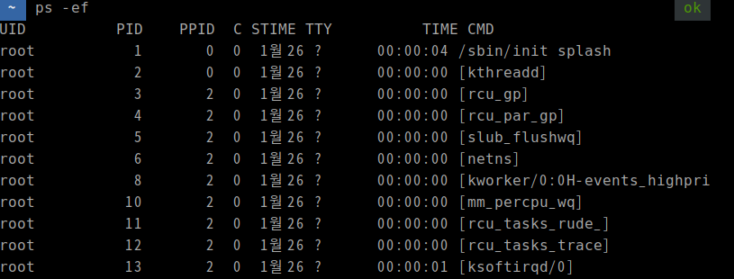

+++
author = "penguinit"
title = "프로세스&스레드 고루틴의 병렬처리 이해"
date = "2024-01-29"
description = "해당 글에서는 프로세스와 쓰레드가 무엇인지에 대해서 정리를하고 Golang 언어에서 고루틴은 어떤 특징을 가지고 있으며 고루틴의 동작원리에 대해서 상세하게 알아봅니다."
tags = [
    "goroutine", "process", "thread", "golang"
]

categories = [
    "os", "language",
]
+++

## 개요

해당 글에서는 프로세스와 쓰레드가 무엇인지에 대해서 정리를하고 Golang 언어에서 고루틴은 어떤 특정을 가지고 있으며 고루틴의 동작원리에 대해서 상세하게 알아봅니다.

## 프로세스

프로세스는 실행 중인 프로그램의 인스턴스입니다. 운영 체제가 프로그램을 메모리에 로드하고 실행할 때, 그 프로그램은 프로세스가 됩니다. 각 프로세스는 독립된 메모리 공간 (코드, 데이터, 힙, 스택 등) 을 가지며, 다른 프로세스와 정보를 공유하지 않습니다.

유닉스계열 운영체제에서 (Mac/Linux) `ps -ef` 명령어를 하게 되면 실행중인 프로세스들에 대해서 확인하실 수 있습니다.

1. **UID**: 프로세스를 실행하는 사용자의 ID.
2. **PID**: Process ID, 프로세스의 고유 식별 번호.
3. **PPID**: Parent Process ID, 프로세스의 부모 프로세스 ID.
4. **C**: CPU 사용률.
5. **STIME**: 프로세스가 시작된 시간.
6. **TTY**: 프로세스가 연결된 터미널.
7. **TIME**: 프로세스가 소비한 총 CPU 시간.
8. **CMD**: 프로세스를 시작한 명령 라인.

### 부모 프로세스

모든 프로세스는 부모 프로세스를 가지고 있습니다. 운영 체제 내에서 프로세스 생성은 부모 프로세스가 자식 프로세스를 생성하는 계층적 구조로 이루어집니다. 이러한 구조는 몇 가지 중요한 특징을 가지고 있습니다.

1. **초기 프로세스**: 시스템이 부팅할 때, 운영 체제는 초기 프로세스를 시작합니다 (**0번**). 이 초기 프로세스는 모든 다른 사용자 수준 프로세스의 조상이며, 보통 'init' 또는 이와 유사한 이름으로 불립니다.
2. **부모-자식 관계**: 사용자가 새 프로그램을 실행하거나 시스템이 새 서비스를 시작할 때, 기존 프로세스(부모)는 새 프로세스(자식)를 생성합니다. 이렇게 생성된 자식 프로세스는 또 다른 프로세스를 생성할 수 있으며, 이러한 방식으로 프로세스 트리가 형성됩니다.
3. **프로세스 종료와 고아 프로세스**: 부모 프로세스가 종료되고 자식 프로세스가 계속 실행 중인 경우, 자식 프로세스는 고아 프로세스(orphan process)가 됩니다. 고아 프로세스는 대부분의 시스템에서 'init' 프로세스가 자동으로 채택하여 관리합니다.
4. **종료 시 신호 전달**: 일반적으로 부모 프로세스는 자식 프로세스의 종료 상태를 확인하고, 자식 프로세스가 종료될 때 자원을 정리합니다.

## IPC

위에서 정리한 내용에서 프로세스간에는 독립된 메모리 공간을 가지고 있고 프로세스간에 정보를 공유하지 않는다고 하는데 그러면 프로세스간에 통신은 어떻게 할까요?

프로세스 간 통신 (**IPC**, Inter-Process Communication) 은 독립된 메모리 공간을 가진 프로세스들이 정보를 교환하고 협력할 수 있도록 하는 메커니즘입니다.

- **공유 메모리 (Shared Memory)**: 별도의 메모리 영역을 설정하여 여러 프로세스가 접근할 수 있도록 함으로써 간접적인 메모리 공유를 허용합니다.
- **메시지 큐 (Message Queues)**: 프로세스 간 메시지를 전달하는 방식으로 통신합니다.

## 쓰레드

쓰레드는 프로세스 내의 실행 흐름으로, 프로세스의 자원 (메모리, 파일 핸들 등) 을 공유합니다. 쓰레드는 프로세스 내에서 코드, 데이터, 힙 공간을 공유하면서 각자의 스택을 가지고 독립적으로 실행됩니다.

- 같은 프로세스 내의 쓰레드들은 메모리를 공유합니다. 따라서, 한 쓰레드가 **데이터를 변경하면 다른 쓰레드도 그 변경 사항을 볼 수 있습니다**.
- 쓰레드 간의 컨텍스트 스위칭은 상대적으로 오버헤드가 적습니다. 공유된 메모리 덕분에 효율적인 자원 사용이 가능합니다.
- 프로세스 생성은 상대적으로 시간과 자원을 많이 소모하지만 쓰레드의 경우에는 비교적 가볍게 생성하고 관리할 수 있습니다.
- 각 쓰레드는 고유의 스택을 할당받아, 스택에는 함수 호출, 지역 변수 등이 저장됩니다
- 데이터의 일관성을 유지하기 위해 뮤텍스, 세마포어 등의 동기화 메커니즘을 사용합니다.

- 쓰레드는 CPU 할당을 받아 독립적으로 명령을 실행합니다. **멀티코어 프로세서**에서는 여러 쓰레드가 동시에 실행될 수 있습니다.
- 메모리를 공유하기 때문에 데이터 교환과 통신이 용이하지만, 이로 인한 동기화 문제가 있을 수 있습니다.

### 멀티코어 프로세서란?

멀티코어 프로세서는 여러 개의 CPU 코어를 하나의 칩에 통합한 것입니다. 각 코어는 독립적인 처리 장치로서 기능하며, 자체적인 연산을 수행할 수 있습니다. 이는 단일 코어 프로세서에 비해 동시에 더 많은 작업을 처리할 수 있음을 의미합니다. 예를 들어, **4 코어 프로세서**에서는 **최대 4 개의 쓰레드**가 동시에 실행될 수 있습니다.

간단하게 생각하면 코어 1 개당 작업하나를 처리할 수 있고 여러개의 코어를 가지고 있으면 동시에 여러일을 처리할 수 있습니다. 운영체제에서 병렬처리를 위한 방식들이 여럿있습니다.

- 멀티프로세싱
- 멀티테스킹
- 멀티쓰레딩

해당 주제로만 내용이 길어질수도 있어서 간략하게 해당 작업들을 보여주는 내용을들 도식화 해보았습니다. 위에 설명한 내용은 **멀티프로세싱**에 해당합니다. (코어당 1 개의 작업을 수행)

현대적인 운영체제에서는 CPU 를 최대한 활용하기 위해서 멀티프로세싱 뿐만아니라 아래 같은 작업들이 기본적으로 다 수행이 되고있습니다. 그렇게 때문에 우리는 현재에도 여러가지 프로그램들이 동시에 수행되는 것을 느낄 수 있습니다.

## 고루틴

고루틴은 Go 언어에서 도입된 **경량 쓰레드입**니다. 쓰레드보다 **훨씬 적은 메모리를 사용하며**, 수천 개의 고루틴을 쉽게 생성하고 관리할 수 있습니다. 고루틴은 Go 런타임에 의해 관리되며, 런타임 스케줄러는 이들을 여러 쓰레드에 효율적으로 분배합니다.

실제로 쓰레드 하나를 만들게되면 **1MB**정도의 메모리를 소비하게 되는데 고루틴의 경우에는 **2KB**정도의 메모리만 소비합니다.

CPU 와 쓰레드와 고루틴을 비유로하자면 아래처럼 설명할 수 있습니다. → [출처](https://www.youtube.com/watch?v=5LfqrEGwDmE)

위에 그림처럼 실행가능한 고루틴이 로컬 큐에 대기하고 있다가 만약에 시스템 스레드에 할당된 고루틴이 시스템콜이나 다른 모종의 이유로 대기 상태가 될 경우에는 대기하고 있던 고루틴이 작업영역으로 오는 형태로 수행이 됩니다. 그리고 유휴상태에 있던 고루틴은 로컬 큐에 대기해서 자신이 다시 요리할 때를 기다리게 됩니다.

이런 일련의 작업들이 고 런타임에 의해서 수행이되고 요즘 환경에는 멀티쓰레드로 돌아가기 때문에 유휴한 쓰레드가 없도록 런타임 스케쥴러에서 큐가 비어있다면 다른 쓰레드에 있는 큐를 비어있는 큐로 이동시키기도 합니다. (**Go Work-Stealing**)

## 정리

해당 글을 통해서 프로세스와 쓰레드가 무엇인지를 이해하고 Golang 의 핵심요소인 고루틴에 대해서 알아보았습니다. 고루틴이 좋다라고 말들은 많이하는데 구체적으로 왜 좋은지에 대해서는 상대적으로 고민을 덜하게 되는 것 같습니다.

고루틴의 모든 것을 알아본 것은 아니지만 고루틴이 쓰레드에 비해서 경량화되어 효율적으로 사용하고 관리할 수 있다는 점과 고 런타임 스케쥴러를 통해서 멀티코어의 이점을 살려줄 수 있다는 점들을 알아보았습니다.