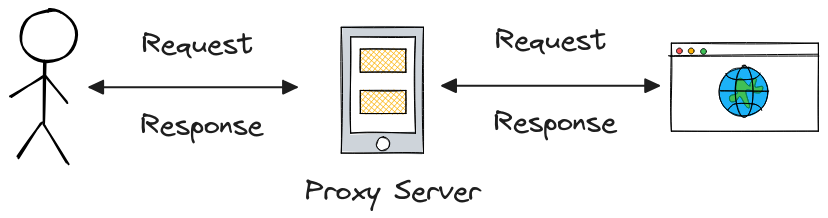

+++
author = "penguinit"
Title = "What is Proxy?"
date = "2024-01-22"
Description = "I've understood it roughly, but I've been confused about concepts for a long time (especially forward and reverse proxies) so I'd like to take this opportunity to clear up."
tags = [
"proxy"
]

categories = [
"infra",
]
+++

## Overview

I understood it roughly, but there has been confusion about the concept since a long time ago (especially about **forward proxy** and **reverse proxy**), so I would like to take this opportunity to clarify.

## What is a proxy

It's a term I've heard a lot in everyday life, but it has the meaning of **agent/agent** in advance, and it means that CS does it for a specific request or response. It's often referred to as **proxy server** because the server is the subject that plays the role.

To summarize more from a case point of view, for example, searching for a website.

1. Enter the website address in your browser
2. **Proxy server** receives requests.
3. **Proxy server** will forward the request to the web server.
4. The web server sends a response (website data) to the **proxy server**.
5. **Proxy server** will forward the response to the user.

## Proxy type

Typically, proxies can be distinguished by **forward proxies** and **reverse proxies**. The act of proxying is not different in both, but it is distinguished by the **purpose** and the **position** of the proxy server.

### Forward Proxy

It means accessing Internet resources on behalf of the user. Typically, proxy servers are located close to the user.

Forward proxies are intended to protect users' privacy or to restrict access to specific content or users. For example, a specific site can be blocked in-house through this forward proxy. On the other hand, you can intentionally hide users' identities and locations by going through a proxy before accessing the outside Internet. However, this depends on the proxy server's configuration, and it's up to you to decide whether you follow the **Anonymous Proxy** policy or the **Transparent Proxy** policy.

### reverse proxy

It serves to forward client requests from the Internet to the server instead. Generally, reverse proxy servers are located close to the server.

The main purpose of reverse proxy is **server load distribution**, **security**, **caching**, **SSL/TLS processing**, etc. The main purpose of reverse proxy is to **server load distribution**, and in the case of SSL/TLS processing, servers may increase or decrease from an operator's point of view, so it is advantageous when considering scalability because only the proxy server is handled rather than working on the server daily. In particular, reverse proxy servers can have many security benefits as well, as internal servers are not exposed to the outside world.

## conclusion

Proxy servers are a key component of modern Internet infrastructure, which provides various benefits by mediating communication between users and servers. In this article, we looked at the functions and differences of forward and reverse proxies, as well as their typical use cases.

**Forward Proxy** focuses primarily on increasing network safety and efficiency, and is useful for protecting users' anonymity and controlling content access. **Reverse Proxy**, on the other hand, is used for server load distribution, increased security, and faster content delivery (caching).
