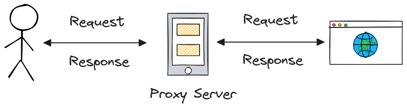

+++
author = "penguinit"
title = "프록시란 무엇인가?"
date = "2024-01-22"
description = "대략적으로는 이해하고 있었지만 예전부터 개념에 대해서 혼돈이 있어서 (특히 포워드 프록시와 리버스 프록시에 대해서) 이번 기회를 통해서 확실하게 정리를 해보고자 합니다."
tags = [
    "proxy"
]

categories = [
    "infra",
]
+++

## 개요

대략적으로는 이해하고 있었지만 예전부터 개념에 대해서 혼돈이 있어서 (특히 **포워드 프록시**와 **리버스 프록시**에 대해서) 이번 기회를 통해서 확실하게 정리를 해보고자 합니다.

## 프록시란

일상생활에서도 많이 들어본 용어인데 사전적으로는 **대리권/대리인** 정도의 의미를 가지고 있고 CS 에서는 특정 요청이나 응답에 대해서 대신 해주는 행위를 뜻합니다. 해당 역할을 하는 주체가 서버이기 때문에 **프록시 서버**라고 많이 지칭합니다.

좀 더 사례 관점에서 요약하자면 웹사이트를 검색하는걸 예로 들 수 있습니다.

1. 브라우저에 웹사이트 주소를 입력
2. **프록시 서버**가 요청을 받습니다.
3. **프록시 서버**가 웹 서버에 요청을 전달합니다.
4. 웹 서버가 응답 (웹사이트 데이터) 을 **프록시 서버**에게 보냅니다.
5. **프록시 서버**가 응답을 사용자에게 전달합니다.

## 프록시 종류

대표적으로 프록시는 **포워드 프록시**와 **리버스 프록시**로 구분이 가능합니다. 프록시를 하는 행위는 둘다 다르지 않지만 **목적**과 프록시 서버의 **위치**에 따라서 구분이 됩니다.

### 포워드 프록시

유저를 대신하여 인터넷 리소스에 접근하는 것을 의미합니다. 일반적으로 프록시 서버는 유저에 근접해 위치하고 있습니다.

포워드 프록시는 유저의 개인정보 보호나 특정 컨텐츠 혹은 유저에 대한 접근제한을 목적을 두고 합니다. 예를 들면 사내에서 특정 사이트가 블록된다거나 하는 것은 모두 이런 포워드 프록시를 통해서 가능합니다. 반대로 이렇게 외부 인터넷에 접근하기 전에 한번 프록시를 거치기 때문에 의도적으로 사용자의 신원과 위치를 숨길 수도 있습니다. 하지만 이건 프록시 서버의 설정에 따라서 다르며 **익명 프록시 (Anonymous Proxy)** 정책을 따를 것인지 **투명 프록시 (Transparent Proxy) 를** 따를 것인지는 각 상황에 따라서 판단하여 선택해야할 부분입니다.

### 리버스 프록시

인터넷의 클라이언트 요청을 서버에 대신 전달하는 역할을 합니다. 보통 리버스 프록시 서버는 실제에 서버에 근접해 위치하고 있습니다.

리버스 프록시의 주요 목적은 **서버의 부하분산**, **보안**, **캐싱**, **SSL/TLS처리** 등이 주요 목적입니다. L7 로드밸런서의 경우에는 이런 리버스 프록시의 일종으로 간주될 수 있고 SSL/TLS 처리의 경우에는 작업자 관점에서 서버가 늘어나거나 줄어들 수도 있는데 그 때 마다 일일히 서버에 작업해주는 것 보다 프록시 서버만 처리를 해주면 되니 확장성을 고려해봤을 때 이점있습니다. 특히 리버스 프록시 서버로 인해서 내부의 서버들은 외부에 노출되지 않기 때문에 보안적으로도 많은 이점을 많이 가질 수 있습니다.

## 결론

프록시 서버는 현대 인터넷 인프라의 핵심 요소로, 사용자와 서버 간의 통신을 중재하며 다양한 이점을 제공합니다. 이 글에서는 포워드 프록시와 리버스 프록시의 기능과 차이점, 그리고 각각의 대표적인 사용 사례들을 살펴보았습니다. 

**포워드 프록시**는 주로 네트워크 안전성과 효율성을 높이는 데 초점을 맞추며, 사용자의 익명성 보호와 콘텐츠 접근 제어에 유용합니다. 반면, **리버스 프록시**는 서버의 부하 분산, 보안 강화, 그리고 빠른 콘텐츠 전달을 목적으로 사용됩니다 (캐싱).