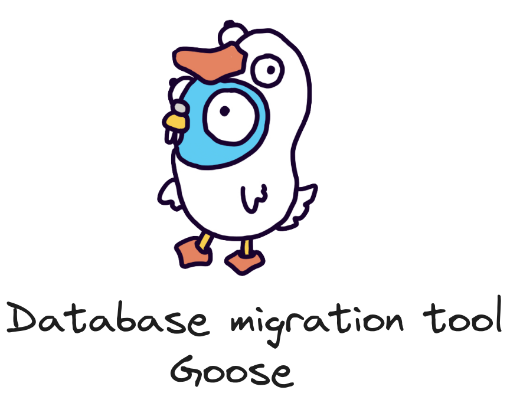

+++
author = "penguinit"
title = "Golang 마이그레이션 툴 Goose 알아보기"
date = "2024-02-26"
description = "이전 직장에서나 지금 직장에서나 DB 마이그레이션은 어떤 상황에도 꾸준히 있었던 것 같습니다. 사실 저 같은 경우에는 지금까지는 따로 툴을 활용했던 건 아니고 에드훅(Ad hoc) 코드 혹은 스크립트를 직접 작성했었습니다. 오늘 포스팅에서는 Golang에서 DB 관련 마이그레이션 툴인 Goose에 대해서 알아보고자 합니다."
tags = [
"golang", "migration", "goose"
]
categories = [
"language",
]
+++



## 개요

이전 직장에서나 지금 직장에서나 DB 마이그레이션은 어떤 상황에도 꾸준히 있었던 것 같습니다. 사실 저 같은 경우에는 지금까지는 따로 툴을 활용했던 건 아니고 에드훅(Ad hoc) 코드 혹은 스크립트를 직접 작성했었습니다. 오늘 포스팅에서는 Golang에서 DB 관련 마이그레이션 툴인 Goose에 대해서 알아보고자 합니다.

## DB 마이그레이션이란

여기서 DB 마이그레이션은 여러 가지 상황과 의미를 내포하고 있습니다. DB 마이그레이션을 진행한다라고 하면 아래 상황들을 생각해볼 수 있습니다. 정확한 내용은 말이 나오는 맥락에 따라서 달라질 수 있습니다.

- 성능 / 시스템 업그레이드 개선
- DB 이전 : 낮은 비용의 인스턴스 혹은 다른 유형의 DB로의 이전
- 통합 / 분리 : 여러 데이터 소스를 한곳에 모으거나 반대의 경우
- **개선 :** 시스템의 변경으로 인해서 기존 데이터 셋에 대해 추가/수정하거나 삭제하는 행위

DB 마이그레이션이라고 함은 DB를 가지고 수반되는 여러 가지 작업들을 통칭하는 경우가 많습니다. 오늘 얘기할 Goose 툴은 개선과 연관이 있습니다.

실제 업무 환경에서는 **특정 유저들의 데이터**를 업데이트한다거나 더 이상 사용하지 않는 **컬럼을 드랍**시킨다던가 이런 유형들의 일들이 개선의 영역에 있을 수 있습니다.

## Goose를 사용한 이유

Goose는 Go 언어로 작성된 데이터베이스 마이그레이션 툴입니다. 다른 DB 마이그레이션 툴도 많지만 우선 Golang으로 프로젝트를 하고 있고 마이그레이션 툴을 위해서 다른 종속성이 생기는 것에 거부감이 있었습니다.

위에 언급했듯이 Golang으로 만들어진 마이그레이션 툴 중에서 선택을 했어야 했는데 가장 직관적이고 러닝 커브가 적은 툴을 선택했습니다.

유지 보수 관점에서 최근 3개월 이내에 커밋 된 이력이 있고 이슈들이 계속 관리되고 있는지도 고려를 하였습니다.

## Goose 설치

우선 간단하게 Goose를 설치하는 것부터 시작해보겠습니다.

- macOS

```bash
brew install goose
```

- Linux

```bash
curl -fsSL \
    https://raw.githubusercontent.com/pressly/goose/master/install.sh |\
    GOOSE_INSTALL=$HOME/.goose sh -s v3.5.0
```

- Go Install

```bash
go install github.com/pressly/goose/v3/cmd/goose@latest
```

- 코드에서 직접 빌드

```bash
git clone https://github.com/pressly/goose
cd goose
go mod tidy
go build -o goose ./cmd/goose

./goose --version
# goose version:(devel)
```

참조 : [https://pressly.github.io/goose/installation/](https://pressly.github.io/goose/installation/)

실행하려는 환경과 상황에 맞게 설치를 해주면 됩니다. 앞으로 다룰 내용들이 v3 버전을 다루기 때문에 해당 버전 이후로 설치해 주시길 바랍니다. (현재 글 작성 기준으로 최신버전 : v3.18.0)

설치를 완료하시고 **goose** 명령어를 치시면 아래같이 help 페이지가 출력됩니다.

```bash
goose                                                                   ok 
Usage: goose [OPTIONS] DRIVER DBSTRING COMMAND

or

Set environment key
GOOSE_DRIVER=DRIVER
GOOSE_DBSTRING=DBSTRING

Usage: goose [OPTIONS] COMMAND

Drivers:
    postgres
    mysql
    sqlite3
    mssql
    redshift
    tidb
    clickhouse
    vertica
    ydb
    turso
...중략
```

Goose는 아래 드라이버들을 지원합니다. (위에 5개까지만 알고 나머지는 저도 처음 보네요)

- postgres
- mysql
- sqlite3
- mssql
- redshift
- tidb
- clickhouse
- vertica
- ydb
- turso

## 실습

Goose는 3가지 방법을 통해서 마이그레이션을 진행할 수 있습니다.

- SQL Migrations
- Embedded sql migrations
- Go Migrations

각각에 케이스들에 대해서 예제 코드를 통해서 자세하게 설명드리겠습니다. 실습은 빠른 진행을 위해서 SQLite로만 진행을 합니다.

**SQLite 테스트 데이터**

```bash
> sqlite3 example.db
Enter ".help" for usage hints.
sqlite> CREATE TABLE IF NOT EXISTS users(id INTEGER PRIMARY KEY, name TEXT);
sqlite> INSERT INTO users(name) VALUES('John Doe');
sqlite> INSERT INTO users(name) VALUES('Mike Cho');
sqlite> .exit
```

### SQL Migration

- Goose 스크립트 초기화

```bash
> GOOSE_DRIVER=sqlite3 GOOSE_DBSTRING=./example.db goose create init sql
2024/02/27 21:01:39 Created new file: 20240227120139_init.sql
```

위에 명령어를 수행하면 UnixTime 형태로 파일이 만들어집니다. 해당 파일은 아래처럼 구성되어 있습니다.

```sql
-- +goose Up
-- +goose StatementBegin
-- +goose StatementEnd

-- +goose Down
-- +goose StatementBegin
-- +goose StatementEnd

```

Goose 명령어는 `+goose Up` `+goose Down`이라는 주석이 있어야 합니다. 해당 주석 아래의 SQL 구문들은 트랜잭션 아래에서 수행이 되고 `+goose StatementBegin`과 `+goose StatementEnd` 내부에서는 복잡한 쿼리를 수행할 수 있습니다. (ex. PL/pgSQL)

아래는 특정 데이터를 삭제하고 복구하는 SQL구문입니다.

```sql
-- +goose Up
DELETE FROM users WHERE name = 'John Doe';

-- +goose Down
INSERT INTO users(name) VALUES('John Doe');
```

- 상태확인

```sql
> GOOSE_DRIVER=sqlite3 GOOSE_DBSTRING=./example.db goose status
2024/02/27 21:01:41     Applied At                  Migration
2024/02/27 21:01:41     =======================================
2024/02/27 21:01:41     Pending                  -- 20240227120139_init.sql
```

- 마이그레이션 수행

```sql
> GOOSE_DRIVER=sqlite3 GOOSE_DBSTRING=./example.db goose up
2024/02/27 21:02:04 OK   20240227120139_init.sql (28.55ms)
2024/02/27 21:02:04 goose: successfully migrated database to version: 20240227120139
```

해당 마이그레이션을 수행하면 ‘John Doe’ 라는 이름을 가진 행이 삭제됩니다.

- 마이그레이션 결과 확인

```sql
> GOOSE_DRIVER=sqlite3 GOOSE_DBSTRING=./example.db goose status
2024/02/27 21:17:44     Applied At                  Migration
2024/02/27 21:17:44     =======================================
2024/02/27 21:17:44     Tue Feb 27 12:02:39 2024 -- 20240227120139_init.sql
```

- 마이그레이션 취소 (롤백)

```sql
> GOOSE_DRIVER=sqlite3 GOOSE_DBSTRING=./example.db goose down
2024/02/27 21:02:11 OK   20240227120139_init.sql (28.35ms)
```

```sql
GOOSE_DRIVER=sqlite3 GOOSE_DBSTRING=./example.db goose status                     ok | % 
2024/02/27 21:02:17     Applied At                  Migration
2024/02/27 21:02:17     =======================================
2024/02/27 21:02:17     Pending                  -- 20240227120139_init.sql
```

### Embedded sql migrations

해당 케이스는 SQL문을 go:embed 를 이용해서 불러오고 goose 패키지를 이용해서 마이그레이션을 수행합니다.

- 설치

```go
go get github.com/mattn/go-sqlite3
go get github.com/pressly/goose/v3
```

- main.go

```go
package main

import (
	"database/sql"
	"embed"
	"log"

	_ "github.com/mattn/go-sqlite3" // SQLite 드라이버 import
	"github.com/pressly/goose/v3"
)

//go:embed 20240227120139_init.sql
var embedMigrations embed.FS

func main() {
	// SQLite 데이터베이스 파일 경로 설정
	db, err := sql.Open("sqlite3", "example.db")
	if err != nil {
		log.Fatalf("Failed to open database: %v", err)
	}
	defer db.Close()

	// Goose에 embed된 파일 시스템 설정
	goose.SetBaseFS(embedMigrations)

	if err := goose.SetDialect("sqlite3"); err != nil {
		log.Fatalf("Failed to set dialect: %v", err)
	}

	// 마이그레이션 실행
	if err := goose.Up(db, "."); err != nil {
		log.Fatalf("Failed to run migrations: %v", err)
	}
}

```

- 결과

```bash
2024/02/27 21:27:51 OK   20240227120139_init.sql (21.87ms)
2024/02/27 21:27:51 goose: successfully migrated database to version: 20240227120139
```

### Go Migration

해당 케이스는 스크립트가 아니라 실제 내부 코드에서 마이그레이션 제어를 합니다. 위에 두 예제는 SQL을 기반으로 마이그레이션을 진행했기에 SQL 파일이 필요했지만 go에서는 내부적으로 직접 쿼리문을 수행하기 때문에 SQL구문이 필요 없습니다.

대신 이력을 남겨야 하기에 수행하는 파일 이름을 버전으로 사용합니다. 파일명은 숫자로 시작해야 하고 언더바(_)를 구분자로 삼고 있습니다.

`20240227125030_migration.go`

- main.go

```go
// 20240227125030_migration.go
package main

import (
	"context"
	"database/sql"
	"log"

	_ "github.com/mattn/go-sqlite3"
	"github.com/pressly/goose/v3"
)

func init() {
	// 마이그레이션 함수 등록
	goose.AddMigrationContext(Up, Down)
}

func main() {
	db, err := sql.Open("sqlite3", "example.db")
	if err != nil {
		log.Fatal("Cannot open database", err)
	}
	defer db.Close()

	// Goose 설정
	goose.SetDialect("sqlite3")

	// 모든 마이그레이션 실행
	if err := goose.Up(db, "."); err != nil {
		log.Fatalf("Goose up error: %v", err)
	}
}

func Up(ctx context.Context, tx *sql.Tx) error {
	if _, err := tx.Exec("DELETE FROM users WHERE name = 'John Doe';"); err != nil {
		return err
	}

	return nil
}

func Down(ctx context.Context, tx *sql.Tx) error {
	if _, err := tx.Exec("INSERT INTO users(name) VALUES('John Doe');"); err != nil {
		return err
	}

	return nil
}

```

위에 코드를 수행하면 **20240227125030** 버전이 생성됩니다.

```bash
2024/02/27 21:54:07 OK   20240227125030_main.go (21.19ms)
2024/02/27 21:54:07 goose: successfully migrated database to version: 20240227125030
```

## 정리

해당 포스팅에서는 Go Migration 라이브러리 중 하나인 Goose에 대해서 알아보았습니다. 직관적이어서 README만 보고도 충분히 이해가 갔습니다. 복잡하게 사용하지 않을 것으로 생각하기에 이 정도면 충분하다고 생각하면서도 좀 더 고차원적인 기능을 원하시는 분이라면 다른 라이브러리 혹은 솔루션을 활용해 보는 것도 괜찮을 것 같습니다.