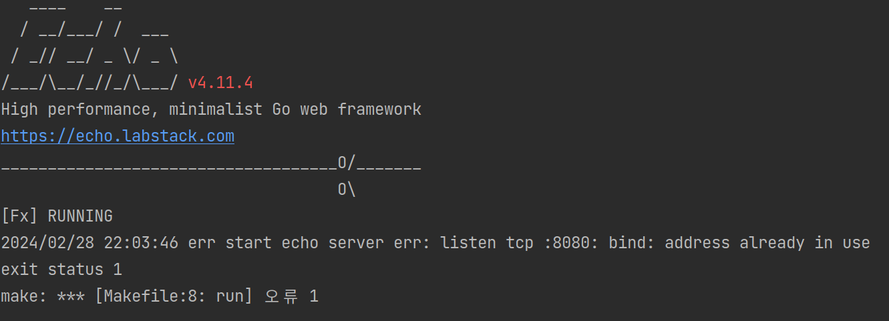

+++
author = "penguinit"
title = "Find out which port is being used by Ubuntu"
date = "2024-02-28"
description = "If you're running an Ubuntu or Linux-based server, you may find yourself shutting down with ports open, either by mistake or for unknown reasons. I'm sure you've experienced the problem of trying to restart your server only to find that the ports are already occupied. In this post, I'll show you how to check the ports you're using."
tags = [
"netstat", "ss", "lsof"
]
categories = [
"linux"
]
+++


## Overview

If you're running an Ubuntu or Linux-based server, you may find yourself shutting down with ports open due to user error or unknown reasons. I'm sure you've experienced the problem of trying to restart your server only to find that the port is already occupied. In this post, I'll show you how to check which ports are in use.

## Already occupied ports

If the port is already occupied, you will get an error like below because the port is not allocated. Other languages may output different errors, but they are all the same.
(The example is from the Golang Echo framework)



If you simply turn off the server to make the port idle, it's not a big deal, but for some reason, the port may still be holding up after you turn it off. In this case, you'll need to find the process that is holding the port and signal it to terminate via the kill command.

## Checking specific ports

In Ubuntu, there are several ways to see which ports are in use.

### Using netstat

Netstat is a tool that shows information about your network, including network connections, routing tables, interface statistics, and more. It is not installed by default in Ubuntu 18.04 and later versions, so you need to install the `net-tools` package to use it.

- To install

```bash
sudo apt update
sudo apt install net-tools
```

- Check the ports & processes in use

```bash
> netstat -ltnp
Active Internet connections (only servers)
Proto Recv-Q Send-Q Local Address           Foreign Address         State       PID/Program name    
tcp        0      0 127.0.0.1:1313          0.0.0.0:*               LISTEN      25411/hugo          
tcp        0      0 127.0.0.1:631           0.0.0.0:*               LISTEN      1266/cupsd          
tcp        0      0 127.0.0.53:53           0.0.0.0:*               LISTEN      1110/systemd-resolv 
tcp6       0      0 127.0.0.1:52829         :::*                    LISTEN      2584/./jetbrains-to 
tcp6       0      0 ::1:631                 :::*                    LISTEN      1266/cupsd          
tcp6       0      0 127.0.0.1:63342         :::*                    LISTEN      14295/java          
tcp6       0      0 :::8080                 :::*                    LISTEN      23185/main   
```

- `l` (listen): Displays only sockets in the listening state. A listening socket is a socket that is in the state of waiting for an external connection.
- `t` (TCP): Shows only connections for the TCP protocol.
- `n` (numeric): Displays addresses and port numbers as numbers. By default, `netstat` translates addresses and port numbers to their corresponding names; this option skips the translation and displays them as numbers.
- `p` (program): For each socket, display the PID and program name of the process using that socket. You may need root privileges to use this option.

### Using ss

The `ss` command can examine the sockets on your system more quickly than `netstat`. In recent versions of Ubuntu, `ss` is recommended as a replacement for `netstat`.

```bash
> ss -ltnp
State    Recv-Q   Send-Q          Local Address:Port  Peer     Address:Port    Process
LISTEN   0        4096            127.0.0.53%lo:53             0.0.0.0:*
LISTEN   0        5                   127.0.0.1:631            0.0.0.0:*
LISTEN   0        4096                127.0.0.1:1313           0.0.0.0:*       users:(("hugo",pid=25411,fd=3))
LISTEN   0        5                       [::1]:631            [::]:*
LISTEN   0        50         [::ffff:127.0.0.1]:52829          *:*             users:(("jetbrains-toolb",pid=2584,fd=55))
LISTEN   0        4096       [::ffff:127.0.0.1]:63342          *:*             users:(("java",pid=14295,fd=47))
LISTEN   0        4096                        *:8080           *:*             users:(("main",pid=23185,fd=7))
```

The -ltnp option has the same meaning as netstat.

### Using the lsof command

The `lsof` stands for "List Open Files" and shows a list of the files that are currently open on the system. You can use this tool to find out which processes are using a particular port.

- To install

```bash
sudo apt update
sudo apt install lsof
```

- Find processes using a specific port

```bash
sudo lsof -i :포트번호
COMMAND   PID    USER   FD   TYPE DEVICE SIZE/OFF NODE NAME
chrome   2954 penguin   56u  IPv4 673112      0t0  TCP localhost:58570->localhost:xtel (ESTABLISHED)
hugo    25411 penguin    3u  IPv4 663660      0t0  TCP localhost:xtel (LISTEN)
hugo    25411 penguin    8u  IPv4 677744      0t0  TCP localhost:xtel->localhost:58570 (ESTABLISHED)
```

## Summary

There are many ways to find out what ports are currently in use on Ubuntu. Depending on the situation, you can use tools like `netstat`, `ss`, `lsof`, and others as appropriate.  Which one is better is a matter of context and personal preference, so use what you're comfortable with (I prefer ss because it's shorter) and have it handy when you need it.