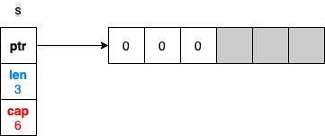

+++
author = "penguinit"
title = "Understanding exactly what length and capacity mean in a Go slice"
date = "2024-02-05"
description = "This article explains how length and capacity work in Slice, which you may have been using unconsciously, and where you can make mistakes with them, using examples."
tags = [
    "golang"
]

categories = [
    "language"
]
+++

## Overview

Explains how length and capacity work with Slice, which you may have been using unconsciously, and where you can make mistakes with it, with examples.

## What is a Slice

A slice is a data structure that abstracts the part of an array whose length is not fixed and can change dynamically. Slice is one of the most common ways to handle data collections in Go, similar to arrays but with more flexibility and power.

A slice contains a reference to an array by default, so when you pass a slice to another function, a memory reference is passed, allowing for changes to the original data.

The code below initializes a Slice with a length of 3 and a size of 6.

```go
s := make([]int, 3, 6)

// s: [0, 0, 0]
```

The make command creates two types of slices.
- The first is the Slice, which takes in the type to be constructed
- The second is the length value
- The third argument is the size value. The length value cannot be omitted and the size value can be omitted.

### What are length and size?

Here's a diagrammatic representation of the above example



- Length refers to the length of the values allocated in the actual array and can be checked using the `Len()` function.
- Size is the size of the entire allocated array and can be found using the `Cap()` function.

If you use the Append function here, the length will be increased, but the size will remain the same.

```go
s := make([]int, 3, 6)
s[1] = 1

s = append(a, 2)

// s: [0, 1, 0, 2]
```


What happens if we continue to append beyond the size **(6)** allocated by append? If we go over the size, the size of the Slice will be doubled (and later increased by 25% if we go over 1024).

To be more precise, the Slice's pointer will be changed to point to the newly created array at high runtime, and the existing internal array will be cleaned up by the Garbage Collector (GC).

```go
s := make([]int, 3, 6)
s[1] = 1

s = append(s, 2)

fmt.Printf("[address : %p, len: %v, cap : %v]\n", &s, len(s), cap(s))

s = append(s, 3, 4, 5)

fmt.Printf("[address : %p, len: %v, cap : %v]\n", &s, len(s), cap(s))

// [address : 0xc000010018, len: 4, cap : 6]
// [address : 0xc000010018, len: 7, cap : 12]
```


## What is Slicing

Slicing means creating a new slice using some elements from an existing slice. Creating a new Slice does not mean creating a new array, so if you don't know and use Slice well, your code may not work as intended.

`slice[start:end]`

- Where `start` represents the start index of the slice and `end` represents the end index of the slice. In this case, the elements at the `start` index are included in the resulting Slice, but the elements at the `end` index are not.

```go
s1 := make([]int, 3, 6)
s2 := s1[1:3]

// s1 : [0, 0, 0]
// s2 : [0, 0]
```


We explained that slicing creates a new slice that points to a specific element of the new array, so both s1 and s2 point to different elements of the same array. This means that if you change an array element in s2, it can affect s1 as well.

### Size and length

So what happens to the length and size of the new slice created by slicing? Referring back to the previous illustration, it's easier to understand. The bottom line is that s1 remains unchanged and s2 has a length of 2 and a size of 5.

Since s2's starting index is [1] and its size is fixed, we're going to size it based on that. Now here's where you might be wondering, because we said earlier that changes to s2 can affect s1, but what happens if s2 does an append, does that affect s1?

```go
s1 := make([]int, 3, 6)

s2 := s1[1:3]
s2[1] = 1

s2 = append(s2, 2)

// s1: [0 0 1]
// s2: [0 1 2]
```

By appending a value of 2 to s2, we have added a value to the 4th index of the array. Naturally, the length has been expanded, but this has no effect on s1, because in the s1 slice, the length is still 3. So even if there was actually a value at the 4th index, s1 wouldn't know.


### When the size is exceeded

What happens if you append to an array that exceeds its size? This part is no different than what we talked about earlier: a new array will be created at runtime, and the pointer to the slice that was exceeded will point to the new array value.

For example, what happens if we append the values 3,4,5 to s2? It will create an array that is twice as large as it was before because it is out of size, and s2 will point to that array.


The s1 and s2 pointers will now point to different arrays, and there will be no GC on the previously pointed array because it is still being referenced by s1. Changing the value of a particular index in s2 will have no effect on s1, because they are already pointing to different arrays.

```go
s1 := make([]int, 3, 6)

s2 := s1[1:3]
s2[1] = 1

s2 = append(s2, 2)
s2 = append(s2, 3, 4, 5)

s2[1] = 10

// s1: len=3, cap=6, [0 0 1]
// s2: len=6, cap=10, [0 10 2 3 4 5]
```

## Summary

We've summarized how Slice works in Golang.

In actual development, Slice is used a lot, and I think that if you understand the characteristics of Slice through this post, you can prevent possible mistakes.

---

***This post was written in reference to** **[Not understanding slice length and capacit](https://100go.co/20-slice/).***