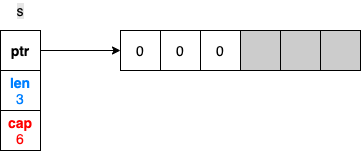

+++
author = "penguinit"
title = "Go 슬라이스에서 길이와 용량을 정확히 이해하기"
date = "2024-02-05"
description = "무의식적으로 쓰고 있었던 Slice에서 대해서 길이와 용량이 어떻게 동작하고 해당 부분에서 실수할 수 있는 부분들에 대해서 예제를 통해서 설명합니다."
tags = [
    "golang"
]

categories = [
    "language"
]
+++

## 개요

무의식적으로 쓰고 있었던 Slice에서 대해서 길이와 용량이 어떻게 동작하고 해당 부분에서 실수할 수 있는 부분들에 대해서 예제를 통해서 설명합니다.

## Slice란

Slice는 배열의 길이가 고정되어 있지 않고 동적으로 변할 수 있는 부분을 추상화한 자료 구조입니다. Slice는 Go에서 데이터 컬렉션을 다루는 가장 일반적인 방법 중 하나로, 배열과 유사하지만 더 유연하고 강력한 기능을 제공합니다.

Slice는 기본적으로 배열에 대한 참조를 포함합니다. 따라서 Slice를 다른 함수에 전달할 때는 메모리 참조가 전달되므로, 원본 데이터에 대한 변경이 가능합니다

아래 코드는 길이가 3, 크기가 6인 Slice를 초기화합니다.

```go
s := make([]int, 3, 6)

// s: [0, 0, 0]
```

make 명령을 통해서 만들 수 있습니다.
- 첫 번째는 Slice는 구성할 타입이 들어옵니다
- 두 번째는 길이값
- 세 번째 인자는 크기 값이 들어오게 됩니다. 길이 값은 생략될 수 없고 크기값은 생략될 수 있습니다.

### 길이와 크기란

위 예시에 대한 내용을 도식화하면 아래와 같습니다.



- 길이는 실제 배열에 할당된 값의 길이를 의미하고 `Len()`  함수를 이용해서 확인하실 수 있습니다.
- 크기는 할당된 배열 전체의 크기를 의미하고 `Cap()` 함수를 이용해서 확인하실 수 있습니다.

여기서 Append 함수를 하게 되면 길이는 늘어나도 크기는 그대로 유지가 됩니다.

```go
s := make([]int, 3, 6)
s[1] = 1

s = append(a, 2)

// s: [0, 1, 0, 2]
```


만약에 여기서 계속 append를 통해서 할당받은 크기 **(6)** 를 벗어나면 어떻게 될까요? 크기를 넘어가게 되면 Slice의 크기는 2배 늘어나게 됩니다. (나중에 1024를 넘어가면 25%씩 증가)

좀 더 정확히 얘기하자면 Slice의 포인터가 고 런타임에서 새롭게 만들어진 배열을 가리키도록 변경되고 기존에 있던 내부 배열은 GC(Garbage Collector)에서 정리가 됩니다.

```go
s := make([]int, 3, 6)
	s[1] = 1

	s = append(s, 2)

	fmt.Printf("[address : %p, len: %v, cap : %v]\n", &s, len(s), cap(s))

	s = append(s, 3, 4, 5)

	fmt.Printf("[address : %p, len: %v, cap : %v]\n", &s, len(s), cap(s))

// [address : 0xc000010018, len: 4, cap : 6]
// [address : 0xc000010018, len: 7, cap : 12]
```


## Slicing이란

Slicing이란 기존 Slice에서 일부 요소들을 이용해서 새로운 Slice를 만드는 작업을 의미합니다. 새로운 Slice가 만들어진다는 게 새로운 배열을 만든다는 뜻은 아니기 때문에 Slice를 잘 알고 쓰지 않는다면 의도한 대로 코드가 동작하지 않을 수도 있습니다.

`slice[start:end]`

- `start`는 Slicing 시작 인덱스를, `end`는 Slicing 끝 인덱스를 나타냅니다. 이 때, `start` 인덱스의 요소는 결과 Slice에 포함되지만, `end` 인덱스의 요소는 포함되지 않습니다.

```go
s1 := make([]int, 3, 6)
s2 := s1[1:3]

// s1 : [0, 0, 0]
// s2 : [0, 0]
```


Slicing을 하게 되면 새로운 배열의 특정 요소를 가리키는 새로운 Slice가 생성된다고 설명했고 그렇기 때문에 s1, s2 모두 같은 배열의 다른 요소를 가르키게 됩니다. 이말은 s2에서 배열 요소를 변경하게 되면 s1에도 영향을 끼칠 수 있다는 말이 됩니다.

### 크기와 길이

그러면 Slicing해서 새롭게 만들어지는 Slice의 길이와 크기는 어떻게 될까요? 이전의 그림을 참조하면 좀 더 이해가 쉽습니다. 결론부터 말하면 s1은 바뀐 게 없고 s2의 길이는 2, 크기는 5가 됩니다.

s2의 시작 인덱스가 [1]이고 크기는 고정되어 있기 때문에 해당 부분을 기준으로 크기를 정하게 됩니다. 그러면 여기서 궁금한 부분이 생길 수 있는데 앞서 말했듯이 s2의 변경이 s1에 영향을 줄 수 있다고 얘기를 했는데 s2가 append를 하게 되면 어떻게 될까요? s1에는 영향이 있을까요?

```go
s1 := make([]int, 3, 6)

s2 := s1[1:3]
s2[1] = 1

s2 = append(s2, 2)

// s1: [0 0 1]
// s2: [0 1 2]
```

s2에 2값을 append해서 배열의 4번째 인덱스에 값을 추가하였습니다. 자연스럽게 길이는 확장되었지만 s1에는 아무런 영향이 없습니다. 왜냐하면 s1 Slice에서 길이는 여전히 3이기 때문에 4번째 인덱스에 실제로 값이 있다 하더라도 s1은 알지 못합니다.


### 크기를 초과했을 때

앞서 언급했던 배열의 크기를 넘어서도록 append하면 무슨일이 일어날까요? 이 부분은 앞서 얘기한 것과 다르지 않습니다. 고 런타임에서 새로운 배열을 만들 것이고 초과한 Slice의 포인터는 새로운 배열 값을 가리키게 될 것 입니다.

예를 들어서 s2에 3,4,5 값은 Append하게 되면 어떻게 될까요? 크기를 벗어났음으로 기존보다 2배가 큰 크기의 배열이 만들어질 것 이고 s2는 해당 배열을 가리키게 될 것입니다.


이렇게 되면 s1과 s2 포인터는 서로 다른 배열을 가리키게 될 것이고 기존에 가리켰던 배열은 아직 s1이 참조하고 있기에 따로 GC가 동작하지도 않을 겁니다. s2의 특정 인덱스의 값을 바꾸도라도 s1에는 영향을 끼치지 못할 겁니다. 왜냐하면 이미 둘은 다른 배열을 가리키고 있기 때문입니다.

```go
s1 := make([]int, 3, 6)

s2 := s1[1:3]
s2[1] = 1

s2 = append(s2, 2)
s2 = append(s2, 3, 4, 5)

s2[1] = 10

// s1: len=3, cap=6, [0 0 1]
// s2: len=6, cap=10, [0 10 2 3 4 5]
```

## 정리

Golang에서 Slice가 어떻게 동작하는지에 대해서 정리를 해보았습니다.

실제 개발하다 보면 Slice는 엄청 많이 쓰이는데요 해당 포스팅을 통해서 Slice의 특성에 대해서 이해를 한다면 혹여나 있을 수 있는 실수를 미연에 방지할 수 있다고 생각합니다.

---

***해당 글은** **[Not understanding slice length and capacit](https://100go.co/20-slice/)을 참조해서 작성하였습니다.***