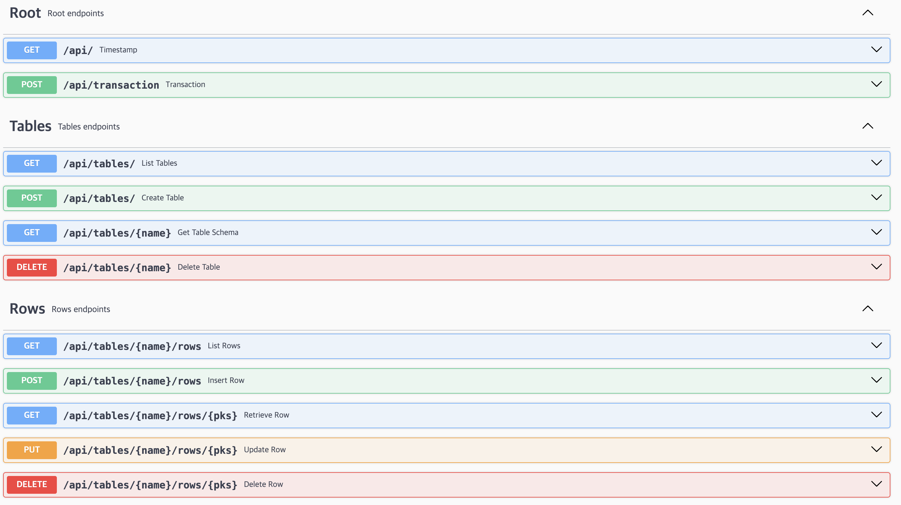

+++
author = "penguinit"
title = "Getting to know SQLite Soul, part 1"
date = "2024-03-24"
description = "I was looking at geeknews and saw an interesting open source project called SQLite Soul, so I thought I'd give it a try and post about it. It's a bit hands-on, so I'm splitting it into two posts because it can get long."
tags = [
"sqlite", "soul"
]
categories = [
"web"
]
+++


## Overview

I came across an interesting open source project called SQLite Soul on geeknews, so I thought I'd give it a try and post about it. It's a bit hands-on, so I'm splitting it into two posts.

## What is SQLite Soul

SQLite Soul is an open source project that provides a Realtime REST server for SQLite.
To summarize, you can create a RESTful API server using SQLite alone without any development implementation.

[https://thevahidal.github.io/soul/](https://thevahidal.github.io/soul/)

## Preparation

To actually implement this project, you'll need the following

- SQLite
- nodejs

### Install SQLite

- On a MAC, install

```bash
brew install sqlite
```bash brew install sqlite

- Installing on Linux (Debian)

```bash
sudo apt-get update
sudo apt install sqlite3
```

### Install nodejs

- Installing on MAC

```bash
brew install node
```bash brew install node

- Install on Linux (Debian)

```bash
curl -fsSL https://deb.nodesource.com/setup_lts.x | sudo -E bash -
sudo apt-get install -y nodejs
```

### Verify installation

- Verify node installation

``` bash
node --version
> v21.7.1
```

- Install sqlite

```bash
sqlite3 --version
> 3.43.2 2023-10-10 13:08:14 1b37c146ee9ebb7acd0160c0ab1f... (64-bit)
```

## Install Soul

After completing the above preparations, execute npm to install Soul.

```bash
 npm install -g soul-cli
```

If the installation is successful, you can see the output like below when you enter soul.

```bash
> soul

Usage: soul [options]

Options:
            --version Show version number [boolean]
  -d, --database SQLite database file or :memory:                    [string] [required]
  -p, --port Port to listen on [number]
  -r, --rate-limit-enabled Enable rate limiting [boolean].
  -c, --cors CORS whitelist origins [string]
  -a, --auth Enable authentication and authorization [boolean]

  --iuu, --initialuserusername Initial user username [string]
  --iup, --initialuserpassword Initial user password [string]

  --ts, --tokensecret Token Secret [string]
  --atet, --accesstokenexpirationtime Access Token Expiration Time (Default: 5H) [string]
  --rtet, --refreshtokenexpirationtime Refresh Token Expiration Time (Default: 1D) [string] [string] --rtet, --refreshtokenexpirationtime Refresh Token Expiration Time (Default: 1D) [string] [string
  -S, --studio Start Soul Studio in parallel
  --help Show help
```

## Prepare SQLite data

To test Soul, we created the Product and Inventory tables for an inventory management program in the SQLite database and inserted sample data.

### Product table

- **id**: Product's unique number
- **name**: Product name
- **category**: Product category
- **price**: Product price

| id | name     | category    | price |
|----|----------|-------------|-------|
| 1  | Laptop   | Electronics | 1200  |
| 2  | Mouse    | Electronics | 25    |
| 3  | Keyboard | Electronics | 45    |
| 4  | Monitor  | Electronics | 150   |
| 5  | Chair    | Furniture   | 85    |

### Inventory table

- **product_id**: Unique number of the product (associated with the id in the Product table)
- **quantity**: Inventory quantity

| product_id | quantity |
|------------|----------|
| 1          | 10       |
| 2          | 20       |
| 3          | 15       |
| 4          | 17       |
| 5          | 8        |

### Script

- Create a database

```bash
sqlite3 inventory.db
```

- DDL and data insertion

```bash
CREATE TABLE Product (
    id INTEGER PRIMARY KEY,
    name TEXT NOT NULL,
    category TEXT NOT NULL,
    price DECIMAL NOT NULL
);

CREATE TABLE Inventory (
    product_id INTEGER NOT NULL,
    quantity INTEGER NOT NULL,
    FOREIGN KEY(product_id) REFERENCES Product(id)
);

INSERT INTO Product (id, name, category, price) VALUES
(1, 'Laptop', 'Electronics', 1200),
(2, 'Mouse', 'Electronics', 25),
(3, 'Keyboard', 'Electronics', 45),
(4, 'Monitor', 'Electronics', 150),
(5, 'Chair', 'Furniture', 85);

INSERT INTO Inventory (product_id, quantity) VALUES
(1, 10),
(2, 20),
(3, 15),
(4, 17),
(5, 8);
```

After executing and exiting the above script, we have all the data set up for testing: (inventory.db)

## Run the server

Execute the command below to start the SQLite-based Realtime API server on port 8000.

```bash
soul -d inventory.db -p 8000

Warning: Soul is running in open mode without authentication or authorization for API endpoints. 
Please be aware that your API endpoints will not be secure.
No extensions directory provided
Soul is running...
 > Core API at http://localhost:8000/api/
```

When the server is executed above, the RESTful API server is operated based on the table. Currently, the tables we created are Product and Inventory, and if you want to get all the product-related data, you can call them like below.

- Calling the Product Table

```bash
curl -X GET http://localhost:8000/api/tables/Product/rows
```

- Call result

```json
{
   "data":[
      {
         "id":1,
         "name":"Laptop",
         "category":"Electronics",
         "price":1200
      },
      {
         "id":2,
         "name":"Mouse",
         "category":"Electronics",
         "price":25
      },
      {
         "id":3,
         "name":"Keyboard",
         "category":"Electronics",
         "price":45
      },
      {
         "id":4,
         "name":"Monitor",
         "category":"Electronics",
         "price":150
      },
      {
         "id":5,
         "name":"Chair",
         "category":"Furniture",
         "price":85
      }
   ],
   "total":5,
   "next":null,
   "previous":null
}
```

As you can see, we've simply connected SQLite via soul, and the requests are exposed as if we've implemented a real API server. We can even go into `localhost:8000/api/docs` and see that it even generates the relevant API-related Swagger for us.



## Summary

In this post, we learned about the Soul project and did some preliminary work to get started with it. We saw a simple table stored in SQLite and called through the server, and in the next post, we will go deeper into the authentication and CRUD features provided by Soul.

Translated with DeepL.com (free version)