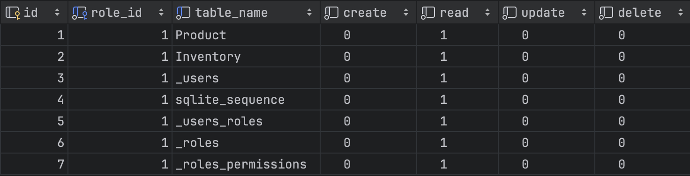

+++
author = "penguinit"
Title = "Learn about SQLite Soul Part 2"
date = "2024-03-25"
description = "Learn more about SQLite Soul. Learn more about Soul's certification and CRUD API through hands-on experience."
tags = [
"sqlite", "soul"
]
categories = [
"web"
]
+++


<div class="callout-box">
  <span class="callout-icon">💡</span>
  <div class="callout-content">
    <p>Related Series</p>
    <p><a href="/en/post/202403/10/">✅ Learn about SQLite Soul Part 1</a></p>
  </div>
</div>

## Overview
Learn more about SQLite Soul. Learn more about Soul's certification and CRUD API through hands-on experience.

## SQLite authentication
Authentication is mandatory when running a real API server. In Soul, you can set up related functions very simply.

```bash
soul -p 8000 --d inventory.db -a --ts=secret --atet=4H --rtet=3D --iuu=penguin --iup=YQ8iTCN3OFhVF2r!
```

For each option below, we explain what it means.

- a option: Enable authentication and authorization [boolean].
- ts option: JWT TOKEN SECRET KEY [string].
- atet option: Access Token expiration time [string]
- rtet option: Refresh Token expiration time [string]
- iuu option: Initial User ID [string] [string
- IUP option: Initial user password [string]

If you run the server with this option, the user and permission tables are created and authentication is requested for all APIs.

### superuser
When the server is initially started in authentication-required mode, a user is created with the initial values. The user will be granted per-table permissions for CRUD for each API, but will only have READ permissions unless otherwise specified.



For ease of testing, we'll change the user we initially created to a superuser, although this shouldn't be necessary if you're actually configuring a program with Soul.

```bash
soul --d inventory.db updatesuperuser --id=1 --is_superuser=true
```

## Authenticate
After initially creating the user, you will not need to enter a user and password the next time you spin up the server.

```bash
$ soul -p 8000 --d inventory.db -a --ts=secret --atet=4H --rtet=3D
```

You can use the following API to get the authentication value.

```bash
$ curl -X POST 'http://localhost:8000/api/auth/token/obtain' \
--header 'Content-Type: application/json' \
--data '{
    "fields":         {
            "username" :"penguin",
            "password" : "YQ8iTCN3OFhVF2r!"
        }
}'

{"message":"Success","data":{"userId":1}}
```

If the authentication API succeeds, it will send down the cookie values for the Access Key and Secret Key as headers.

If you include the cookie values and execute the following, the API values will respond normally.

```bash
curl -X GET 'http://localhost:8000/api/tables/Product/rows' \
--header 'Cookie: accessToken={accessToken}'
```

- The response value

```json
{
    "data": [
        {
            "id": 1,
            "name": "Laptop",
            "category": "Electronics",
            "price": 1200
        },
        {
            "id": 2,
            "name": "Mouse",
            "category": "Electronics",
            "price": 25
        },
        {
            "id": 3,
            "name": "Keyboard",
            "category": "Electronics",
            "price": 45
        },
        {
            "id": 4,
            "name": "Monitor",
            "category": "Electronics",
            "price": 150
        },
        {
            "id": 5,
            "name": "Chair",
            "category": "Furniture",
            "price": 85
        }
    ],
    "total": 5,
    "next": null,
    "previous": null
}
```

## Lookups
In general, Soul provides a lot of filtering or paging related processing that can be done by developing a lookup API.

### Paging
You can utilize paging functionality when making a lookup.

- The request

```bash
curl -X GET 'http://localhost:8000/api/tables/Product/rows?_limit=2&_page=1' \
--header 'Cookie: accessToken={accessToken}'
```

- Response

```json
{
    "data": [
        {
            "id": 1,
            "name": "Laptop",
            "category": "Electronics",
            "price": 1200
        },
        {
            "id": 2,
            "name": "Mouse",
            "category": "Electronics",
            "price": 25
        }
    ],
    "total": 5,
    "next": "/tables/Product/rows?_limit=2&_page=2",
    "previous": null
}
```

The response value gives the URL path to the previous or next page, if any: (previous, next)

### Searching
The List API provides search functionality. You can search for a specific value or compare values.

- Search for values that contain the word Laptop

    ```bash
    curl -X GET 'http://localhost:8000/api/tables/Product/rows?_search=laptop' \
    --header 'Cookie: accessToken={accessToken}'
    ```

- Response value

    ```bash
    {
        "data": [
            {
                "id": 1,
                "name": "Laptop",
                "category": "Electronics",
                "price": 1200
            }
        ],
        "total": 1,
        "next": Null,
        "previous": null
    }
    ```


- Retrieve products with prices over 100 won

    ```bash
    curl -X GET 'http://localhost:8000/api/tables/Product/rows?_filters=price__gt:100' \
    --header 'Cookie: accessToken={accessToken}'
    ```

- Response value

    ```bash
    {
        "data": [
            {
                "id": 1,
                "name": "Laptop",
                "category": "Electronics",
                "price": 1200
            },
            {
                "id": 4,
                "name": "Monitor",
                "category": "Electronics",
                "price": 150
            }
        ],
        "total": 2,
        "next": Null,
        "previous": null
    }
    ```


### Single lookup
You can get a single lookup of a specific value using an ID.

- The request value

    ```bash
    curl --location 'http://localhost:8000/api/tables/product/rows/5' \
    --header 'Cookie: accessToken={accessToken}'
    ```

- Response value

    ```bash
    {
        "data": [
            {
                "id": 5,
                "name": "Chair",
                "category": "Furniture",
                "price": 85
            }
        ]
    }
    ```


### Create
You can use the POST function to create a resource for a table.

- The request value

    ```bash
    curl -X POST 'http://localhost:8000/api/tables/product/rows' \
    --header 'Content-Type: application/json' \
    --header 'Cookie: accessToken={accessToken}' \ --header 'Cookie: accessToken={accessToken}'
    --data '{
        "fields" : {
            "name": "Monitor",
            "category": "Electronics",
            "price": 500
        }
    }'
    ```

- Response value

    ```json
    {
        "message": "Row inserted",
        "data": {
            "changes": 1,
            "lastInsertRowid": 6
        }
    }
    ```


### Update
Updates the value of a specific resource. The update is performed as a partial update. (Update price value to 1000)

- Request value

    ```bash
    curl -X PUT 'http://localhost:8000/api/tables/product/rows/6' \
    --header 'Content-Type: application/json' \
    --header 'Cookie: accessToken={accessToken}' \ --header 'Cookie: accessToken={accessToken}'
    --data '{
        "fields" : {
            "price": 1000
        }
    }'
    ```

- Response value

    ```json
    {
        "message": "Row updated",
        "data": {
            "changes": 1,
            "lastInsertRowid": 6
        }
    }
    ```


### Delete
Deletes a resource in a table with a specific ID value.

- Request value

    ```bash
    curl -X DELETE 'http://localhost:8000/api/tables/product/rows/6' \
    --header 'Cookie: accessToken={acccesToken}'
    ```


- Response value

    ```bash
    {
        "message": "Row deleted",
        "data": {
            "changes": 1,
            "lastInsertRowid": 6
        }
    }
    ```


## Summary
In this post, we've shown how to set up and work with authentication in Soul, and how you can create CRUD APIs in no time with just SQLite, calling all of them, and see how they work in practice. While it may not be enough for real complex needs, I think it's a project that can be incredibly productive for simple needs and in certain situations.

In addition to this CRUD, Soul also has support for the Join syntax, the ability to perform literal transactions, and web sockets. If I have time in the future, I'll try to write a third installment.