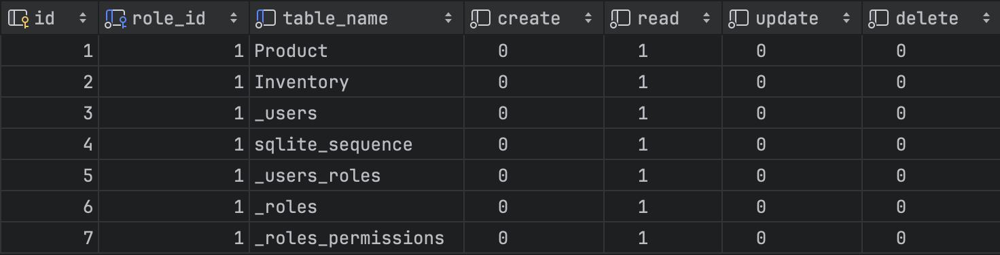

+++
author = "penguinit"
title = "SQLite Soul에 대해서 알아보기 2편"
date = "2024-03-25"
description = "SQLite Soul에 대해서 알아보기 1편에서 이어지는 글입니다. Soul의 인증과 CRUD API를 실습을 통해서 좀 더 자세하게 알아봅니다."
tags = [
"sqlite", "soul"
]
categories = [
"web"
]
+++


<div class="callout-box">
  <span class="callout-icon">💡</span>
  <div class="callout-content">
    <p>관련 시리즈</p>
    <p><a href="/post/202403/10/">✅ SQLite Soul에 대해서 알아보기 1편</a></p>
  </div>
</div>


## 개요
SQLite Soul에 대해서 알아보기 1편에서 이어지는 글입니다. Soul의 인증과 CRUD API를 실습을 통해서 좀 더 자세하게 알아봅니다.

## SQLite 인증
실제 API 서버를 운영하다 보면 인증은 필수로 붙이게 됩니다. Soul에서는 아주 간단하게 관련 기능을 설정할 수 있습니다. 

```bash
soul -p 8000 --d inventory.db -a --ts=secret --atet=4H --rtet=3D --iuu=penguin --iup=YQ8iTCN3OFhVF2r!
```

아래 각 옵션에 대해서 어떤 것을 의미하는지 설명합니다. 

- a 옵션 : 인증 및 권한 부여 사용 [boolean]
- ts 옵션 : jwt token secret key [string]
- atet 옵션 : Access Token 만료시간 [string]
- rtet 옵션 : Refresh Token 만료시간 [string]
- iuu 옵션 : 초기 유저 아이디 [string]
- iup 옵션 : 초기 유저 패스워드 [string]

해당 옵션을 이용해서 서버를 운영하게 되면 유저와 권한 관련 테이블들이 생성되고 모든 API에 대해서 인증을 필수로 요청받게 됩니다.

### 슈퍼 유저
인증이 필요한 모드로 서버를 최초에 띄우면 초기에 설정한 값대로 유저가 생성됩니다. 유저는 각 API에 대해서 CRUD에 대한 각 테이블 별 권한을 부여받습니다. 따로 명시하지 않는 이상은 READ 권한만을 가집니다.



실제로 Soul을 가지고 프로그램을 구성한다면 그렇게 해서는 안 되겠지만 테스트의 용이성을 위해서 초기에 생성한 유저를 슈퍼유저로 변경합니다.

```bash
soul --d inventory.db updatesuperuser --id=1 --is_superuser=true
```

## 인증
최초에 유저를 만들고 나서는 다음에 서버를 띄울 때는 유저 및 패스워드는 입력하지 않아도 됩니다.

```bash
$ soul -p 8000 --d inventory.db -a --ts=secret --atet=4H --rtet=3D
```

아래 API를 이용해서 인증 값을 받을 수 있습니다.

```bash
$ curl -X POST 'http://localhost:8000/api/auth/token/obtain' \
--header 'Content-Type: application/json' \
--data '{
    "fields":         {
            "username" :"penguin",
            "password" : "YQ8iTCN3OFhVF2r!"
        }
}'

{"message":"Success","data":{"userId":1}}
```

인증 API가 성공되면 Access Key와 Secret Key에 대한 쿠키 값을 헤더로 내려주게 됩니다. 

쿠키 값을 넣어서 아래와 같이 수행을 하게 되면 API 값이 정상적으로 응답하게 됩니다. 

```bash
curl -X GET 'http://localhost:8000/api/tables/Product/rows' \
--header 'Cookie: accessToken={accessToken}'
```

- 응답 값

```json
{
    "data": [
        {
            "id": 1,
            "name": "Laptop",
            "category": "Electronics",
            "price": 1200
        },
        {
            "id": 2,
            "name": "Mouse",
            "category": "Electronics",
            "price": 25
        },
        {
            "id": 3,
            "name": "Keyboard",
            "category": "Electronics",
            "price": 45
        },
        {
            "id": 4,
            "name": "Monitor",
            "category": "Electronics",
            "price": 150
        },
        {
            "id": 5,
            "name": "Chair",
            "category": "Furniture",
            "price": 85
        }
    ],
    "total": 5,
    "next": null,
    "previous": null
}
```

## 조회
일반적으로 조회 API를 개발하면 할 수 있는 여러 가지 필터링이나 페이징 관련 처리를 Soul을 자체적으로 제공을 합니다.

### 페이징
조회를 했을 때 페이징 기능을 활용할 수 있습니다.

- 요청값

```bash
curl -X GET 'http://localhost:8000/api/tables/Product/rows?_limit=2&_page=1' \
--header 'Cookie: accessToken={accessToken}'
```

- 응답값

```json
{
    "data": [
        {
            "id": 1,
            "name": "Laptop",
            "category": "Electronics",
            "price": 1200
        },
        {
            "id": 2,
            "name": "Mouse",
            "category": "Electronics",
            "price": 25
        }
    ],
    "total": 5,
    "next": "/tables/Product/rows?_limit=2&_page=2",
    "previous": null
}
```

응답 값에는 만약 이전 페이지나 다음 페이지가 있다면 해당 URL Path를 제시합니다. (previous, next) 

### 검색
리스트 API에서  검색 기능을 제공하고 있습니다. 특정 값에 대해서 조회를 하거나 비교해서 값을 조회할 수 있습니다. 

- Laptop이라는 단어를 포함하고 있는 값을 조회
    
    ```bash
    curl -X GET 'http://localhost:8000/api/tables/Product/rows?_search=laptop' \
    --header 'Cookie: accessToken={accessToken}'
    ```
    
- 응답 값
    
    ```bash
    {
        "data": [
            {
                "id": 1,
                "name": "Laptop",
                "category": "Electronics",
                "price": 1200
            }
        ],
        "total": 1,
        "next": null,
        "previous": null
    }
    ```
    

- 가격이 100원 이상이 되는 상품을 조회
    
    ```bash
    curl -X GET 'http://localhost:8000/api/tables/Product/rows?_filters=price__gt:100' \
    --header 'Cookie: accessToken={accessToken}'
    ```
    
- 응답 값
    
    ```bash
    {
        "data": [
            {
                "id": 1,
                "name": "Laptop",
                "category": "Electronics",
                "price": 1200
            },
            {
                "id": 4,
                "name": "Monitor",
                "category": "Electronics",
                "price": 150
            }
        ],
        "total": 2,
        "next": null,
        "previous": null
    }
    ```
    

### 단건조회
ID를 이용해서 특정 값을 단건 조회 할 수 있습니다.

- 요청 값
    
    ```bash
    curl --location 'http://localhost:8000/api/tables/product/rows/5' \
    --header 'Cookie: accessToken={accessToken}'
    ```
    
- 응답 값
    
    ```bash
    {
        "data": [
            {
                "id": 5,
                "name": "Chair",
                "category": "Furniture",
                "price": 85
            }
        ]
    }
    ```
    

### 생성
POST 함수를 이용해서 테이블의 리소스를 생성할 수 있습니다.

- 요청 값
    
    ```bash
    curl -X POST 'http://localhost:8000/api/tables/product/rows' \
    --header 'Content-Type: application/json' \
    --header 'Cookie: accessToken={accessToken}' \
    --data '{
        "fields" : {
            "name": "Monitor",
            "category": "Electronics",
            "price": 500
        }
    }'
    ```
    
- 응답 값
    
    ```json
    {
        "message": "Row inserted",
        "data": {
            "changes": 1,
            "lastInsertRowid": 6
        }
    }
    ```
    

### 업데이트
특정 리소스의 값을 업데이트 합니다. 업데이트는 부분 업데이트로 진행됩니다. (price 값을 1000으로 업데이트)

- 요청 값
    
    ```bash
    curl -X PUT 'http://localhost:8000/api/tables/product/rows/6' \
    --header 'Content-Type: application/json' \
    --header 'Cookie: accessToken={accessToken}' \
    --data '{
        "fields" : {
            "price": 1000
        }
    }'
    ```
    
- 응답 값
    
    ```json
    {
        "message": "Row updated",
        "data": {
            "changes": 1,
            "lastInsertRowid": 6
        }
    }
    ```
    

### 삭제
특정 ID 값으로 테이블의 리소스를 삭제할 수 있습니다. 

- 요청 값
    
    ```bash
    curl -X DELETE 'http://localhost:8000/api/tables/product/rows/6' \
    --header 'Cookie: accessToken={acccesToken}'
    ```
    

- 응답 값
    
    ```bash
    {
        "message": "Row deleted",
        "data": {
            "changes": 1,
            "lastInsertRowid": 6
        }
    }
    ```
    

## 정리
Soul의 인증은 어떻게 설정하고 동작하는지를 설명하였고 CRUD API들을 모두 호출하면서 SQLite만 있으면 순식간에 CRUD API를 만들고 실제로 어떻게 동작하는지에 대해서 해당 포스팅을 통해서 알아보았습니다. 실제 복잡한 요구사항에 대응하기에는 부족할 수 있지만 간단한 요구사항이나 특정 상황에서는 엄청나게 생산성을 올려줄 수 있는 프로젝트라고 생각합니다. 

Soul에서는 이런 CRUD 외에도 Join 구문에 대한 지원과 리터럴 한 트랜잭션 수행 및 웹 소켓 기능도 지원을 하고 있습니다. 향후에 시간이 된다면 3편을 이어서 작성해보려고 합니다.