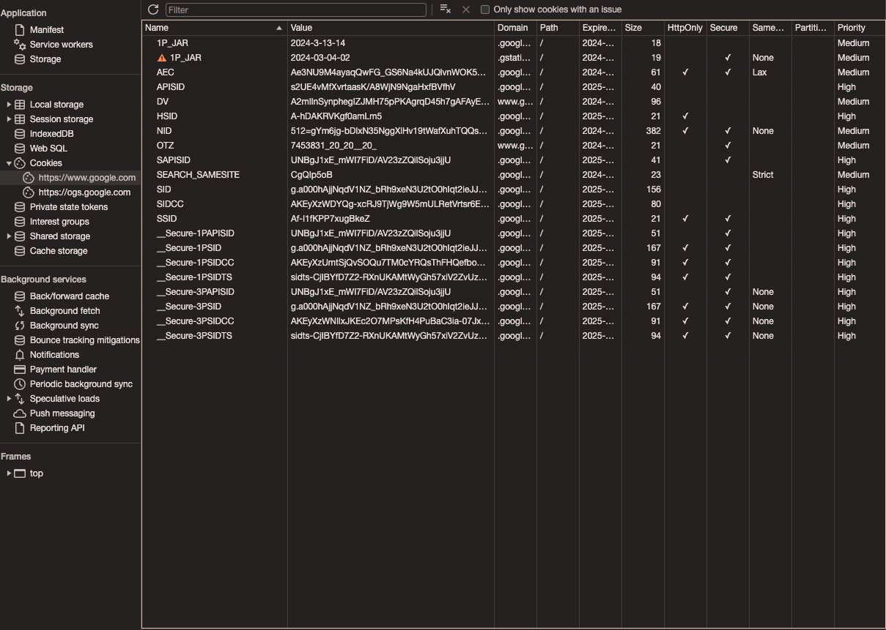

+++
author = "penguinit"
title = "How to save data in the browser"
date = "2024-03-13"
description = "In web development, we often need to store and manage various data on the client side. In particular, when communicating with a server, we can store and use credentials or session information in the browser, and browsers provide several techniques for doing so. In this post, I'll introduce you to the different ways to store data in the browser and their features."
tags = [
"cookies", "browser"
]
categories = [
"web"
]
+++

## Overview

In web development, we often need to store and manage various data on the client side. In particular, when communicating with a server, we can store and use credentials and session information in the browser, and the browser provides several techniques for doing so. In this post, I will introduce the different ways to store data in the browser and their characteristics.

## What is a cookie

A term you've probably heard a lot, both good and bad, cookies are data that is stored in your browser when you visit a website. Cookies stored by a particular site can be sent back to the server and are used by the website to remember your web browser.



### How it works

1. a user visits a website.
2. the website server asks the user's browser to store a cookie.
3. The browser saves this cookie on the user's device.
4. When the user visits the same website again, the browser sends this cookie back to the server, which uses the cookie information to identify the user.

### Properties

Cookies can have the following attributes

- `Value`: This is the part that stores the actual data.
- `Expires/Max-Age`: Determines how long the cookie will live. If not set, it will be a session cookie and will be deleted when you close the browser.
- `Domain`: Specifies the domain from which the cookie can be sent. By default, it is set to the domain of the site that generated the cookie.
- `Path`: Specifies the path where the cookie can be sent.
- `Secure`: If this property is set, cookies are sent only over the HTTPS protocol.
- `HttpOnly`: Prohibits cookies from being accessed via JavaScript. This helps prevent XSS attacks via cookies.

### Server Example (Golang)

Using the golang echo package, I wrote a simple code to generate a cookie and send it to the client.

```go
package main

import (
    "github.com/labstack/echo/v4"
    "net/http"
    "time"
)

func main() {
    e := echo.New()

    e.POST("/login", func(c echo.Context) error {
        // Generate the JWT after the user authentication logic (here we put our own token as an example)
        token := "your.jwt.token.here"

        cookie := new(http.Cookie)
        cookie.Name = "jwt"
        cookie.Value = token
        cookie.Expires = time.Now().Add(24 * time.Hour)
        cookie.HttpOnly = true // prevent client scripts from accessing the cookie

        c.SetCookie(cookie)

        return c.String(http.StatusOK, "Login Successful and JWT stored in cookie")
    })

    e.Logger.Fatal(e.Start(":8080"))
}
```

You can prevent scripts on the client from accessing the cookie via a field called HttpOnly.

## What is Web Storage

This is a data storage mechanism provided by the browser that is stored in the browser similar to cookies, but unlike cookies, it is not automatically sent to the server. There is local storage and session storage, which can be stored in key/value form, and IndexedDB, which can store more complex forms of data, but we'll cover that later.

### Local storage

Allows you to store data persistently in the user's browser, and the data persists between browser sessions, meaning it doesn't disappear when the user closes and reopens the browser.

**Features

- Can store large amounts of data (typically 5MB to 10MB).
- Not automatically sent to the server.
- Stored separately by domain.
- Not shared between HTTP and HTTPS content.

### Local storage examples

How to use local storage to store and read back a user's language preference settings.

```jsx
// Store data in local storage
localStorage.setItem('preferredLanguage', 'en');

// Read data from local storage
const preferredLanguage = localStorage.getItem('preferredLanguage');
console.log(preferredLanguage); // print 'en'

// Delete data from local storage
localStorage.removeItem('preferredLanguage');

// Delete all data from local storage
localStorage.clear();
```

### Session storage

Session storage stores data until the user closes the browser tab, meaning that data is only retained as long as the tab or window is open.

**Features**

- Data is destroyed when the tab or window is closed.
- Can store large amounts of data, similar to local storage.
- Not automatically sent to the server.
- Managed uniquely by each tab or window.

### Session storage examples

How to use session storage to store and read back a user's temporary shopping cart ID.

```jsx
// Store data in session storage
sessionStorage.setItem('cartId', '12345');

// Read data from session storage
const cartId = sessionStorage.getItem('cartId');
console.log(cartId); // print '12345'

// Delete data from session storage
sessionStorage.removeItem('cartId');

// Delete all data from session storage
sessionStorage.clear();

```

## Cookies vs Web Storage

It's hard to say which is "better": web storage or cookies. Depending on your use case, you'll need to decide which is better for you. For example, if you want to use large amounts of data only on the client side, web storage might be better for you. On the other hand, if you need to maintain state with the server or have security-critical data, you might be better off using cookies.

As explained above, the HttpOnly option is present in cookies, whereas web storage does not have that feature, which can make it vulnerable to cross-site scripting (XSS) attacks.

## Summary

We've seen how there are different ways to store data in the browser and how you can access and store it through examples. As mentioned above, there are similarities, but it's important to find the right method for your purposes.