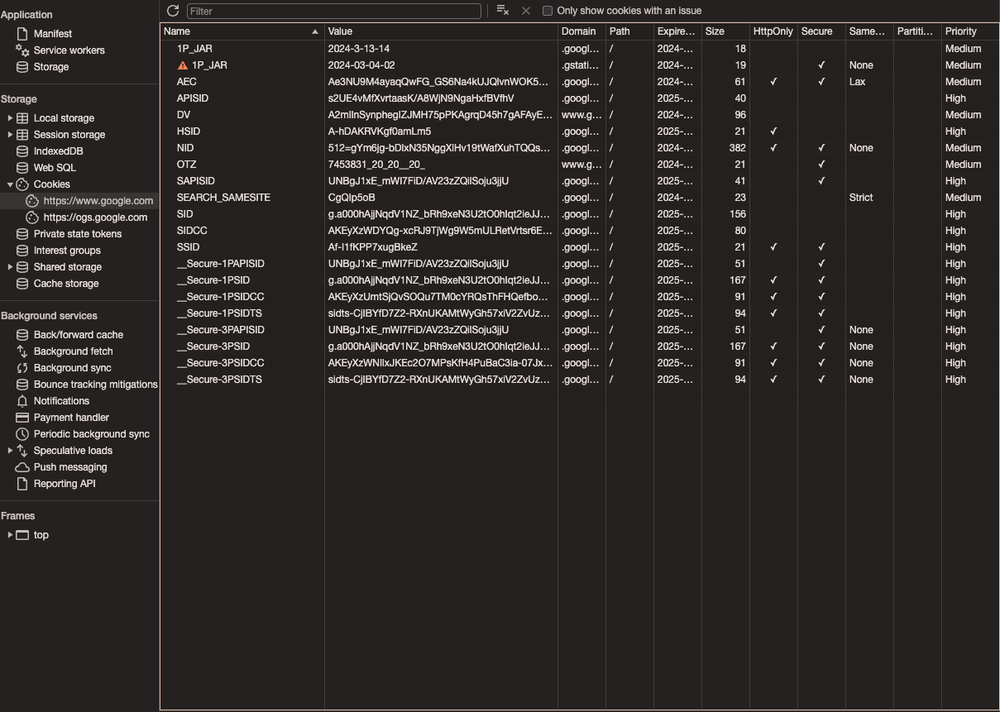

+++
author = "penguinit"
title = "브라우저에서 데이터를 저장하는 방법"
date = "2024-03-13"
description = "웹 개발을 하다 보면 다양한 데이터를 클라이언트 측에서 저장하고 관리해야 할 필요가 있습니다. 특히 서버와 통신할 때는 인증정보나 세션 정보들을 브라우저에 저장하고 사용할 수 있으며, 브라우저에서는 이를 위한 여러 가지 기술들을 제공합니다. 해당 포스팅을 통해서 브라우저에서 데이터를 저장하는 방법에는 어떤 것들이 있고 각자의 특징에 대해서 알아보겠습니다."
tags = [
"cookies", "browser"
]
categories = [
"web"
]
+++

## 개요

웹 개발을 하다 보면 다양한 데이터를 클라이언트 측에서 저장하고 관리해야 할 필요가 있습니다. 특히 서버와 통신할 때는 인증정보나 세션 정보들을 브라우저에 저장하고 사용할 수 있으며, 브라우저에서는 이를 위한 여러 가지 기술들을 제공합니다. 해당 포스팅을 통해서 브라우저에서 데이터를 저장하는 방법에는 어떤 것들이 있고 각자의 특징에 대해서 알아보겠습니다. 

## 쿠키란

긍정적이던/부정적이던 많이 들어봤을 용어인데 쿠키는 웹 사이트에 접속할 때 사용자의 브라우저에 저장되는 데이터를 말합니다. 특정 사이트에서 저장된 쿠키는 서버로 다시 전송될 수 있으며 웹 사이트가 해당 웹 브라우저를 기억하는데 이용합니다. 



### 동작방식

1. 사용자가 웹 사이트를 방문합니다.
2. 웹 사이트 서버는 사용자의 브라우저에 쿠키를 저장하라는 요청을 합니다.
3. 브라우저는 이 쿠키를 사용자의 디바이스에 저장합니다.
4. 사용자가 동일한 웹 사이트를 다시 방문하면 브라우저는 이 쿠키를 서버로 다시 전송하고, 서버는 이 쿠키 정보를 사용하여 사용자를 식별합니다.

### 속성

쿠키는 다음과 같은 속성을 가질 수 있습니다

- **값(Value)**: 실제 데이터를 저장하는 부분입니다.
- **만료 기간(Expires)/최대 수명(Max-Age)**: 쿠키의 생존 기간을 정합니다. 설정하지 않으면 세션 쿠키가 되며, 브라우저를 닫을 때 삭제됩니다.
- **도메인(Domain)**: 쿠키가 전송될 수 있는 도메인을 지정합니다. 기본적으로 쿠키를 생성한 사이트의 도메인으로 설정됩니다.
- **경로(Path)**: 쿠키가 전송될 수 있는 경로를 지정합니다.
- **보안(Secure)**: 이 속성이 설정되면 쿠키는 HTTPS 프로토콜을 통해서만 전송됩니다.
- **HttpOnly**: JavaScript를 통한 쿠키의 접근을 금지합니다. 이는 쿠키를 통한 XSS 공격을 방지하는 데 도움이 됩니다.

### 서버 예제 (Golang)

golang echo 패키지를 이용해서 간단하게 Cookie를 생성해서 클라이언트에 내려주는 코드를 작성해 보았습니다.

```go
package main

import (
    "github.com/labstack/echo/v4"
    "net/http"
    "time"
)

func main() {
    e := echo.New()

    e.POST("/login", func(c echo.Context) error {
        // 사용자 인증 로직 후 JWT 생성 (여기서는 예시로 직접 토큰을 넣음)
        token := "your.jwt.token.here"

        cookie := new(http.Cookie)
        cookie.Name = "jwt"
        cookie.Value = token
        cookie.Expires = time.Now().Add(24 * time.Hour)
        cookie.HttpOnly = true // 클라이언트 스크립트가 쿠키에 접근하지 못하도록 함

        c.SetCookie(cookie)

        return c.String(http.StatusOK, "Login Successful and JWT stored in cookie")
    })

    e.Logger.Fatal(e.Start(":8080"))
}
```

HttpOnly라는 필드를 통해서 클라이언트의 스크립트가 쿠키에 접근하지 못하도록 설정할 수 있습니다. 

## 웹 스토리지란

브라우저에서 제공하는 데이터 저장 메커니즘으로 쿠키와 유사하게 브라우저에 저장되지만 쿠키와 달리 서버에 자동으로 전송되지는 않습니다. key/value 형태로 저장할 수 있는 로컬 스토리지와 세션 스토리지가 있고 좀 더 복잡한 형태의 데이터를 저장할 수 있는 IndexedDB가 있는데 해당 부분은 나중에 따로 다뤄보겠습니다. 

### 로컬 스토리지

사용자의 브라우저에 데이터를 영구적으로 저장할 수 있게 해주며, 브라우저 세션 간에도 데이터가 유지됩니다. 즉, 사용자가 브라우저를 닫았다가 다시 열어도 데이터가 사라지지 않습니다.

**특징**

- 대용량 데이터 저장 가능 (일반적으로 5MB ~ 10MB).
- 서버로 자동 전송되지 않음.
- 도메인별로 구분되어 저장됨.
- HTTP와 HTTPS 콘텐츠 간에는 공유되지 않음.

### 로컬 스토리지 예제

로컬 스토리지를 사용하여 사용자의 선호 언어 설정을 저장하고, 이를 다시 읽는 방법입니다.

```jsx
// 로컬 스토리지에 데이터 저장
localStorage.setItem('preferredLanguage', 'en');

// 로컬 스토리지에서 데이터 읽기
const preferredLanguage = localStorage.getItem('preferredLanguage');
console.log(preferredLanguage); // 'en' 출력

// 로컬 스토리지에서 데이터 삭제
localStorage.removeItem('preferredLanguage');

// 로컬 스토리지의 모든 데이터 삭제
localStorage.clear();
```

### 세션 스토리지

세션 스토리지는 사용자가 브라우저 탭을 닫을 때까지 데이터를 저장합니다. 즉, 탭이나 창이 열려 있는 동안에만 데이터가 유지됩니다.

**특징**

- 탭 또는 창을 닫으면 데이터가 소멸됨.
- 로컬 스토리지와 유사하게 대용량 데이터 저장 가능.
- 서버로 자동 전송되지 않음.
- 각 탭 또는 창에서 고유하게 관리됨.

### 세션 스토리지 예제

세션 스토리지를 사용하여 사용자의 임시 쇼핑 카트 ID를 저장하고, 이를 다시 읽는 방법입니다.

```jsx
// 세션 스토리지에 데이터 저장
sessionStorage.setItem('cartId', '12345');

// 세션 스토리지에서 데이터 읽기
const cartId = sessionStorage.getItem('cartId');
console.log(cartId); // '12345' 출력

// 세션 스토리지에서 데이터 삭제
sessionStorage.removeItem('cartId');

// 세션 스토리지의 모든 데이터 삭제
sessionStorage.clear();

```

## 쿠키 vs 웹 스토리지

웹 스토리지와 쿠키 중 어떤 것이 "더 좋다"고 말하기는 어렵습니다. 각각의 사용 사례에 따라, 어느 쪽이 더 적합할지 결정해야 합니다. 예를 들어, 대량의 데이터를 클라이언트 측에서만 사용하고 싶다면 웹 스토리지가 더 적합할 수 있습니다. 반면, 서버와의 상태를 유지해야 하거나 보안이 중요한 데이터는 쿠키를 사용하는 것이 더 나을 수 있습니다.

위에 설명했듯이 HttpOnly 옵션은 쿠키에 있은 반면 웹 스토리지에는 해당 기능이 없기 때문에 XSS(Cross Site Scripting, XSS) 공격에 취약할 수 있습니다. 

## 정리

브라우저에서 데이터를 저장하는 방법에는 어떤 방식이 있는지와 예제를 통해서 어떻게 접근하고 저장할 수 있는지 알아보았습니다. 위에 언급했듯이 유사한점도 있지만 사용 목적에 따라서 적절한 방법을 찾는 게 중요할 것 같습니다.