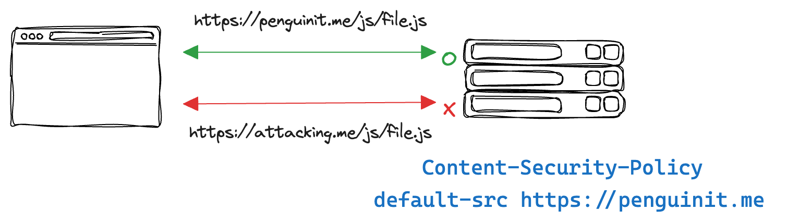
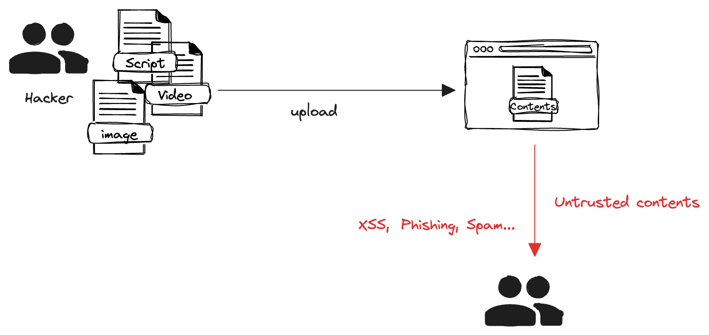
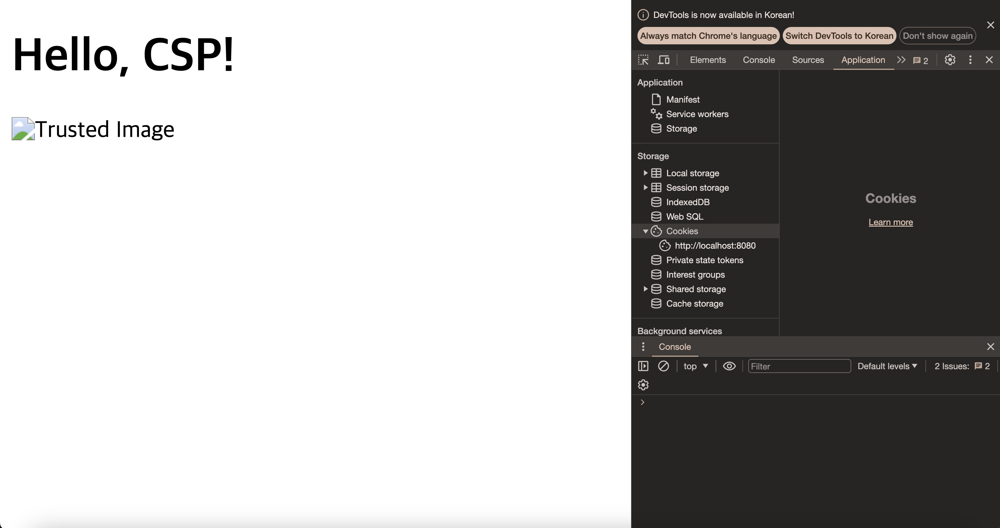

+++
author = "penguinit"
title = "What is CSP, learn more with Golang"
date = "2024-03-14"
description = "In the security field, a Content Security Policy (CSP) is one of the important methods used to harden website security. CSPs help prevent cross-site scripting (XSS) attacks and data injection attacks by restricting the sources from which web pages can load resources."
tags = [
"csp", "browser", "golang"
]
categories = [
"web", "language"
]
+++

## Overview

In this post, we will learn about Content Security Policy (CSP) and how it works and can be utilized in Golang examples.

## What is CSP?

In the field of security, Content Security Policy (CSP) is one of the important methods used to enhance website security. CSPs help prevent cross-site scripting (XSS) attacks and data injection attacks by limiting the sources from which web pages can load resources.



CSP is set as an HTTP header on the server and can declare different security policies for your web application.

```http
Content-Security-Policy: default-src https://penguinit.me
```

## CSP header usage

### Self Directive

The `'self'` directive means that the Content Security Policy (CSP) will only allow resources hosted from the same origin as the current document. "Same origin" refers to the same protocol, host (domain name), and port.

### Default usage

```
default-src 'self' https://penguinit.me;
```

This is the default policy, allowing loading from the current domain ( `'self'`) and `https://penguinit.me` for all resource types.

### Script

```
script-src 'self' https://penguinit.me;
```

Allow JavaScript files to be loaded from the current domain and from `https://penguinit.me`.

### stylesheet

```
style-src 'self' https://penguinit.me;
```

Allow CSS stylesheets to be loaded from the current domain and from `https://penguinit.me`.

### images

```
img-src 'self' https://penguinit.me;
```

Allow image files to be loaded from the current domain and from `https://penguinit.me`.

### fonts

```
font-src 'self' https://penguinit.me;
```

Allow font resources to be loaded from the current domain and from `https://penguinit.me`.

### Connections (AJAX, WebSockets, etc.)

```
connect-src 'self' https://penguinit.me;
```

Allow data loading of AJAX requests, WebSockets, etc. only from the current domain and `https://penguinit.me`.

### media

```
media-src 'self' https://penguinit.me;
```

Allow audio and video resources to be loaded from the current domain and from `https://penguinit.me`.

There are many other specifications, but these are the most important ones, and you can refer to the links below for more details.

[https://developer.mozilla.org/en-US/docs/Web/HTTP/Headers/Content-Security-Policy](https://developer.mozilla.org/en-US/docs/Web/HTTP/Headers/Content-Security-Policy)

### Case studies

I realized that talking about it like this might not give you a sense of what it's like to use it in the real world, so I thought of a few "what if" examples.

In a service where users upload material and consume it, you can use CSP settings to ensure that they are consuming trusted content.

For example, let's say you have a training platform, and you're uploading videos or training materials without any restrictions, you're exposing yourself to a lot of security risks, both for the users and the services that consume them. If they can consume content from a trusted domain, it can make it easier to censor phishing sites or inappropriate content.



## Golang example

Implement a CSP example in golang utilizing only the net/http package. I'm going to write an example where unregistered domains are blocked through CSP, and an example where trusted domains are registered and not blocked.

### Example of blocking all external content via CSP

```go
package main

import (
    "fmt"
    "net/http"
)

func serveContent(w http.ResponseWriter, r *http.Request) {
    csp := "default-src 'self'; script-src 'none'; img-src 'none';"
    w.Header().Set("Content-Security-Policy", csp)
    htmlContent := `
<!DOCTYPE html>
<html>
<head>
    <title>CSP Test</title>
</head>
<body>
    <h1>Hello, CSP!</h1>
    <script src="https://example.com/script.js"></script>
    
</body>
</html>
`
    fmt.Fprint(w, htmlContent)
}

func main() {
    http.HandleFunc("/", serveContent)
    fmt.Println("Server is running on http://localhost:8080")
    http.ListenAndServe(":8080", nil)
}

```
In this example, we set up a CSP policy that blocks all external scripts and images. It uses the `'self'' directive to allow only content that comes from the current domain, blocking all external sources.


If you run the above server and access it in a browser, `script.js` and `image.png` are blocked by the CSP policy, and you can see the related warning in the console.

### Example of registering a trusted site with the CSP to allow content

This time, we'll add `https://trusted.com` as a trusted source so that scripts and images served from that domain can be loaded.

```go
package main

import (
    "fmt"
    "net/http"
)

func serveContent(w http.ResponseWriter, r *http.Request) {
    csp := "default-src 'self'; script-src 'self' https://trusted.com; img-src 'self' https://trusted.com;"
    w.Header().Set("Content-Security-Policy", csp)
    htmlContent := `
<!DOCTYPE html>
<html>
<head>
    <title>CSP Test</title>
</head>
<body>
    <h1>Hello, CSP!</h1>
    <script src="https://trusted.com/script.js"></script>
    
</body>
</html>
`
    fmt.Fprint(w, htmlContent)
}

func main() {
    http.HandleFunc("/", serveContent)
    fmt.Println("Server is running on http://localhost:8080")
    http.ListenAndServe(":8080", nil)
}
```
After running this server and accessing it in a browser, you can see that `script.js' and `image.png' served by `https://trusted.com` are allowed by the CSP policy and loaded. On the other hand, resources from other sources are still blocked.



## Summary

In this post, we've seen what CSP is and when it's used, using a Golang example. Security always seems to be a challenging issue in web development. Adopting CSP is one of the ways to achieve big security gains in a relatively simple process.

However, as with any technology, it's not all sunshine and rainbows. As you can probably tell from the above post, it's complicated to set up and requires ongoing maintenance, and some older browsers may not support certain fields in CSP, so it's best to consider the project-specific circumstances.

- Browser version compatibility

[https://developer.mozilla.org/ko/docs/Web/HTTP/CSP#브라우저_호환성](https://developer.mozilla.org/ko/docs/Web/HTTP/CSP#%EB%B8%8C%EB%9D%BC%EC%9A%B0%EC%A0%80_%ED%98%B8%ED%99%98%EC%84%B1)