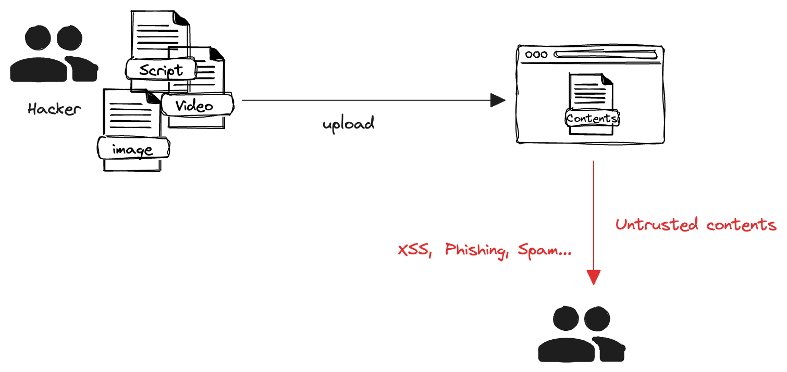
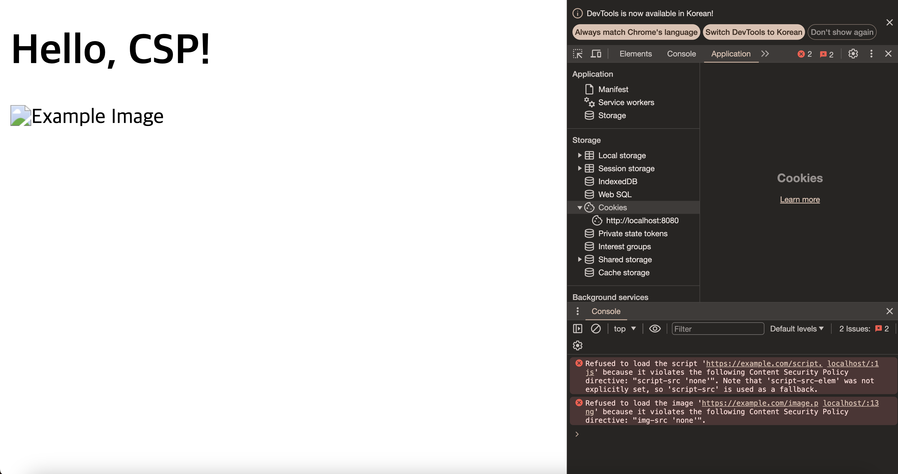
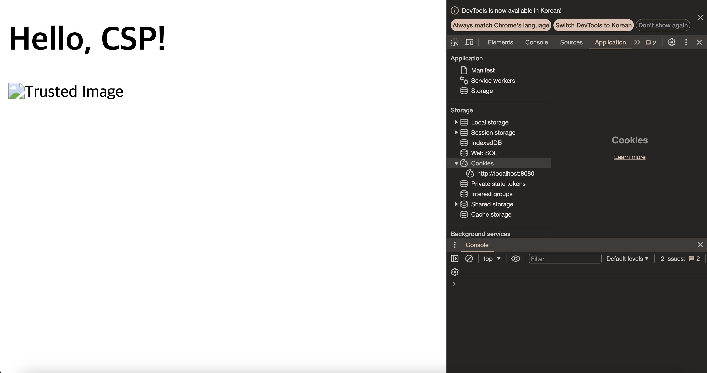

+++
author = "penguinit"
title = "CSP 란 무엇인가, Golang으로 자세히 알아보기"
date = "2024-03-14"
description = "보안 분야에서 CSP(Content Security Policy)는 웹사이트 보안을 강화하는 데 사용되는 중요한 방법 중 하나입니다. CSP는 웹 페이지가 리소스를 로드할 수 있는 출처를 제한함으로써 XSS(Cross-Site Scripting) 공격과 데이터 주입 공격을 방지하는 데 도움을 줍니다."
tags = [
"csp", "browser", "golang"
]
categories = [
"web", "language"
]
+++

## 개요

해당 포스팅에서는 CSP(Content Security Policy)에 대해서 알아보고 Golang 예제를 통해서 어떻게 동작하고 활용할 수 있는지에 대해서 알아보고자 합니다.

## CSP란 무엇인가

보안 분야에서 CSP(Content Security Policy)는 웹사이트 보안을 강화하는 데 사용되는 중요한 방법 중 하나입니다. CSP는 웹 페이지가 리소스를 로드할 수 있는 출처를 제한함으로써 XSS(Cross-Site Scripting) 공격과 데이터 주입 공격을 방지하는 데 도움을 줍니다.


CSP는 서버에서 HTTP 헤더로 설정되며, 웹 애플리케이션에 대한 다양한 보안 정책을 선언할 수 있습니다.

```http
Content-Security-Policy: default-src https://penguinit.me
```

## CSP 헤더 사용법

### Self 지시어

`'self'` 지시어는 CSP(Content Security Policy)에서 현재 문서와 동일한 출처(origin)에서 호스팅 되는 리소스만을 허용하겠다는 의미입니다. 여기서 "동일한 출처"라는 것은 동일한 프로토콜, 호스트(도메인 이름), 그리고 포트를 가리킵니다.

### 기본 사용법

```
default-src 'self' https://penguinit.me;
```

기본 정책으로, 모든 리소스 타입에 대해 현재 도메인(`'self'`)과 `https://penguinit.me`에서 로드를 허용합니다.

### 스크립트

```
script-src 'self' https://penguinit.me;
```

JavaScript 파일을 현재 도메인과 `https://penguinit.me`에서 로드를 허용합니다.

### 스타일시트

```
style-src 'self' https://penguinit.me;
```

CSS 스타일시트를 현재 도메인과 `https://penguinit.me`에서 로드를 허용합니다.

### 이미지

```
img-src 'self' https://penguinit.me;
```

이미지 파일을 현재 도메인과 `https://penguinit.me`에서 로드를 허용합니다.

### 폰트

```
font-src 'self' https://penguinit.me;
```

폰트 리소스를 현재 도메인과 `https://penguinit.me`에서 로드를 허용합니다.

### 커넥션 (AJAX, WebSockets, etc.)

```
connect-src 'self' https://penguinit.me;
```

AJAX 요청, WebSocket 등의 데이터 로딩을 현재 도메인과 `https://penguinit.me`에서만 허용합니다.

### 미디어

```
media-src 'self' https://penguinit.me;
```

오디오 및 비디오 리소스를 현재 도메인과 `https://penguinit.me`에서 로드를 허용합니다.

이외에도 다양한 스펙들이 있는데 대표적인 것들만 추려보았고 상세한 스펙은 아래 링크를 참조하시면 좋을 것 같습니다. 

[https://developer.mozilla.org/en-US/docs/Web/HTTP/Headers/Content-Security-Policy](https://developer.mozilla.org/en-US/docs/Web/HTTP/Headers/Content-Security-Policy)

### 사례 중심 설명

이렇게 얘기하면 실제로 현업에서 어떤 사례에서 쓰는지 감이 오지 않을 것 같아서 있을법한? 사례들을 몇 개 생각해 보았습니다.

유저들이 자료들을 올리고 그걸 소비하는 서비스에서 CSP 설정을 사용해서 신뢰할 수 있는 컨텐츠를 소비하도록 보장할 수 있습니다.

예를 들어서 교육 플랫폼이 있다고 가정을 했을 때 영상이나 교육자료들을 아무런 제약 없이 업로드한다면 이걸 소비하게 되는 유저나 서비스 측면에서도 다양한 보안적인 위험에 노출되게 됩니다. 이때 신뢰할 수 있는 도메인으로부터 컨텐츠를 소비할 수 있다면 피싱사이트나 부적절한 컨텐츠에 대한 검열이 보다 수월해질 수 있습니다. 



## Golang 예제

golang에서 net/http 패키지만을 활용해서 CSP 예제를 구현해 봅니다. CSP를 통해서 등록되지 않는 도메인이 막히는 예제와 신뢰할 수 있는 도메인을 등록하여 막히지 않는 예시를 작성해 보려고합니다.

### CSP를 통해 모든 외부 컨텐츠를 막는 예시

```go
package main

import (
    "fmt"
    "net/http"
)

func serveContent(w http.ResponseWriter, r *http.Request) {
    csp := "default-src 'self'; script-src 'none'; img-src 'none';"
    w.Header().Set("Content-Security-Policy", csp)
    htmlContent := `
<!DOCTYPE html>
<html>
<head>
    <title>CSP Test</title>
</head>
<body>
    <h1>Hello, CSP!</h1>
    <script src="https://example.com/script.js"></script>
    
</body>
</html>
`
    fmt.Fprint(w, htmlContent)
}

func main() {
    http.HandleFunc("/", serveContent)
    fmt.Println("Server is running on http://localhost:8080")
    http.ListenAndServe(":8080", nil)
}

```

이 예제에서는 모든 외부 스크립트와 이미지를 차단하는 CSP 정책을 설정합니다. 이는 `'self'` 지시어를 사용하여 현재 도메인에서 제공되는 컨텐츠만 허용하고, 모든 외부 출처를 차단합니다.



위 서버를 실행하고, 브라우저에서 접속하면 `script.js`와 `image.png`는 CSP 정책에 의해 차단되며, 콘솔에서 관련 경고를 볼 수 있습니다.

### 신뢰할 수 있는 사이트를 CSP에 등록하여 컨텐츠를 허용하는 예시

이번에는 `https://trusted.com`을 신뢰할 수 있는 출처로 추가하여 해당 도메인에서 제공하는 스크립트와 이미지가 로드될 수 있도록 설정합니다.

```go
package main

import (
    "fmt"
    "net/http"
)

func serveContent(w http.ResponseWriter, r *http.Request) {
    // https://trusted.com 을 신뢰할 수 있는 출처로 추가
    csp := "default-src 'self'; script-src 'self' https://trusted.com; img-src 'self' https://trusted.com;"
    w.Header().Set("Content-Security-Policy", csp)
    htmlContent := `
<!DOCTYPE html>
<html>
<head>
    <title>CSP Test</title>
</head>
<body>
    <h1>Hello, CSP!</h1>
    <script src="https://trusted.com/script.js"></script>
    
</body>
</html>
`
    fmt.Fprint(w, htmlContent)
}

func main() {
    http.HandleFunc("/", serveContent)
    fmt.Println("Server is running on http://localhost:8080")
    http.ListenAndServe(":8080", nil)
}
```

이 서버를 실행한 후 브라우저에서 접속하면 `https://trusted.com`에서 제공하는 `script.js`와 `image.png`는 CSP 정책에 의해 허용되어 로드되는 것을 확인할 수 있습니다. 반면, 다른 출처의 리소스는 여전히 차단됩니다.



## 정리

해당 포스팅을 통해서 CSP란 무엇이고 어떤 때 사용이 되는 것인지를 Golang 예제를 통해서 알아보았습니다. 웹 개발을 하면서 보안은 항상 어려운 문제인 것 같습니다. CSP의 도입은 비교적 간단한 과정을 통해 큰 보안 이익을 얻을 수 있는 방법 중 하나입니다.

하지만 어떤 기술이든 그렇듯이 항상 장점만 있는 것은 아닙니다. 위에 글을 통해서 느낄 수 있으실 수도 있지만 설정이 복잡하고 지속적으로 유지관리가 되어야 합니다. 또 일부 구 버전의 브라우저에서는 CSP의 특정 필드들을 지원하지 않을 수도 있으니 프로젝트별로 여러 가지 상황들을 고려해 보고 도입하시기를 추천드립니다.

- 브라우저 버전별 호환성

[https://developer.mozilla.org/ko/docs/Web/HTTP/CSP#브라우저_호환성](https://developer.mozilla.org/ko/docs/Web/HTTP/CSP#%EB%B8%8C%EB%9D%BC%EC%9A%B0%EC%A0%80_%ED%98%B8%ED%99%98%EC%84%B1)