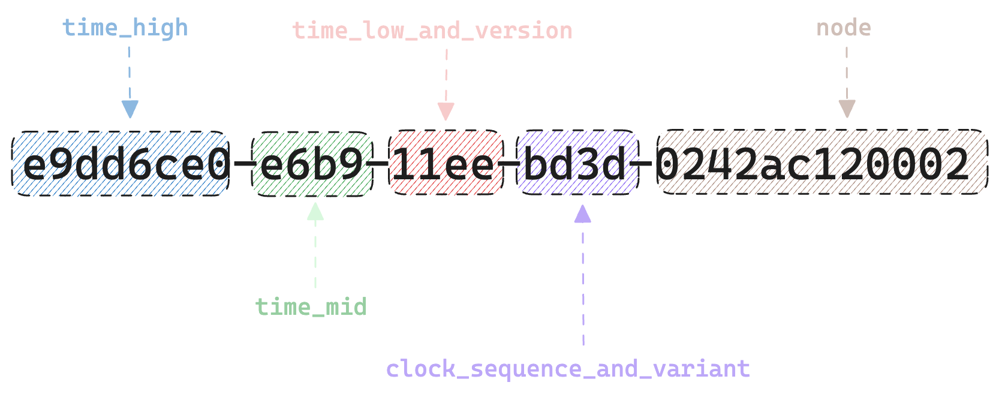

+++
author = "penguinit"
title = "Learn about UUIDs"
date = "2024-03-20"
description = "In today's post, we'll learn about UUIDs, what they are, how they've changed over the years, and what you should consider when using them as a primary key in MYSQL."
tags = [
"uuid", "mysql"
]
categories = [
"web"
]
+++

## Overview

In today's post, we'll take a look at UUIDs, see how they've evolved over the years, and learn what you need to consider when using UUIDs as primary keys in MYSQL.

## What is UUID?

A Universally Unique Identifier (UUID) is a long 128-bit number that has a globally unique value. UUIDs are often used to identify and distinguish objects across databases, systems, and services. The unique structure and algorithm of a UUID makes it extremely unlikely to be a duplicate, which helps ensure the uniqueness and consistency of data. Mathematically, there is a chance of a duplicate, but it's close to impossible.

**UUID4: db5f007a-5986-4b5f-ada9-2795976179ca**

- Used as a conversation identifier in chatgpt


## UUIDv1

UUID version 1 (UUIDv1) creates a unique identifier that is time-based (UUID). While most modern computers are based on the UNIX time zone (January 1, 1970), UUIDs were designed based on the Gregorian calendar (October 10, 1568).

In a UUID1, information related to the timestamp occupies the first 60 bits. This is a little easier to understand if you look at the image below


e9dd6ce0-e6b9-11ee-bd3d-0242ac120002 to be precise means the values related to time, sorted from the front to the lower time unit. Time is expressed in 100 nanoseconds, and 11ee, which is third in the time units, has the highest time value in the time units, and as illustrated above, the first value indicates version information, meaning that the value `1ee`, except for 1, which states version information, is a time value.

The next item, `bd3d`, is called the clock sequence, and to be precise, the first value is one of the values that make up the upper part of the clock sequence, and the remaining part, `d3d`, is the clock sequence.
These values change when the time value set by the system changes, or when multiple UUIDs need to be generated within the same time unit. For example, if you randomly rotate the time on your server and end up with an outdated time zone, this value will change when it is detected.

The last `0242ac120002` node entry represents the Mac address of the network interface, meaning that the server that gave out that UUID has a Mac address of 02:42:ac:12:00:02.

### Advantages of UUIDv1

1. **chronologically ordered:** UUIDv1s are generated in order based on their creation time, which is useful in systems that require temporally ordered data management. 
2. **Low risk of collision:** Because they are based on unique MAC address and time information, UUIDs are highly unlikely to collide within the same system.
3. **Use in distributed systems:** UUIDs can be generated independently by different systems and still retain their uniqueness, making them ideal for identifying data in distributed systems.

### Disadvantages of UUIDv1

1. **Predictability:** Because it includes the time of creation and MAC address, it is possible to trace that information back through the UUID, which can make it a predictable UUID. This should be considered in security-critical environments. 
2. **Privacy concerns:** Because it contains information from a physical device, such as the MAC address, it can be a privacy concern.
3. **Potential for time-based collisions:** Although very rare, if multiple UUIDs are generated at the same time and the clock sequence is not properly managed, there is a possibility of collisions.

### UUIDv2

UUIDv2 is a version that is rarely used today for security reasons. There is a detailed article on why the UUIDv2 version has been deprecated and what's weird about it at the link below. I'll try to summarize that article later if I have time.

[https://unicorn-utterances.com/posts/what-happened-to-uuid-v2](https://unicorn-utterances.com/posts/what-happened-to-uuid-v2)

## UUIDv3, v5

UUIDv3 and UUIDv5 are namespace-based UUIDs, generated using MD5 (v3) and SHA-1 (v5) hashing algorithms, respectively. They have the property of always generating the same UUID for a given input (namespace and name). You can give a namespace arbitrarily, but you can also use a predefined namespace.

- DNS -`6ba7b810-9dad-11d1-80b4-00c04fd430c8`
- URL -`6ba7b811-9dad-11d1-80b4-00c04fd430c8`
- OID -`6ba7b812-9dad-11d1-80b4-00c04fd430c8`
- X.500DN -`6ba7b814-9dad-11d1-80b4-00c04fd430c8`

This is often used when you want to specify a unique namespace and use it as an identifier for static data so that you always get the same value returned, rather than feeling like it's the only randomly generated identifier. For security reasons, I prefer the v5 version, which uses the SHA-1 algorithm.

## UUIDv4

UUIDv4 is a UUID based on randomness. This version is generated using a cryptographically secure random number generator, and the resulting UUID is highly unique. Because of the structure and nature of UUIDv4, it is very flexible because it allows you to generate UUIDs without any predefined rules or values.

A UUIDv4 is 128 bits long and is represented as a 32-digit hexadecimal number. This hexadecimal number is divided into five groups separated by a hyphen (-), with each group having a structure of 8-4-4-4-4-12. For example, it looks something like **`f47ac10b-58cc-4372-a567-0e02b2c3d479`**

When we actually create it, we don't see any regularity in the data.

- **1b6181e9-f873-4030-9262-fd765be91151**
- **0a6d03ee-3d06-4f6c-b16a-5f966c340a21**
- **a601e097-3b10-4b7b-ad0d-182669913055**

Instead, there is a repetition, and you can see that the number 4 is repeated in the third group. This is a characteristic of UUIDv4 and everything else is randomly generated. Obviously, since they are generated based on random numbers, there will be duplicates. But the odds are so close to impossible that it's safe to use. Since it's 128 bits long and 122 bits of it are randomly generated, there are 2^122 possible cases, so I'd say the probability of duplicates is very small.

## UUIDv6,v7

UUIDv6 and UUIDv7 are variations of the traditional time-based UUID, version 1, and are designed to address privacy issues with UUIDv1 (e.g., using MAC addresses) and provide better performance and ease of use.

More specifically, it looks something like this



Unlike v1, higher time values are placed in front. Instead, lower time values are placed at the back, which can be more useful when sorting in chronological order.

We've also improved privacy concerns by using more securely randomized information where v1 nodes used Mac information. v7 also uses UNIX time as the time zone, unlike v6. This allows us to include more detailed information about creation times, providing millisecond or better precision.

## UUIDs and MYSQL

With the advent of containers and the lightweighting of servers, microservices architectures are much more favored these days than monolithic architectures (which doesn't mean they're better).

In an MSA environment, UUIDs are often used as primary keys to identify specific resources. I've done something similar in the past, and I don't think I gave much thought to the performance implications of choosing a UUID as an identifier.

### When using UUIDv4 as primary key

Inserting data can take a lot of time compared to sequentially incrementing data. The B+Tree structure is indexed every time new data is inserted, and if the value is stored as a random number, it takes a lot of time to sort, which can cause problems when the data becomes large.

Also, in terms of storage, 128-bit UUIDs take up almost 4 times the storage space compared to using 32-bit integers as primary keys. In addition to the primary index, the secondary index also takes up a lot of space, which can lead to a lot of unintended performance degradation.

### Best practices for using UUIDs as primary keys

1. choose a UUID version: As discussed above, using time-based UUIDv1, UUIDv6, and UUIDv7 can be a much better choice than randomized UUIDs.
2. Store UUIDs in binary format: Instead of storing UUIDs as strings, you can save storage space by storing them in a 16-byte binary format. This also helps to improve query performance.

```sql
create table uuids(
  UUIDAsChar char(36) not null,
  UUIDAsBinary binary(16) not null
);

insert into uuids set
  UUIDAsChar = 'd211ca18-d389-11ee-a506-0242ac120002',
  UUIDAsBinary = UUID_TO_BIN('d211ca18-d389-11ee-a506-0242ac120002');

select * from uuids;
-- +--------------------------------------+------------------------------------+
-- | UUIDAsChar | UUIDAsBinary |
-- +--------------------------------------+------------------------------------+
-- | d211ca18-d389-11ee-a506-0242ac120002 | 0xD211CA18D38911EEA5060242AC120002 |
-- +--------------------------------------+------------------------------------+

```

1. choose an alternative to UUID (**Snowflake ID**): Snowflake ID is an identifier generation algorithm for distributed systems developed by Twitter. It generates unique identifiers that are 64-bit integers, sorted in chronological order. The components consist of a timestamp, data center identifier, machine ID, sequence number, etc.
- 7176229187156447232
- 7176229187156447233
- 7176229187156447234
- 7176229187156447235
- 7176229187156447236

This does not mean that Snowflake IDs are absolutely superior: they may have advantages in terms of storage and scalability, but because they are time-based, they require time synchronization between servers and management of unique identifiers per node, and because they inevitably have 64 bits of storage, they can theoretically reach their scope limit if you generate extremely many IDs quickly compared to UUIDs (128 bits).

## Summary

In this post, we've covered what UUIDs are, how they are characterized by version, and some of the issues with using UUIDs as the primary key in MYSQL and how they can be improved.

I thought that the reason why UUID has so many different versions is because there are different cases where it is needed in different situations. I hope this article will help you understand the features of each version of UUID and use them as needed.