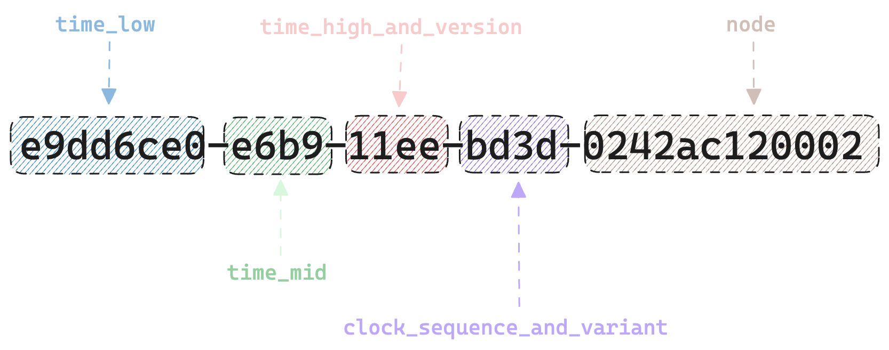

+++
author = "penguinit"
title = "UUID에 대해서 알아보기"
date = "2024-03-20"
description = "오늘 포스팅에서는 UUID에 대해서 알아보고 버전 별로 어떤 특징과 변천사가 있었는지 알아보고 MYSQL에서 UUID를 기본키로 사용을 할 때 고려해봐야 하는 점들에 대해서도 알아봅니다."
tags = [
"uuid", "mysql"
]
categories = [
"web"
]
+++

## 개요

오늘 포스팅에서는 UUID에 대해서 알아보고 버전 별로 어떤 특징과 변천사가 있었는지 알아보고 MYSQL에서 UUID를 기본키로 사용을 할 때 고려해 봐야 하는 점들에 대해서도 알아봅니다. 

## UUID란 무엇인가?

UUID(Universally Unique Identifier)는 전 세계적으로 고유한 값을 가지는 128비트의 긴 숫자입니다. UUID는 데이터베이스, 시스템, 서비스 간에 객체를 식별하고 구별하는 데 주로 사용됩니다. UUID의 독특한 구조와 알고리즘을 통해서 중복이 될 수 있는 가능성을 극도로 낮추고, 이로 인해 데이터의 유일성과 일관성을 보장할 수 있습니다. 수학적으로는 중복이 될 수 있는 확률이 있지만 거의 불가능에 가까운 수준으로 보셔도 될 것 같습니다.

**UUID4 : db5f007a-5986-4b5f-ada9-2795976179ca**

- chatgpt에서 대화의 식별자로 사용


## UUIDv1

UUID 버전 1 (UUIDv1)은 시간 기반(UUID)의 고유 식별자를 생성합니다. 현대의 컴퓨터는 대부분 UNIX 시간대 (1970년 1월 1일)를 기본으로 사용하지만 UUID는 그레고리력(1568년 10월 10일)을 기준으로 설계가 되었습니다. 

UUID1에서 타임스탬프와 관련된 정보들은 첫 60비트를 차지하게 됩니다. 아래 그림을 보시면 좀 더 이해하기 쉽습니다.



e9dd6ce0-e6b9-11ee-bd3d-0242ac120002에서 정확하게는 `e9dd6ce0-e6b9-11ee` 까지가 시간에 관련된 값을 의미하고 앞에서부터 낮은 시간단위로 정렬됩니다. 시간은 100나노초 단위로 표현이 되고 시간 단위에서 세 번째에 있는 11ee는 가장 높은 단위의 시간 값을 가지고 있는데 위에 그림에도 있듯이 첫 번째 값은 버전 정보를 나타냅니다. 즉 버전 정보를 명시한 1을 제외한 `1ee` 값이 시간 값이라고 할 수 있습니다. 

다음에 있는 항목 `bd3d`을 클락 시퀀스라고 하는데 이 부분도 정확하게 얘기하면 첫 번째 값은 클락 시퀀스의 상위 부분을 구성하는 값 중 하나이고 나머지 부분 `d3d`가 클락시퀀스입니다. 
해당 값은 시스템에서 설정한 시간 값이 바뀌었거나 같은 시간 단위 내에 여러 UUID가 생성될 필요가 있을 때 값이 변경됩니다. 예를 들어서 서버의 시간을 임의로 돌리거나 하면 예전 시간대가 나오게 되는 문제가 발생할 수 있는데 이를 감지하면 해당 값이 변경이 됩니다.

마지막 `0242ac120002` 노드 항목은 네트워크 인터페이스의 Mac주소를 나타냅니다. 즉 해당 UUID를 내려준 서버의 Mac 주소는 02:42:ac:12:00:02 라는 것을 의마합니다.  

### UUIDv1의 장단점

1. **시간 순서대로 생성:** UUIDv1은 생성 시간에 기반하여 순서대로 생성되기 때문에, 시간적으로 정렬된 데이터 관리가 필요한 시스템에서 유용합니다.
2. **충돌 위험성 낮음:** 고유한 MAC 주소와 시간 정보를 기반으로 하기 때문에, 같은 시스템 내에서는 UUID가 충돌할 확률이 매우 낮습니다.
3. **분산 시스템에서의 활용:** 서로 다른 시스템에서 독립적으로 UUID를 생성해도 고유성이 유지되므로, 분산 시스템에서 데이터를 식별하는 데 적합합니다.

### UUIDv1의 단점

1. **예측 가능성:** 생성 시간과 MAC 주소가 포함되어 있어, UUID를 통해 해당 정보를 역추적할 수 있으며, 이로 인해 예측 가능한 UUID가 될 수 있습니다. 보안이 중요한 환경에서는 이를 고려해야 합니다.
2. **개인정보 보호 문제:** MAC 주소와 같은 물리적 장치의 정보를 포함하기 때문에, 개인정보 보호와 관련하여 문제가 될 수 있습니다.
3. **시간 기반 충돌 가능성:** 매우 드물지만, 같은 시간에 다수의 UUID가 생성되고 클락 시퀀스가 적절히 관리되지 않는 경우 충돌할 가능성이 있습니다.

## UUIDv2

UUIDv2는 보안상의 이유로 현재는 거의 사용하고 있지 않는 버전입니다. UUIDv2 버전이 왜 사용되지 않게 되었고 어떤 점이 이상한지에 대해서는 아래 링크에 자세하게 작성이 되어있습니다. 나중에 시간이 된다면 해당 글도 한번 정리해 보겠습니다.  

[https://unicorn-utterances.com/posts/what-happened-to-uuid-v2](https://unicorn-utterances.com/posts/what-happened-to-uuid-v2)

## UUIDv3, v5

UUIDv3와 UUIDv5는 네임 스페이스 기반의 UUID로, 각각 MD5(v3)와 SHA-1(v5) 해시 알고리즘을 사용하여 생성됩니다. 이들은 주어진 입력(네임스페이스와 이름)에 대해 항상 동일한 UUID를 생성하는 특성을 가지고 있습니다. 네임 스페이스를 임의로 줄 수도 있지만 사전에 정의된 네임 스페이스를 사용할 수도 있습니다.

- DNS —`6ba7b810-9dad-11d1-80b4-00c04fd430c8`
- URL —`6ba7b811-9dad-11d1-80b4-00c04fd430c8`
- OID —`6ba7b812-9dad-11d1-80b4-00c04fd430c8`
- X.500DN —`6ba7b814-9dad-11d1-80b4-00c04fd430c8`

임의로 생성되는 유일한 식별자라는 느낌보다는 고유한 네임 스페이스를 지정하고 정적 데이터에 대한 식별자로 사용하여 항상 동일한 값을 반환 받고자 할 때 자주 쓰입니다. 아무래도 보안을 고려해봤을 때 SHA-1 알고리즘을 사용하는 v5버전이 좀 더 선호됩니다.

## UUIDv4

UUIDv4는 무작위성을 기반으로 하는 UUID입니다. 이 버전은 암호학적으로 안전한 난수 생성기를 사용하여 생성되며, 그 결과로 얻어지는 UUID는 고유성이 매우 높은 편입니다. UUIDv4의 구조와 특성 때문에, 이를 사용하는 경우 사전에 정의된 어떤 규칙이나 값 없이도 UUID를 생성할 수 있어 매우 유연합니다.

UUIDv4는 128비트 길이를 가지며, 32자리의 16진수로 표현됩니다. 이 16진수는 하이픈(-)으로 구분된 5개의 그룹으로 나누어지며, 각 그룹은 8-4-4-4-12의 구조를 가집니다. 예를 들어, **`f47ac10b-58cc-4372-a567-0e02b2c3d479`**와 같은 형태입니다

실제로 만들어봤을 때 데이터를 보아도 어떠한 규칙성이 보이지 않습니다.

- **1b6181e9-f873-4030-9262-fd765be91151**
- **0a6d03ee-3d06-4f6c-b16a-5f966c340a21**
- **a601e097-3b10-4b7b-ad0d-182669913055**

대신 반복되는 부분이 있는데 3번째 그룹에 숫자 4가 반복되는 것을 보실 수 있습니다. UUIDv4의 특징이며 그 외에는 모두 무작위로 생성됩니다. 아무래도 난수를 기반으로 생성되다 보니 중복이 있을 수 있습니다. 하지만 거의 불가능에 가까운 확률이라 안심하고 사용해도 무방합니다. 128비트의 길이를 가지고 있고 이 중에서 122비트가 무작위로 생성됨으로  2^122 의 경우의 수를 가지고 있기에 중복될 확률은 거의 없다고 봐야 할 것 같습니다.

## UUIDv6,v7

UUIDv6와 UUIDv7는 기존의 시간 기반 UUID인 버전 1의 변형으로, UUIDv1에서 발생할 수 있는 개인 정보 노출 문제(예: MAC 주소 사용)를 해결하고, 더 나은 성능과 사용 편의성을 제공하기 위해 설계되었습니다. 

구체적으로는 아래와 같은 형태로 바뀌었다고 보면 이해가 쉽습니다. 


v1과 다르게 높은 시간 값이 앞에 위치하게 됩니다. 대신 낮은 시간 값은 뒤로 배치가 되고 이로 인해서 시간 순서대로 정렬을 할 때 좀 더 유용하게 사용될 수 있습니다. 

또한 기존 v1 노드에서 Mac 정보를 사용했었는데 더 안전하게 랜덤화된 정보를 사용해서 개인 정보 노출 문제를 개선하였습니다. 또한 v7은 v6와 다르게 시간대를 UNIX 시간을 사용하도록 개선이 되었습니다. 이로 인해서 밀리초 단위 또는 그 이상의 정밀도를 제공해서 생성 시간에 대한 정보를 더 상세하게 포함할 수 있습니다.

## UUID와 MYSQL

컨테이너의 등장과 함께 서버들이 경량화되면서 요즘은 모노리식 아키텍처보다는 마이크로 서비스 아키텍쳐가 많이 선호되는 분위기입니다. (더 좋다는 의미는 아닙니다.)

MSA 환경에서는 특정 리소스에 대해서 식별을 할 때 UUID를 기본키로 많이 사용하게 됩니다. 저 경우에도 예전에 비슷하게 작업을 했던 경험이 있는데 이때는 그냥 단순하게 UUID를 넣기만 하고 식별자로서 UUID를 선택했을 때 성능적인 면에 대해서 고려를 많이 못 했던 것 같습니다.

### UUIDv4를 기본키로 쓸 경우

데이터를 삽입을 하거나 할 때 순차적으로 증가하는 경우와 비교하면 훨씬 오랜 시간이 걸릴 수 있습니다. B+Tree 구조로 데이터가 새로 삽입될 때마다 인덱싱을 하게 되는데 이때 난수로 저장되는 값이 들어오게 되면 정렬에 많은 시간이 소요되기에 데이터가 많아지면 문제가 발생할 수 있습니다.

또한 저장 측면에서도 32비트 정수를 기본키로 사용할 때와 비교하면 128비트인 UUID는 거의 4배의 저장 공간을 차지하게 됩니다. 기본 인덱스 외에도 보조 인덱스도 많은 공간을 차지하기 때문에 성능이 의도치 않게 많이 저하될 수 있습니다. 

### UUID를 기본키로 사용하는 가장 좋은 방법

1. UUID 버전 선택 : 위에서 설명했던 것처럼 시간을 기반으로 하는 UUIDv1, UUIDv6, UUIDv7을 사용하는 것이 난수 기반의 UUID 보다 훨씬 좋은 선택이 될 수 있습니다.
2. UUID를 바이너리 형식으로 저장 : UUID를 문자열로 저장하는 대신, 16바이트 바이너리 형식으로 저장하여 저장 공간을 절약할 수 있습니다. 이는 또한 쿼리 성능을 향상시키는 데 도움이 됩니다.

```sql
create table uuids(
  UUIDAsChar char(36) not null,
  UUIDAsBinary binary(16) not null
);

insert into uuids set
  UUIDAsChar = 'd211ca18-d389-11ee-a506-0242ac120002',
  UUIDAsBinary = UUID_TO_BIN('d211ca18-d389-11ee-a506-0242ac120002');

select * from uuids;
-- +--------------------------------------+------------------------------------+
-- | UUIDAsChar                           | UUIDAsBinary                       |
-- +--------------------------------------+------------------------------------+
-- | d211ca18-d389-11ee-a506-0242ac120002 | 0xD211CA18D38911EEA5060242AC120002 |
-- +--------------------------------------+------------------------------------+

```

1. UUID가 아닌 대안을 선택 (**Snowflake ID**) : Snowflake ID는 Twitter에서 개발한 분산 시스템용 식별자 생성 알고리즘입니다. 이는 64비트 정수로, 시간 순서대로 정렬되는 고유 식별자를 생성합니다. 구성 요소는 타임스탬프, 데이터 센터 식별자, 머신 ID, 시퀀스 번호 등으로 구성됩니다.
- 7176229187156447232
- 7176229187156447233
- 7176229187156447234
- 7176229187156447235
- 7176229187156447236

그런다고 Snowflake ID가 절대적으로 우위에 있는 것은 아닙니다. 저장 공간이나 확장성 측면에서는 이점을 가질 수 있으나 시간을 기반으로 만들어지기 때문에 서버 간에 시간 동기화와 노드별 고유 식별자 관리가 필요하고 아무래도 64비트의 저장 공간을 가지고 있기 때문에 UUID(128비트)에 비해서 극단적으로 많은 ID를 빠르게 생성하는 경우에 이론적으로 범위 제한에 도달할 수도 있습니다. 

## 정리

포스팅을 통해서 UUID가 무엇이고 버전별로 어떤 특징이 있는지 또 MYSQL에서 UUID를 기본키로 했을 때 고려해야 하는 문제점과 개선해서 사용할 수 있는 방법들에 대해서 다루어 보았습니다. 

UUID가 버전이 이렇게 다양한 것은 여러 가지 상황에 따라 필요한 케이스가 다르기 때문이 아닐까라는 생각이 들었습니다. 이 글을 통해서 UUID의 버전별 특징을 정확히 이해하고 필요에 따라 잘 사용하면 좋겠습니다.