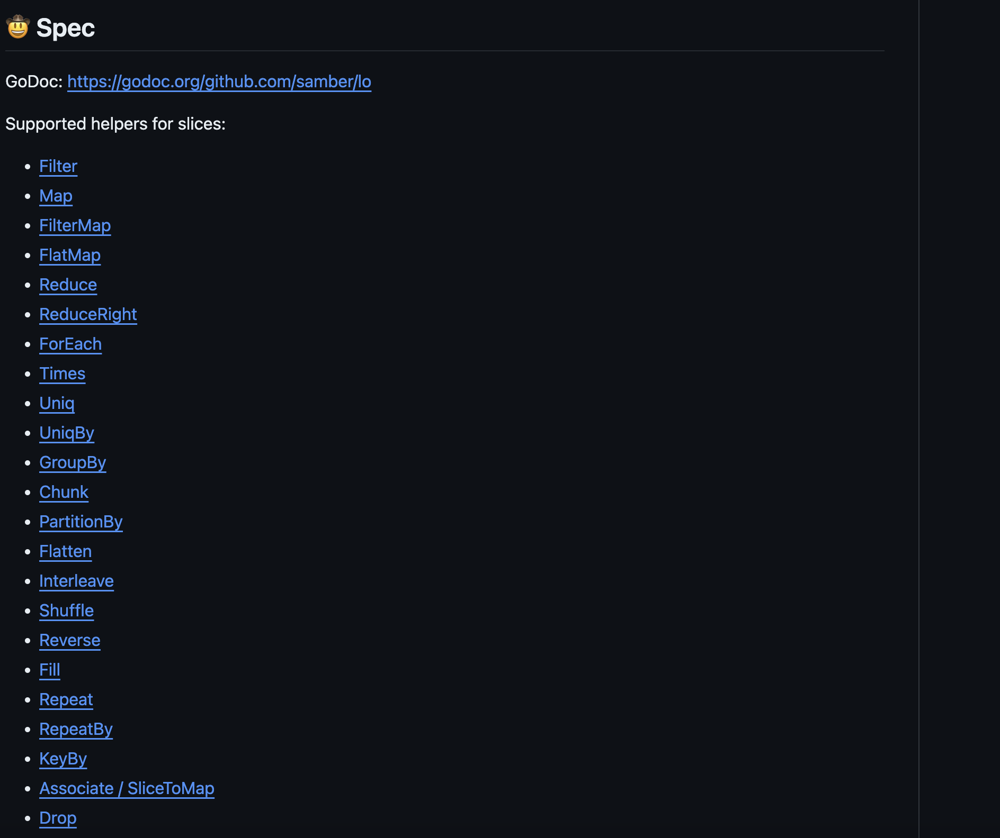

+++
author = "penguinit"
title = "Markdown 작성시 TOC 자동으로 만들기"
date = "2024-03-22"
description = "Github 오픈소스 프로젝트들을 보면 Markdown으로 작성을 대부분 했음에도 불구하고 TOC가 작성이 되어있는 경우가 있는데 오늘 포스팅에서는 TOC가 무엇이고 Markdown에서 TOC를 어떻게 편하게 작성할 수 있는지에 대해서 알아보겠습니다."
tags = [
"markdown"
]
categories = [
"language"
]
+++

## 개요
Github 오픈소스 프로젝트들을 보면 Markdown으로 작성을 대부분 했음에도 불구하고 TOC가 작성이 되어있는 경우가 있는데 오늘 포스팅에서는 TOC가 무엇이고 Markdown에서 TOC를 어떻게 편하게 작성할 수 있는지에 대해서 알아보겠습니다. 

## TOC란 무엇인가?
Markdown TOC(Table of Contents)는 Markdown 문서 내에서 제공되는 목차를 의미합니다. 이 목차는 문서 내의 제목과 소제목을 기반으로 구성되며, 독자가 문서의 특정 부분으로 쉽게 이동할 수 있도록 돕습니다. TOC는 특히 긴 문서에서 구조를 빠르게 파악하고 원하는 섹션으로 즉시 접근하는 데 유용합니다.

[https://github.com/samber/lo](https://github.com/samber/lo)



## Markdown Acnhor
Markdown 문법에서 anchor를 지원하고 있습니다. 아래처럼 작성하면 링크를 클릭했을 때 참조하는 위치로 스크롤이 이동합니다. 

```markdown
## Table of Contents
- [Section 1: Introduction](#section-1-introduction)
- [Section 2: Main Content](#section-2-main-content)
  - [Subsection 2.1: Topic A](#subsection-21-topic-a)
  - [Subsection 2.2: Topic B](#subsection-22-topic-b)
- [Section 3: Conclusion](#section-3-conclusion)

## Section 1: Introduction
Content for Section 1...

## Section 2: Main Content
### Subsection 2.1: Topic A
Content for Subsection 2.1...

### Subsection 2.2: Topic B
Content for Subsection 2.2...

## Section 3: Conclusion
Content for Section 3...

```

하지만 위 방식에는 문제점이 있습니다.

1. 컨텐츠가 많아지면 적는데 시간이 너무 많이 소요가 됨
2. 앵커를 정의할 때 Header의 이름을 명시하게 되는데 이때 특수문자나 공백 한글이 들어가게 되면 앵커가 이해할 수 있는 문자열로 인코딩을 해줘야 합니다. 

Subsection 2.2: Topic B → #subsection-22-topic-b

TOC를 작성하는 방법들은 각자 선호하는 방식이 다르겠지만 오늘은 CLI 명령어를 통해서 자동으로 생성하는 방법을 설명하려고 합니다.

## TOC 자동생성
예전에는 Markdown을 붙여 넣으면 TOC가 붙은 형태의 Markdown을 반환해 주는 웹사이트를 많이 애용했었는데 최근에 이곳저곳에서 글 작성할 일이 많아져서 다른 방법을 찾기 시작했습니다. 

이런 류의 서비스가 워낙 많아서 다양한 방법들이 있지만 그중에 다양한 옵션과 사용성이 편한 오픈 소스 프로젝트를 소개하고자 합니다. 

[https://github.com/jonschlinkert/markdown-toc](https://github.com/jonschlinkert/markdown-toc)

### 설치방법
markdown-toc을 설치하기 위해서는 node가 사전에 설치되어 있어야 합니다. 

- node 설치 (Windows)
    1. **Node.js 웹사이트 방문**: [Node.js 공식 웹사이트](https://nodejs.org/)에 접속합니다.
    2. **Windows 인스톨러 다운로드**: 홈페이지에서 "Windows Installer"를 선택하여 다운로드합니다. 보통 LTS(Long Term Support) 버전을 추천합니다.
    3. **인스톨러 실행**: 다운로드한 **`.msi`** 파일을 실행하여 설치 마법사의 지시에 따릅니다. npm은 Node.js와 함께 자동으로 설치됩니다.
- node 설치 (MacOS)

```bash
brew install node
```

- Ubuntu/Debian 계열

```bash
curl -fsSL https://deb.nodesource.com/setup_lts.x | sudo -E bash -
sudo apt-get install -y nodejs
```

- CentOS, Fedora, Red Hat 계열

```bash
curl -fsSL https://rpm.nodesource.com/setup_lts.x | sudo bash -
sudo yum install nodejs
```

---

node 설치가 완료되었으면 아래 명령어를 실행합니다.

```bash
npm install -g markdown-toc
```

### 사용방법
위에 Anchor 예시에서 TOC를 지운 상태로 markdown-toc를 이용해서 작성해 보겠습니다.

```bash
## Table of Contents

## Section 1: Introduction
Content for Section 1...

## Section 2: Main Content
### Subsection 2.1: Topic A
Content for Subsection 2.1...

### Subsection 2.2: Topic B
Content for Subsection 2.2...

## Section 3: Conclusion
Content for Section 3...
```

위에 상태에서 ## Table of Contents 아래에 `<!-- toc -->` 를 적어줍니다. 해당 라인에 TOC가 자동으로 작성이 됩니다. 

```bash
## Table of Contents

<!-- toc -->

## Section 1: Introduction
Content for Section 1...

## Section 2: Main Content
### Subsection 2.1: Topic A
Content for Subsection 2.1...

### Subsection 2.2: Topic B
Content for Subsection 2.2...

## Section 3: Conclusion
Content for Section 3...
```

markdown-toc 수행 (파일이름이 [README.md](http://README.md) 라고 가정)

```bash
markdown-toc -i README.md
```

#### 결과
```bash
## Table of Contents

<!-- toc -->

- [Section 1: Introduction](#section-1-introduction)
- [Section 2: Main Content](#section-2-main-content)
  * [Subsection 2.1: Topic A](#subsection-21-topic-a)
  * [Subsection 2.2: Topic B](#subsection-22-topic-b)
- [Section 3: Conclusion](#section-3-conclusion)

<!-- tocstop -->

## Section 1: Introduction
Content for Section 1...

## Section 2: Main Content
### Subsection 2.1: Topic A
Content for Subsection 2.1...

### Subsection 2.2: Topic B
Content for Subsection 2.2...

## Section 3: Conclusion
Content for Section 3...
```

결과를 확인해 보면 `<!-- toc -->` 아래에 적었던 Header들의 TOC가 자동으로 작성된 것을 확인할 수 있습니다. 에디터에서 눌러보면 제대로 동작하는 것을 확인하실 수 있습니다.

## 정리
CLI로 하니 자유도도 높아지고 손쉽게 TOC를 작성할 수 있었습니다. 설명드린 건 가장 간단한 케이스고 여러 가지 옵션들이 있기 때문에 읽어보시고 잘 활용하셨으면 좋겠습니다.