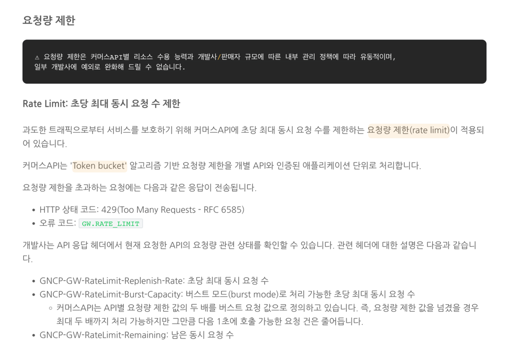
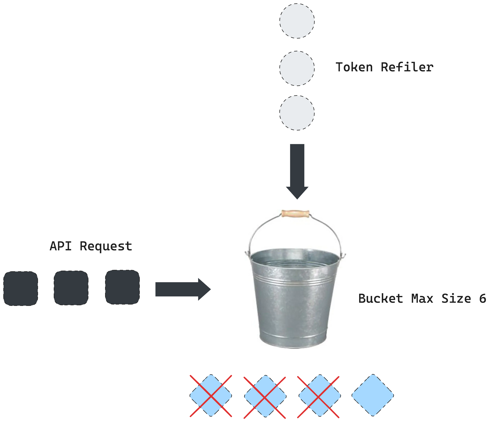
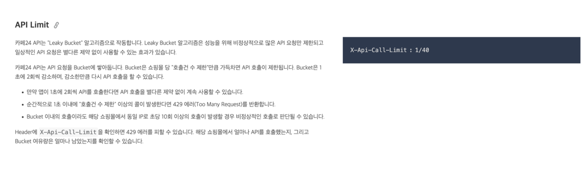
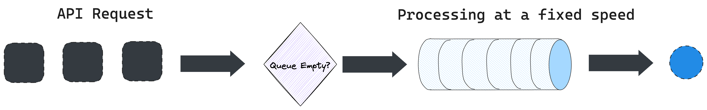

+++
author = "penguinit"
title = "Rate Limiter란 무엇인가 2부"
date = "2024-04-12"
description = "Rate Limiter 알고리즘 중에서 토큰 버킷과 누출 버킷에 대해서 상세히 알아봅니다."
tags = [
"rate-limiter"
]
categories = [
"web"
]
+++

## 개요

Rate Limiter 알고리즘 중에서 토큰 버킷과 누출 버킷에 대해서 상세히 알아봅니다.

## 토큰 버킷 (Token Bucket)
토큰 버킷 알고리즘은 직관적이고 Rate Limiter 알고리즘중 하나로 여러곳에서 폭넓게 사용되고 있습니다. 이전에 이커머스 관련 개발을 했던 경험이 있는데 
네이버 커머스 플랫폼에서 토큰 버킷 알고리즘을 이용해서 Rate Limiter를 구현하고 있었습니다.

- 네이버

토큰 버킷 알고리즘은 요청이 가능한 토큰들을 버킷에 담아두고, 요청이 들어올 때마다 토큰을 소비하는 방식으로 동작합니다. 토큰 버킷 알고리즘은 크게 두 가지 요소로 구성됩니다.

- 토큰 크기 : 버킷에 담을 수 있는 최대 토큰의 개수
- 토큰 공급률 : 버킷에 토큰을 추가하는 속도

API 요청이 들어왔을 때 버킷에 토큰이 있는지 확인하고, 토큰이 있다면 요청을 처리하고 토큰을 소비합니다. 토큰이 없다면 요청은 버려집니다. 
일반적으로 HTTP 상태 코드 429 Too Many Requests를 반환하고 요청은 거절됩니다.

위에 도식기준으로는 최대 버킷 사이즈는 6개이고 초당 1개씩 토큰을 생성하고 있다고 가정을 합니다. 
해당 시점에는 4개의 토큰이 있었고 3개의 요청이 들어와서 토큰이 소비되고 1개의 토큰이 남아있게 됩니다.

네이버에서는 계정(어플리케이션) 및 엔드포인트별로 토큰을 관리하고 초당 1개의 토큰이 회복됩니다.

- 첫 번째 예시: 12시 00분 01초에 4건의 API 호출을 진행

| 호출 API           | 기대 결과 | 남은 기본 쿼터 | 총 기본 쿼터 |
|------------------|-------|----------|---------|
| [상품] 카테고리 조회 API | 성공    | 1        | 2       |
| [주문] 발송 처리 API   | 성공    | 1        | 2       |
| [상품] 카테고리 조회 API | 성공    | 0        | 2       |
| [주문] 발송 처리 API   | 성공    | 0        | 2       |

- 두 번째 예시: 바로 이어서 12시 00분 02초에 5건의 API 호출을 진행

| 호출 API           | 기대 결과       | 남은 기본 쿼터 | 총 기본 쿼터 |
|------------------|-------------|----------|---------|
| [상품] 카테고리 조회 API | 성공          | 1        | 2       |
| [주문] 발송 처리 API   | 성공          | 1        | 2       |
| [주문] 발송 처리 API   | 성공          | 0        | 2       |
| [주문] 발송 처리 API   | 실패 (호출량 초과) | 0        | 2       |
| [상품] 카테고리 조회 API | 성공          | 0        | 2       |

토큰 버킷 알고리즘의 경우에는 상대적으로 구현이 쉽고 복잡하지 않기 때문에 메모리 사용 측면에서도 효율적입니다. 
버킷에 토큰만 있다면 어떤 제약도 없기에 만약 토큰의 크기가 클 경우 순식간에 요청이 몰릴 수 있습니다. 

## 누출 버킷 (Leaky Bucket)
누출 버킷 알고리즘은 토큰 버킷과 비슷하지만, 토큰을 일정 속도로 누출시키는 방식으로 동작합니다. 
누출 버킷 알고리즘은 FIFO 큐로 구현이되고 버킷의 사이즈는 큐의 사이즈와 동일합니다.
카페24의 경우에는 누출 버킷 알고리즘을 사용하고 있다고 명시되어있습니다.

카페24의 경우에는 큐에 요청을 쌓아두고 초당 2회의 요청을 처리하고 있습니다. 누출 버킷 알고리즘은 아래의 순서로 동작합니다.

- 우선 요청이 들어왔을 때 큐가 다 차있는지 확인을 합니다.
- 큐가 가득 차 있는 경우에는 새 요청을 버려집니다.
- 지정된 시간마다 큐에서 요청을 꺼내서 처리를 합니다.

언뜻 비슷해보이지만 요청을 전달할 때 누출 버킷은 일정한 속도로 토큰을 누출시키는 방식으로 동작하기에 갑자기 요청이 몰리게 되면 토큰 버킷보다는 안정적으로 요청을 처리할 수 있습니다.

## 정리
토큰 버킷과 누출 버킷은 Rate Limiter를 구현할 때 가장 많이 사용되는 알고리즘 중 하나입니다. 두 알고리즘 모두 간단하게 구현할 수 있고 메모리 사용에 있어서 효율적인 알고리즘입니다.
하지만 두개 알고리즘 모두 얼마나 큰 토큰 사이즈를 가지거나 초당 어느정도의 속도로 토큰을 생성하거나 누출시킬지에 대한 설정이 중요합니다. 이 부분은 서비스의 성격마다 너무 천차만별이라 휴리스틱 알고리즘을 적용해서 Rate Limiter를 구현하는 것도 좋은 방법이 될 수 있습니다.
다음에는 Rate Limiter의 알고리즘에 한축을 담당하는 윈도우 기반의 Rate Limiter에 대해서 알아보도록 하겠습니다.

