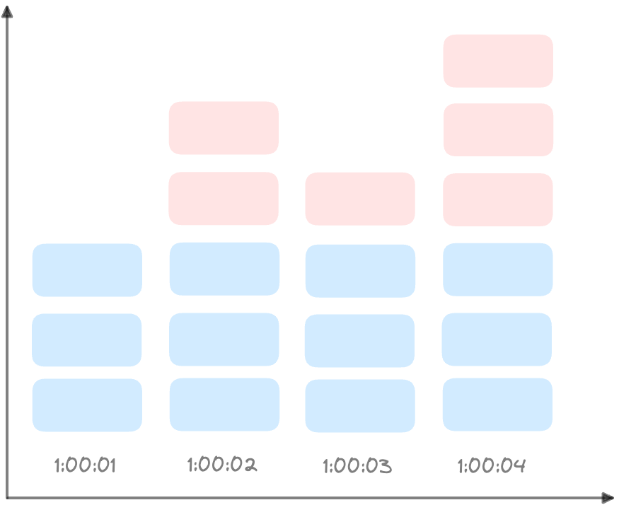
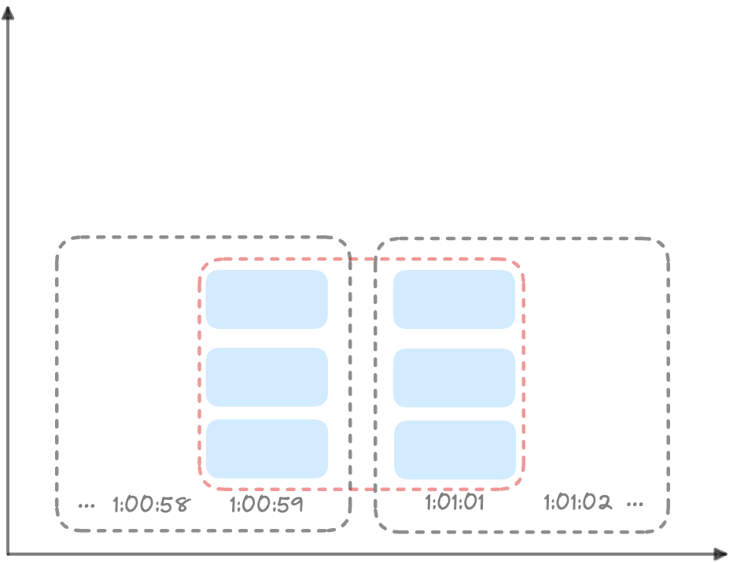
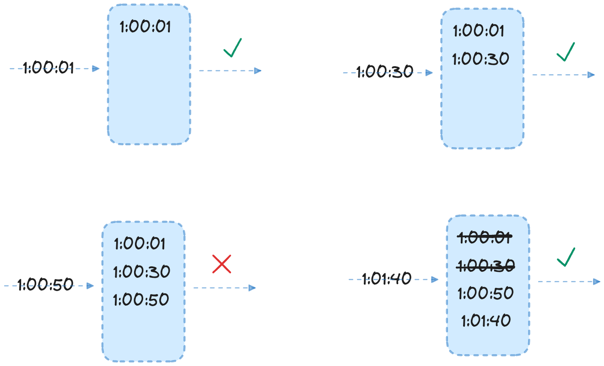

+++
author = "penguinit"
title = "Rate Limiter란 무엇인가 3부"
date = "2024-04-16"
description = "Rate Limiter 알고리즘 중에서 고정 윈도 알고리즘과 이동 윈도 알고리즘에 대해서 상세하게 알아봅니다."
tags = [
"rate-limiter"
]
categories = [
"web"
]
+++

## 개요
Rate Limiter 알고리즘 중에서 고정 윈도 알고리즘과 이동 윈도 알고리즘에 대해서 상세하게 알아봅니다.

## 고정 윈도 카운터 알고리즘 (fixed window counter)
고정 윈도 카운터 알고리즘은 특정 시간 동안의 요청 수를 제한하는 Rate Limiter 알고리즘 중 하나입니다. 
이 알고리즘은 고정된 시간 윈도(예: 1분, 1시간)를 사용하여 요청 수를 추적하고, 윈도 내의 요청 수가 허용된 한계를 초과할 경우 요청을 거부합니다.

예를 들어서 타임라인을 1초로 나누고 시스템은 초당 3개까지의 요청만을 허용한다고 하면 아래와 같이 동작할 수 있습니다.

직관적이고 이해하기 쉽지만 타임라인의 가장자리에서 요청이 몰리는 경우에는 문제가 발생할 수 있습니다. 예를 들어서 아래 도식처럼 타임라인을 1분으로 나누었을 때
만약 59초에 3개의 요청이 들어오고 다음 타임 슬롯 1초에 3개의 요청이 들어온다면 1분 동안 6개의 요청이 들어오게 되어 결론적으로 2배의 부하를 받게 됩니다.

## 이동 윈도 로깅 알고리즘 (sliding window log)
이동 윈도 로깅 알고리즘은 고정 윈도 카운터 알고리즘의 한계를 극복하기 위해 개발된 Rate Limiter 알고리즘입니다.
고정 윈도 카운터 알고리즘은 고정된 시간 윈도를 사용하여 요청 수를 추적하는 반면, 이동 윈도 로깅 알고리즘은 윈도의 시작 시간을 유지하면서 윈도를 이동시키는 방식으로 동작합니다.

예를 들어서 아래 예제는 분당 최대 2회의 요청만을 처리할 수 있도록 설계되었습니다. 

- 요청이 1:00:01에 도착하면 로그는 비어있을 상태이기 때문에 요청이 허용됩니다.
- 새로운 요청 1:00:30에 도착하면 1:00:01 ~ 1:00:31 윈도에 2개의 요청이 들어왔기 때문에 요청이 허용됩니다.
- 새로운 요청 1:00:50에 도착하면 해당 시간을 기준으로 이미 로그에 2개가 쌓여있기에 요청이 거부가 됩니다.
- 새로운 요청 1:01:40에 도착하면 1:00:40 ~ 1:01:40 윈도에 1개의 요청이 들어와있기 때문에 로그에 기록되고 요청이 허용됩니다.나머지 값들은 전부 만료된 값 들이기에 로그에서 모두 지우게 됩니다.

이 알고리즘 기법은 어느 시점의 윈도를 보더라도 요청 수가 허용된 한계를 초과하지 않도록 보장합니다. 이러한 특성으로 인해 이동 윈도 로깅 알고리즘은 고정 윈도 카운터 알고리즘보다 더 정확한 Rate Limiter 알고리즘으로 평가받습니다.
대신 이동 윈도 로깅 알고리즘은 고정 윈도 카운터 알고리즘보다 더 많은 메모리를 사용하게 됩니다. (로그를 저장하기 때문에)

## 정리
이번 포스팅을 마무리로 Rate Limiter가 무엇인지, 그리고 이를 구성하는 알고리즘에는 어떤 것들이 있는지를 모두 살펴보았습니다. Rate Limiter는 서버의 부하를 방지하고 서비스의 안정성을 유지하기 위해 매우 중요한 요소입니다. 
따라서 Rate Limiter를 효과적으로 구현하고 관리하는 것은 모든 서비스 개발자에게 필수적인 역량이라고 할 수 있습니다. Rate Limiter를 통해 서비스의 안정성을 높이고 사용자 경험을 개선하는 데 도움이 되길 바라겠습니다.