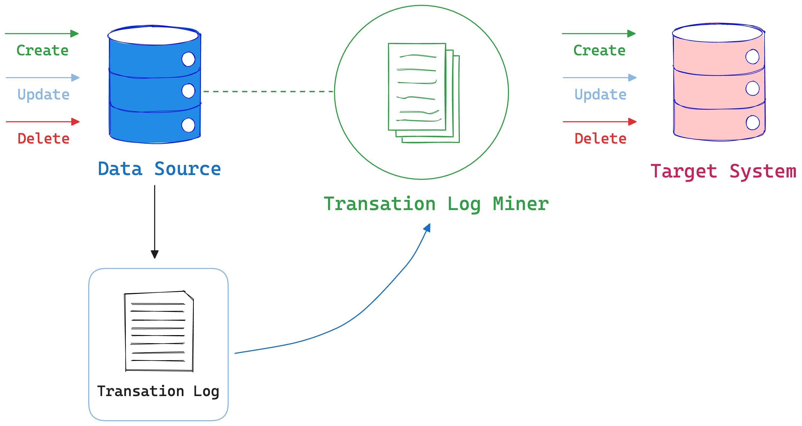
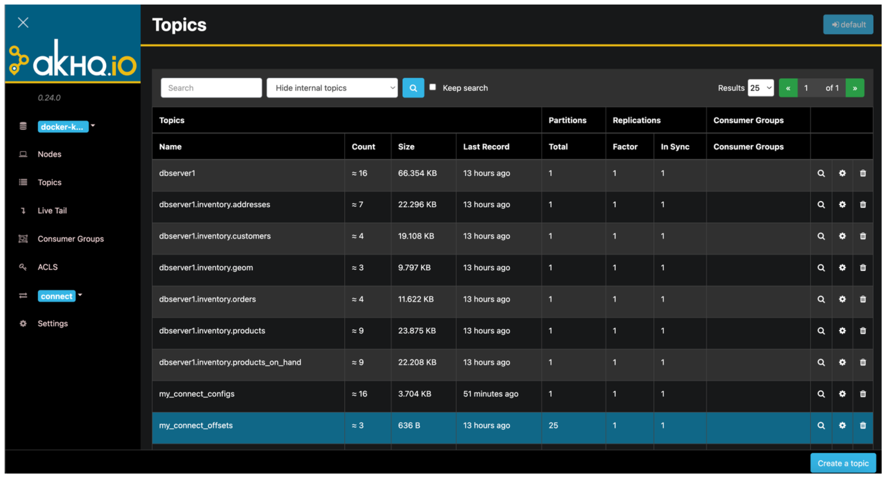
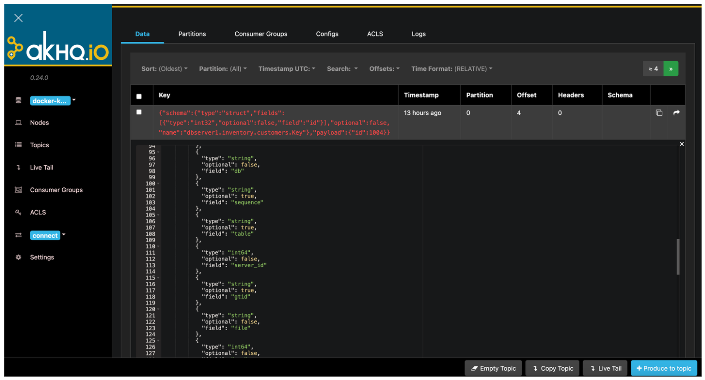

+++
author = "penguinit"
title = "CDC에 대해서 MYSQL과 Kafka를 통해서 알아보기"
date = "2024-04-17"
description = "CDC(Change Data Capture)에 대해서 MYSQL과 Kafka를 통해서 알아보고 실제 구현을 통해서 어떻게 동작하는지 알아봅니다."
tags = [
"kafka", "debezium", "zookeeper", "mysql"
]
categories = [
"cdc"
]
+++

## 개요
CDC(Change Data Capture)에 대해서 MYSQL과 Kafka를 통해서 알아보고 실제 구현을 통해서 어떻게 동작하는지 알아봅니다.

## CDC란
CDC(Change Data Capture)는 데이터베이스의 변경 사항을 실시간으로 감지하고 이를 다른 시스템으로 전달하는 기술입니다.



### Debezium
Debezium은 CDC를 위한 오픈 소스 플랫폼 중 하나로, Apache Kafka와 연동하여 사용됩니다. Debezium은 MySQL, PostgreSQL, MongoDB, Oracle 등 다양한 데이터베이스 시스템의 로그 파일을 모니터링하면서 데이터베이스에 발생하는 모든 변경 사항을 캡처하고 Kafka 토픽으로 이를 전달합니다. 이렇게 Kafka를 통해 전달된 데이터는 실시간 분석, 데이터 통합, 백업 등 다양한 목적으로 활용될 수 있습니다.

## MYSQL과 Kafka CDC 구성
Debezium을 이용하여 MYSQL과 Kafka를 연동하는 방법에 대해서 알아보려고 합니다. 설명할 예제는 [Debezium connector for MySQL](https://debezium.io/documentation/reference/1.8/connectors/mysql.html)를 참고해서 설명하겠습니다.

### 사전준비
우선 설명할 예제는 Docker를 이용해서 구성할 예정이고 아래 컴포넌트들이 컨테이너로 구동됩니다.

- Zookeeper
- Kafka
- Debezium Connect
- MYSQL

MYSQL은 테스트를 위해서 데이터가 일부 들어가있고 데이터의 생성/변경/삭제가 이루어 졌을 때 이를 Kafka로 전달하는 것을 확인할 수 있도록 구성하겠습니다.

### 컨테이너 실행
아래 명령어를 통해서 컨테이너를 실행합니다.

```bash
# Zookeeper
docker run -d -it --rm --name zookeeper -p 2181:2181 -p 2888:2888 -p 3888:3888 quay.io/debezium/zookeeper:2.5

# Kafka
docker run -d -it --rm --name kafka -p 9092:9092 --link zookeeper:zookeeper quay.io/debezium/kafka:2.5

# MYSQL
docker run -d -it --rm --name mysql -p 3306:3306 \
  -e MYSQL_ROOT_PASSWORD=debezium \
  -e MYSQL_USER=mysqluser \
  -e MYSQL_PASSWORD=mysqlpw \
  quay.io/debezium/example-mysql:2.5

# Connect
docker run -d -it --rm --name connect -p 8083:8083 \
  -e GROUP_ID=1 \
  -e CONFIG_STORAGE_TOPIC=my_connect_configs \
  -e OFFSET_STORAGE_TOPIC=my_connect_offsets \
  -e STATUS_STORAGE_TOPIC=my_connect_statuses \
  --link kafka:kafka \
  --link mysql:mysql \
  quay.io/debezium/connect:2.5
```

### Connect 확인 및 등록
Debezium Connect가 정상적으로 실행되었는지 확인하고 MYSQL Connector를 등록합니다.

```bash
# 커넥터 서버 확인
curl -H "Accept:application/json" localhost:8083/

# 커넥터 등록
curl -i -X POST \
  -H "Accept:application/json" \
  -H "Content-Type:application/json" \
  -d '{
        "name": "inventory-connector",
        "config": {
          "connector.class": "io.debezium.connector.mysql.MySqlConnector",
          "tasks.max": "1",
          "database.hostname": "mysql",
          "database.port": "3306",
          "database.user": "debezium",
          "database.password": "dbz",
          "database.server.id": "184054",
          "topic.prefix": "dbserver1",
          "database.include.list": "inventory",
          "schema.history.internal.kafka.bootstrap.servers": "kafka:9092",
          "schema.history.internal.kafka.topic": "schemahistory.inventory"
        }
      }' \
  localhost:8083/connectors/
  
# 커넥터 등록 확인
curl -H "Accept:application/json" localhost:8083/connectors/

# 커넥터 정보 조회
curl -i -X GET -H "Accept:application/json" localhost:8083/connectors/inventory-connector
```

inventory-connector를 조회했을 때 나오는 값은 아래와 같습니다. 

```json
{
  "connector.class": "io.debezium.connector.mysql.MySqlConnector",
  "database.user": "debezium",
  "topic.prefix": "dbserver1",
  "schema.history.internal.kafka.topic": "schemahistory.inventory",
  "database.server.id": "184054",
  "tasks.max": "1",
  "database.hostname": "mysql",
  "database.password": "dbz",
  "name": "inventory-connector",
  "schema.history.internal.kafka.bootstrap.servers": "kafka:9092",
  "database.port": "3306",
  "database.include.list": "inventory"
}
```

### DB 변경 작업
MYSQL에 접속해서 데이터를 변경하면 Kafka로 데이터가 전달되는 것을 확인할 수 있습니다.

```bash
# 접속
docker run -it --rm --name mysqlterm --link mysql mysql:8.2 sh -c \
'exec mysql -h"$MYSQL_PORT_3306_TCP_ADDR" -P"$MYSQL_PORT_3306_TCP_PORT" \
-uroot -p"$MYSQL_ENV_MYSQL_ROOT_PASSWORD"'

# DB 사용
use inventory;

# 테이블 조회
SELECT * FROM customers;

# 특정 필드 업데이트
UPDATE customers SET first_name='Anne Marie' WHERE id=1004;

# 필드 삽입
INSERT INTO customers VALUES (default, "Sarah", "Thompson", "kitt@acme.com");

# 특정 필드 삭제
DELETE FROM customers WHERE id = 1005;
```

## Kafka 확인
Kafka 토픽에 의도한대로 데이터가 들어가 있는지 확인하는 방법은 여러가지가 있습니다. CLI로 간단하게 확인하는 방법은 kafkacat을 설치해서 사용하는 방법이 있지만 이번에는 AKHQ를 이용해서 확인해보겠습니다.
AKHQ는 Kafka GUI로 토픽, 컨슈머 그룹, 스키마 레지스트리, 커넥트 등을 관리할 수 있는 도구입니다.

### AKHQ 설치
AKHQ는 Docker를 이용해서 간단하게 설치할 수 있습니다.

```bash
docker run -d \
--link kafka:kafka --link connect:connect \
-p 8080:8080 \
  -e AKHQ_CONFIGURATION="akhq:
    connections:
      docker-kafka-server:
        properties:
          bootstrap.servers: 'kafka:9092'
        connect:
          - name: 'connect'
            url: 'http://connect:8083'" \
  --name akhq \
tchiotludo/akhq
```

### AKHQ 접속
브라우저를 통해서 `http://localhost:8080`으로 접속하면 AKHQ 화면이 나타납니다.


### 토픽 확인
`Topics` 메뉴를 통해서 `dbserver1.inventory.customers` 토픽을 확인하면 데이터가 들어가 있는 것을 확인할 수 있습니다.
필드에서 payload 데이터를 확인해보면 아래처럼 명시가 되어있습니다. 


```json
{
    "before": {
      "id": 1004,
      "first_name": "Anne",
      "last_name": "Kretchmar",
      "email": "annek@noanswer.org"
    },
    "after": {
      "id": 1004,
      "first_name": "Anne Marie",
      "last_name": "Kretchmar",
      "email": "annek@noanswer.org"
    },
    "source": {
      "version": "2.5.4.Final",
      "connector": "mysql",
      "name": "dbserver1",
      "ts_ms": 1713319992000,
      "snapshot": "false",
      "db": "inventory",
      "sequence": null,
      "table": "customers",
      "server_id": 223344,
      "gtid": null,
      "file": "mysql-bin.000003",
      "pos": 401,
      "row": 0,
      "thread": 12,
      "query": null
    },
    "op": "u",
    "ts_ms": 1713319992707,
    "transaction": null
}
```

- op 필드를 통해서 어떤 작업이 이루어졌는지 확인할 수 있습니다. 
  - u : update
  - c : create
  - d : delete
- before/after 필드를 통해서 변경 전/후 데이터를 확인할 수 있습니다.
- source 필드를 통해서 어떤 데이터베이스에서 어떤 테이블에서 변경이 일어났는지 확인할 수 있습니다.

## 정리
이번 포스팅에서는 CDC(Change Data Capture)에 대해서 MYSQL과 Kafka를 통해서 알아보았습니다. Debezium을 이용해서 MYSQL과 Kafka를 연동하는 방법에 대해서 알아보았고 실제로 데이터베이스에 변경이 일어났을 때 Kafka로 데이터가 전달되는 것을 확인했습니다. CDC는 데이터베이스의 변경 사항을 실시간으로 감지하고 이를 다른 시스템으로 전달하는 기술로 실시간 분석, 데이터 통합, 백업 등 다양한 목적으로 활용될 수 있습니다.
