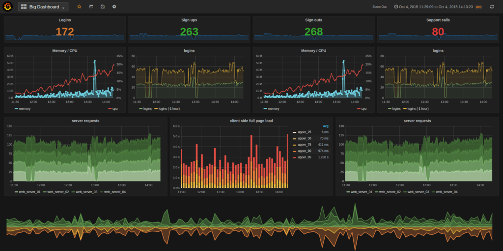
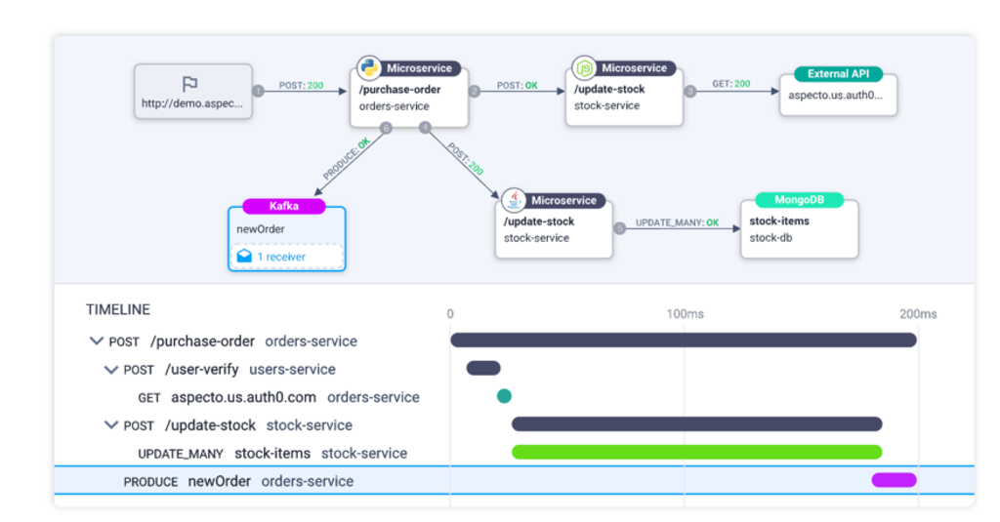
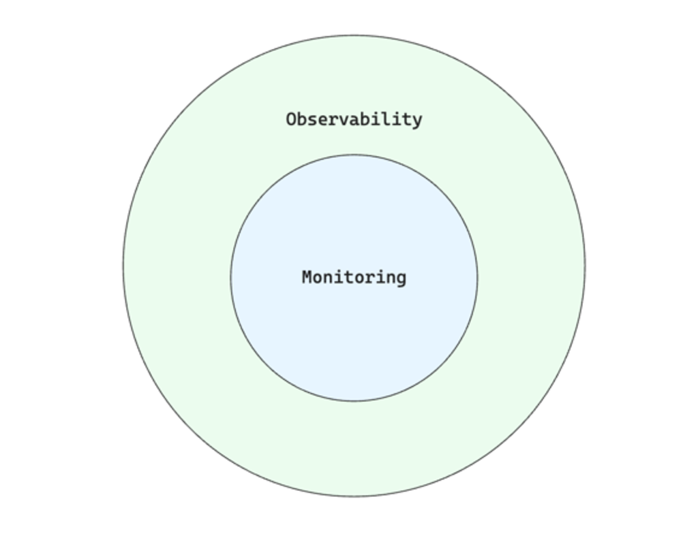

+++
author = "penguinit"
title = "observability vs monitoring 차이점 비교"
date = "2024-05-24"
description = "누군가 관측성(observability)가 정확히 무엇이고 모니터링(monitoring)과 어떤 차이점이 있냐고 물어보면 명확하게 대답하지 못할 것 같아서 글을 정리하려고 합니다."
tags = [
"observability", "monitoring"
]
categories = [
"infra"
]
+++

## 개요
누군가 관측성(observability)가 정확히 무엇이고 모니터링(monitoring)과 어떤 차이점이 있냐고 물어보면 명확하게 대답하지 못할 것 같아서 글을 정리하려고 합니다

## 관측성 (Observability) 이란?
관측성은 시스템 내부 상태를 외부에서 관찰할 수 있는 능력을 의미합니다. 시스템을 더 정확히 이해한다는 관점에서 다양한 데이터를 수집하고 분석합니다. 관측성을 구성한다고 했을 때 세 가지 주요 요소를 가집니다.

### 로그 (Log)
로그란 시스템에서 발생하는 연속적인 이벤트들의 기록을 얘기합니다. 이벤트들에 대한 기록은 사용자가 사용하는 도구나 의도에 따라서 다양한 방법으로 남길 수 있습니다.

예를 들어서 특정 시스템에서 에러가 발생했을 때 로그를 남기고 싶으면 사용자는 에러가 발생한 시간과 상세한 상황들을 로그로 남길 수 있습니다.

### 메트릭 (Metric)
메트릭은 시스템의 성능과 상태를 정량적으로 측정하는 지표라고 정의할 수 있습니다. 시간 변화에 따라서 데이터를 정량적으로 표현할 수 있고 이를 통해서 시각화를 하는 것이 일반적입니다.

예를 들어서 특정 시스템이 특정 시간대에 CPU가 어느 정도 점유하고 있는지 혹은 서버가 다운됐는지 아니면 API 요청이 특정 시간대에 얼마나 요청되었는지 이런 유형들을 모두 메트릭이라고 할 수 있습니다.

아래처럼 시각화를 도와주는 도구들을 통해서 어떤 상황인지를 쉽게 알 수 있습니다.

### 트레이스 (Trace)
트레이스는 현대 시스템이 마이크로서비스를 지향하면서 중요해진 요소로 특정 호출이 여러 서비스를 거치면서 해당 요청의 흐름을 추적할 때 사용하는 데이터들을 트레이스라고 얘기합니다. 트레이스를 통해서 이런 복잡한 시스템들 사이의 상호작용을 좀 더 쉽게 이해하고 병목지점을 빠르게 파악할 수 있습니다.

### 관측성 (Observability) 예시
특정 시간대에 사용자들이 결제 시 오류를 겪고 있다고 가정해 봅니다. 관측성을 통해, 로그를 분석하여 결제 요청 시 발생하는 오류 메시지를 확인하고, 트레이스를 통해 요청이 어떤 서비스에서 실패했는지 추적하며, 메트릭을 통해 결제 서비스의 자원 사용량을 확인할 수 있습니다. 이를 통해 문제의 원인을 정확히 파악하고 해결책을 찾을 수 있습니다.

## 모니터링 (Monitoring) 이란?
모니터링은 관측성의 하나의 요소로 생각하시면 됩니다. 모니터링은 특정 목적을 가지고 데이터를 수집하고 그리고 해당 데이터가 정상인지 비정상인지 여부를 판단합니다. 모니터링에서는 알람이나 보고서 시스템 등을 연동하여 비정상적인 상황에 대해 유저에게 알려줄 수 있습니다.

예를 서버의 CPU 사용률이 90%를 초과할 때 경고를 발생시키는 시스템이 좋은 예입니다. 이는 특정 지표를 지속적으로 모니터링하고, 문제가 발생하면 관리자에게 알립니다.

## 관측성 (Observability) vs 모니터링 (Monitoring) 비교정리

|     특성     |      관측성 (Observability)      | 모니터링 (Monitoring) |
|:----------:|:-----------------------------:|:-----------------:|
|   **목적**   |      시스템의 상태 이해 및 문제 진단       |  시스템 성능 및 가용성 감시  |
| **접근 방식**  | 다양한 데이터 소스 활용 (로그, 메트릭, 트레이스) |  특정 지표나 이벤트 모니터링  |
| **데이터 처리** |         심층 분석 및 문제 해결         |    주기적 측정 및 경고    |
|  **유연성**   |       예측하지 못한 문제에 대응 가능       |   사전 정의된 문제 감지    |

## 결론
관측성과 모니터링의 정의와 어떤 점들이 다른지에 대해서 정리해 보았습니다. 예전에 했던 작업들이 사실은 모니터링이 아니라 관측성에 더 가깝겠다는 생각을 했고 두 용어에 대해서 앞으로 잘 구분해서 사용할 수 있겠다라는 생각이 들었습니다.