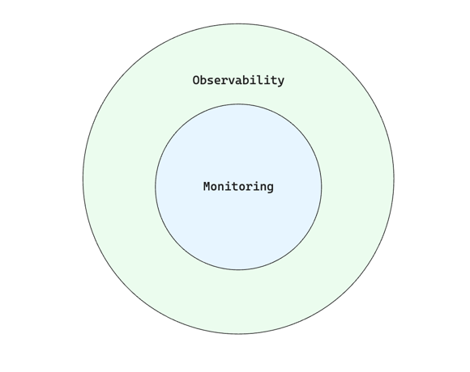

+++
author = "penguinit"
title = "imagemagick 설치 및 사용법"
date = "2024-05-24"
description = "HUGO를 사용해서 블로그를 운영하고 있습니다. 전반적으로 다 마음에 들지만 하나 불편한게 이미지 처리입니다. 일정 사이즈를 넘어가면 자동으로 리사이즈 처리를 하게 되는데요 그래서 일반적으로 캡처를 하게되면 의도와 다르게 이미지가 심하게 깨져버립니다. 그래서 이미지를 조작할일이 많은데 cli로 이미지를 조작할 수 있는 `imagemagick`에 대해서 자세히 알아보려고 합니다."
tags = [
"imagemagick"
]
categories = [
"tool"
]
+++

## 개요
[HUGO](https://gohugo.io/)를 사용해서 블로그를 운영하고 있습니다. 전반적으로 다 마음에 들지만 하나 불편한게 이미지 처리입니다. 일정 사이즈를 넘어가면 자동으로 리사이즈 처리를 하게 되는데요 그래서 일반적으로 캡처를 하게되면 의도와 다르게 이미지가 심하게 깨져버립니다. 그래서 이미지를 조작할일이 많은데 cli로 이미지를 조작할 수 있는 `imagemagick`에 대해서 자세히 알아보려고 합니다.



> 실제 이미지는 이렇지 않지만 HUGO에서 webp로 변환하는 과정에서의 퀄리티가 상당히 낮아지는 불상사를 겪게 됩니다.

## ImageMagick 소개
[ImageMagick](https://imagemagick.org/)은 이미지 파일을 생성, 편집, 변환하는 데 사용되는 강력한 오픈 소스 소프트웨어입니다. 다양한 이미지 형식을 지원하며, 명령어를 통해 다양한 이미지 처리를 수행할 수 있습니다.

## ImageMagick 설치

### Homebrew를 이용한 설치 (macOS)
macOS에서 Homebrew를 통해 ImageMagick을 설치하는 방법은 다음과 같습니다

- Homebrew 설치 (설치되어 있지 않은 경우):

```bash
/bin/bash -c "$(curl -fsSL https://raw.githubusercontent.com/Homebrew/install/HEAD/install.sh)"
```

- ImageMagick 설치

```bash
brew install imagemagick
```

### Ubuntu에서의 설치
snap을 이용해서 ImageMagick를 설치하는 방법은 아래와 같습니다. (Snapd는 Ubuntu 16.04 LTS 버전부터 기본적으로 설치되어 있습니다)

- ImageMagick 설치

```bash
sudo snap install imagemagick
```

## ImageMagick 사용법

### 이미지 변환
- PNG 이미지를 JPG로 변환하는 예제

```bash
convert input.png output.jpg
```

- 여러 이미지를 한번에 변환하는 예제 (해당 디렉토리 내의 특정 포맷을 모두 png로 변환)

```bash
mogrify -format jpg *.png
```

### 이미지 리사이즈
- 이미지를 지정한 크기로 리사이즈하는 예제

```bash
convert input.png -resize 800x600 output.png
```

- 이미지의 비율을 유지하면서 리사이즈 (가로사이즈를 800픽셀로 고정에서 리사이즈)

```bash
convert input.png -resize 800x output.png
```

### 이미지 회전

- 이미지를 시계방향으로 90도 회전

```bash
convert input.png -rotate 90 output.png
```

- 이미지를 반시계방향으로 45도 회전

```bash
convert input.png -rotate -45 output.png
```

## 결론
ImageMagick을 설치하는 방법과 사용법에 대해서 간단하게 알아보았습니다. 상세한 내용들은 [ImageMagick 공식문서](https://imagemagick.org/Usage/)를 참조하시면 됩니다.
이미지가 깨졌을 때 간단하게 스크립트를 만들어서 고정비율로 돌리니깐 크기로 인해서 문제가 생기는 부분도 없고 만족하면서 사용하고 있습니다. 