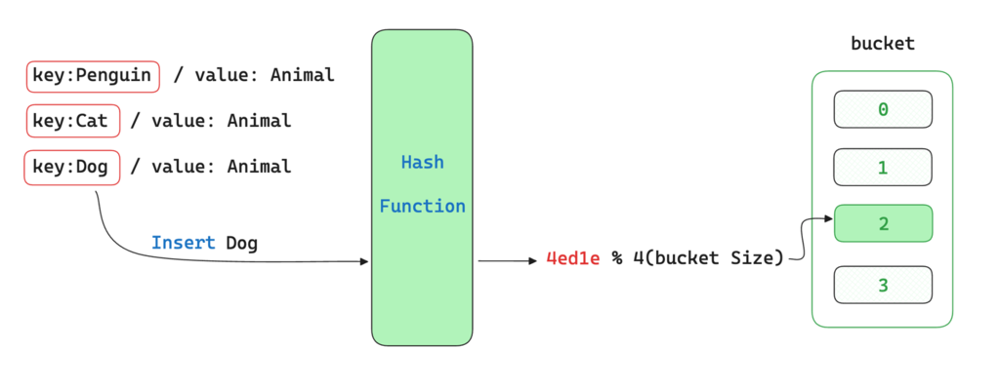
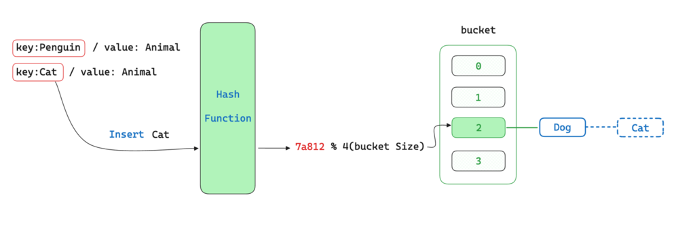
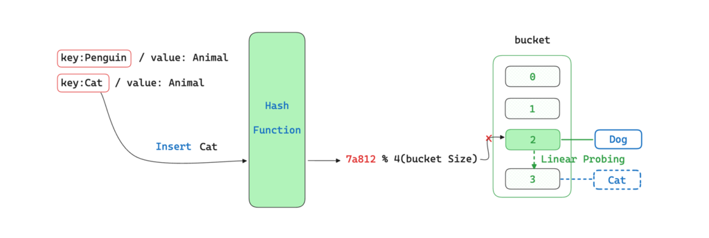

+++
author = "penguinit"
title = "해시 테이블 (hash table)에 대해서 알아보기"
date = "2024-05-28"
description = "개발을 하다보면 해시 테이블(hash table) 자료구조를 많이 사용하게 되는데 어떻게 동작하는지 옛날에 수업시간에 배웠었지만 기억이 가물가물해서 다시 한번 정리해보려고 합니다."
tags = [
"hash-table"
]
categories = [
"data-structure"
]
+++

## 개요
개발을 하다보면 해시 테이블(hash table) 자료구조를 많이 사용하게 되는데 어떻게 동작하는지 옛날에 수업시간에 배웠었지만 기억이 가물가물해서 다시 한번 정리해보려고 합니다.

## 해시 테이블(hash table)이란?
해시 테이블은 키와 값을 저장하는 배열 형태의 데이터 구조입니다. 각 키는 해시 함수(hash function)를 통해 해시 값으로 변환되고, 이 해시 값은 배열의 인덱스(버킷)로 사용됩니다. 이를 통해 특정 키에 대한 값을 빠르게 찾을 수 있습니다.

해시 테이블은 아래와 같은 특징을 가지고 있습니다.

- 해시 테이블은 키와 값의 쌍을 저장하는 자료구조이고 검색, 삽입, 삭제 연산이 빠름
- 해시 함수를 통해 키를 해시 값으로 변환
- 해시 테이블의 성능은 해시 함수의 성능에 크게 의존하므로, 좋은 해시 함수를 선택하는 것이 중요
- 해시 값은 버킷의 인덱스로 사용 (해시 값 / 버킷 사이즈)
- 충돌(Collision)을 해결하기 위한 방법으로는 체이닝(Chaining), 개방주소방식(Open Addressing) 등이 있음
- 시간 복잡도: O(1) (평균적으로)
- 리해싱 (Rehashing)을 통해 해시 테이블의 크기를 동적으로 조절할 수 있음

위에 그림은 해시 테이블의 동작 방식을 나타낸 그림입니다. 키를 해시 함수를 통해 해시 값으로 변환하고, 이를 통해 버킷의 인덱스를 찾아 값을 저장하거나 조회하는 방식입니다.
이런 자료구조를 사용하면 특정 키에 대한 값을 빠르게 찾을 수 있으며 (시간 복잡도 O(1) 일반적으로), 많은 언어에서 기본적으로 제공하는 자료구조 중 하나입니다.

## 해시 함수 (Hash Function)
해시 함수(hash function)는 임의의 크기를 가진 데이터를 고정된 크기의 고유한 값으로 변환하는 함수입니다. 이 고유한 값은 일반적으로 해시 값(hash value) 또는 해시 코드(hash code)라고 불리며, 데이터 검색과 저장의 효율성을 높이는 데 사용됩니다.

효율적인 해시 테이블을 구성하기 위해서 해시 함수는 아래와 같은 특징을 가지고 있어야합니다.

- 동일한 입력에 대해 항상 동일한 해시 값을 반환해야 합니다.
- 해시 함수는 가능한 모든 입력에 대해 균일하게 해시 값을 분포시켜야 합니다.
- 해시 함수는 빠르게 계산될 수 있어야 합니다.
- 서로 다른 입력에 대해 동일한 해시 값을 반환할 확률이 낮아야 합니다.

각 언어마다 해시 함수를 구성하는 방법이 모두 다르고 언어의 특성에 따라서 최적의 해시 함수를 선택합니다.

## 충돌(Collision) 해결 방법
해시 테이블에서 가장 중요한 문제 중 하나는 충돌(Collision)입니다. 충돌은 서로 다른 키에 대해 동일한 해시 값이 나오는 경우를 의미하며, 이를 해결하기 위한 방법으로는 아래와 같은 방법들이 있습니다.

### 체이닝(Chaining)
체이닝은 해시 테이블의 각 버킷에 연결 리스트를 사용하여 충돌을 해결하는 방법입니다. 충돌이 발생하면 해당 버킷에 연결 리스트를 생성하고, 새로운 값을 연결 리스트에 추가하는 방식입니다.

위에 처음에 언급했었는데 시간 복잡도가 O(1)이라고 적어두고 "일반적으로"라는 말을 적어둔 이유는 이렇게 충돌이 일어났을 때 O(1)이 아닐 수 있기 때문입니다. 만약에 충돌이 많이 발생하게 되면 연결 리스트의 길이가 길어져서 O(n)이 될 수 있습니다.

만약에 "Cat" 이라는 키값으로 헤시 테이블에서 데이터를 찾으면 버킷을 반환 받고 연결 리스트를 순회하면서 "Cat"이라는 키값을 찾게 됩니다.

### 개방주소방식(Open Addressing)
개방주소방식은 충돌이 발생했을 때 다른 버킷에 해당 값을 저장하는 방식입니다. 선형 탐사(Linear Probing), 이차 탐사(Quadratic Probing), 이중 해싱(Double Hashing) 등이 있으며, 각각의 방식에 따라 다른 버킷을 탐색하는 방법이 달라집니다.

- 선형 탐사(Linear Probing): 충돌이 발생하면 다음 버킷에 저장하는 방식
- 이차 탐사(Quadratic Probing): 충돌이 발생하면 제곱수만큼 떨어진 버킷에 저장하는 방식
- 이중 해싱(Double Hashing): 충돌이 발생하면 두 번째 해시 함수를 이용하여 다른 버킷에 저장하는 방식

선형 탐사를 예로 들면, "Cat" 값이 이미 버킷에 있을 경우 다음 버킷을 탐색하게 되고, 이 과정을 반복하여 빈 버킷을 찾아서 값을 저장하거나 조회하게 됩니다.

## 정리
해시 테이블은 개발을 하면서 자주 쓰이는 자료구조 중에 하나입니다. 해시 테이블이 실제로 어떤 방식으로 동작하는지 알아보았고, 충돌이 발생했을 때 해결하는 방법에 대해서도 알아보았습니다. 해시 테이블의 버킷이 크면 클수록 충돌이 적게 발생하지만 그 만큼 공간적인 낭비가 있을 수 있습니다. 해시 테이블의 버킷 크기는 적정 수준 이상이 되면 리해싱(rehashing)을 통해 동적으로 조절할 수 있는데 해당 부분은 다른 포스팅에서 이어서 작성해보도록 하겠습니다.
