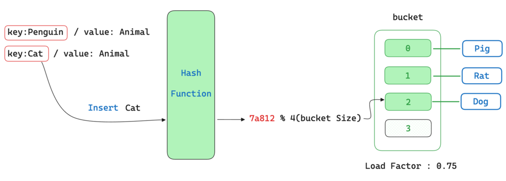

+++
author = "penguinit"
title = "해시 테이블 (hash table) 리해싱(rehashing)에 대해서 알아보기"
date = "2024-05-28"
description = "해시 테이블에서 버킷의 사이즈는 동적으로 변경될 수 있습니다. 이 과정에서 리해싱(rehashing)이라는 작업이 일어나게 되는데 이에 대해서 자세히 알아보려고 합니다."
tags = [
"hash-table", "rehashing"
]
categories = [
"data-structure"
]
+++

## 개요
해시 테이블에서 버킷의 사이즈는 동적으로 변경될 수 있습니다. 이 과정에서 리해싱(rehashing)이라는 작업이 일어나게 되는데 이에 대해서 자세히 알아보려고 합니다.

## 해시 테이블의 리해싱(rehashing)
리해싱(rehashing)은 해시 테이블의 크기를 동적으로 조절하는 작업을 의미합니다. 해시 테이블은 일반적으로 고정된 크기의 버킷을 가지고 있으며, 버킷의 크기가 작을수록 충돌(Collision)이 많이 발생하게 되기 때문에 성능이 점점 안 좋아지게 됩니다. 이러한 문제를 해결하기 위해 해시 테이블은 동적으로 버킷의 크기를 조절할 수 있어야 합니다.

리해싱은 일반적으로 아래와 같은 과정을 거칩니다.

1. 새로운 버킷의 크기를 결정합니다. (일반적으로 2배씩 증가)
2. 기존 버킷의 데이터를 새로운 버킷에 재배치합니다.
3. 새로운 버킷을 사용하도록 설정합니다.

해시 테이블을 구성하는 언어나 라이브러리에 따라 리해싱을 수행하는 방식이 다를 수 있지만 버킷을 늘리는 판단을 할 때 로드팩터(Load Factor)를 고려해서 결정합니다. 로드팩터는 버킷에 저장된 데이터의 개수와 버킷의 크기의 비율을 의미하며, 일반적으로 0.7 ~ 0.75 이상일 경우 (기준이 모두 다름) 리해싱을 수행합니다.

## 리해싱의 시간 복잡도
리해싱의 시간 복잡도는 기존 버킷의 데이터를 새로운 버킷에 재배치하는 작업에 의해 결정됩니다. 일반적으로 이 작업은 O(n)의 시간 복잡도를 가지며, n은 버킷에 저장된 데이터의 개수를 의미합니다. 따라서 리해싱의 시간 복잡도는 버킷의 크기에 비례하게 됩니다.

## 해시 테이블 최적화
리해싱은 해시 테이블의 성능을 유지하기 위해 필요한 작업이지만, 이 작업은 비용이 크기 때문에 최대한 효율적으로 수행해야 합니다. 따라서 해시 테이블을 구성할 때 초기 버킷의 크기나 로드팩터를 적절히 설정하는 것이 중요합니다. 특히 버킷의 크기를 지나치게 크게 할 경우에는 메모리 낭비가 발생할 수 있으며, 지나치게 작게 할 경우에는 충돌이 많이 발생하거나 혹은 리해싱이 빈번하게 일어날 수 있습니다. 따라서 해시 테이블을 사용할 때는 이러한 요소들을 고려해서 최적화하는 것이 중요합니다.

예를 들어서 100만 개의 데이터를 해시 테이블에 저장한다고 했을 때 버킷의 크기를 적게 해두면 리해싱이나 충돌이 많이 발생해서 성능이 떨어질 수 있습니다.

## 결론
해당 포스팅을 통해서 해시 테이블에서 리해싱은 어떤 작업을 하는 것인지에 대해서 알아보았습니다. 리해싱은 해시 테이블의 성능을 유지하기 위해 필요한 작업이며, 해시 테이블을 사용할 때는 초기 버킷의 크기나 로드팩터를 적절히 설정하는 것이 중요합니다. 

