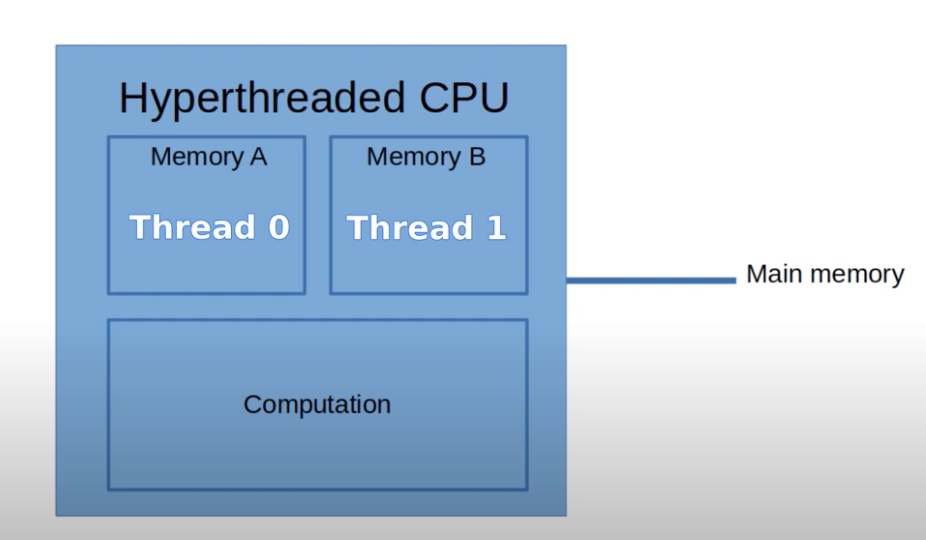
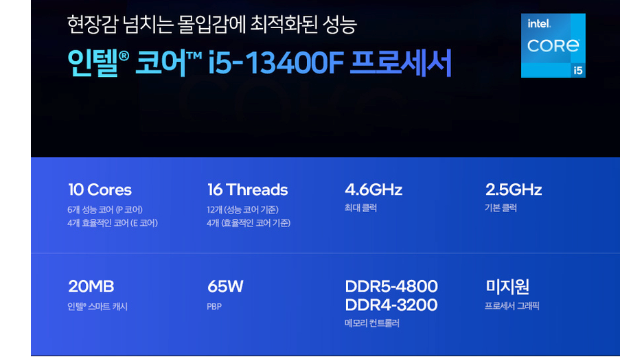

+++
author = "penguinit"
title = "하이퍼쓰레딩(Hyper-Threading, HT)이란 무엇인가?"
date = "2024-05-30"
description = "하이퍼쓰레딩(Hyper-Threading)이 무엇이고 어떤 원리로 동작하는지 알아보려고 합니다."
tags = [
"thread"
]
categories = [
"os"
]
+++

## 개요
하이퍼쓰레딩(Hyper-Threading)이 무엇이고 어떤 원리로 동작하는지 알아보려고 합니다.

## 하이퍼쓰레딩(Hyper-Threading)이란?
하이퍼쓰레딩(Hyper-Threading)은 인텔(Intel)이 개발한 기술로, 물리적 프로세서 코어 하나가 동시에 두 개의 스레드를 처리할 수 있도록 하는 기술입니다. 이를 통해 CPU의 성능과 효율성을 향상시킬 수 있습니다.

예를 들어서 하이퍼쓰레딩을 통해서 두 개의 논리적 코어(Logical Core)를 가진다면 4개의 물리적 코어를 가진 CPU는 하이퍼쓰레딩을 통해서 8개의 쓰레드로 동작할 수 있습니다.

최근에 팔고 있는 CPU를 가지고 좀 더 설명해 보겠습니다. 

### i5-13400F

현재 i5-13400F는 10개의 코어와 16개 쓰레드를 지원한다고 합니다. 10개의 코어에는 P코어와 E코어를 얘기하는데 E코어는 전력소비를 최소화하는 코어로 하이퍼쓰레딩을 사용하지 않습니다.

- P코어 6개 X 2(논리적 코어) = 12 쓰레드
- E코어 4개 = 4 쓰레드

i5-13400F 위와 같은 이유로 16개의 쓰레드를 지원한다고 볼 수 있습니다.

## 하이퍼쓰레딩 작동 방식
하이퍼쓰레딩을 사용하면, 물리적 코어의 연산 장치(Arithmetic Logic Unit, ALU), 레지스터, 캐시 등 하드웨어 자원을 두 개의 스레드가 공유하게 됩니다. 각 스레드는 독립적인 명령어 스트림을 실행할 수 있습니다. 자원을 공유하고 있기 때문에 논리적이긴 하지만 컨텍스트 스위칭을 최소화하여, 시스템의 응답성을 높이고 오버헤드를 줄입니다.

논리적 코어들은 파이프라인의 각 단계를 공유하고 있고 각자 명령어를 독립적으로 처리할 수 있어서 번갈아서 실행할 수 있습니다.

### 파이프라인 단계
1. IF (Instruction Fetch): 명령어를 메모리에서 가져옴.
2. ID (Instruction Decode): 명령어를 디코딩.
3. EX (Execute): 명령어를 실행.
4. MEM (Memory Access): 메모리 접근.
5. WB (Write Back): 결과를 레지스터에 기록.

#### 하이퍼쓰레딩을 지원하는 코어에서 명령어 처리 예시

- 논리적 코어 1
  - T0: 명령어 1 - Instruction Fetch (IF)
  - T1: 명령어 1 - Instruction Decode (ID)
  - T2: 명령어 1 - Execute (EX)
  - T3: 명령어 1 - Memory Access (MEM)
  - T4: 명령어 1 - Write Back (WB)

- 논리적 코어 2
  - T0: 명령어 2 - Instruction Fetch (IF)
  - T1: 명령어 2 - Instruction Decode (ID)
  - T2: 명령어 2 - Execute (EX)
  - T3: 명령어 2 - Memory Access (MEM)
  - T4: 명령어 2 - Write Back (WB)

| 사이클 | IF 단계        | ID 단계        | EX 단계        | MEM 단계       | WB 단계        |
|-----|--------------|--------------|--------------|--------------|--------------|
| T0  | 명령어 1 (코어 1) |              |              |              |              |
| T1  | 명령어 2 (코어 2) | 명령어 1 (코어 1) |              |              |              |
| T2  |              | 명령어 2 (코어 2) | 명령어 1 (코어 1) |              |              |
| T3  |              |              | 명령어 2 (코어 2) | 명령어 1 (코어 1) |              |
| T4  |              |              |              | 명령어 2 (코어 2) | 명령어 1 (코어 1) |
| T5  |              |              |              |              | 명령어 2 (코어 2) |

이 표는 두 논리적 코어가 단일 파이프라인을 공유하여 명령어를 처리하는 과정을 명확하게 보여줍니다. 각 논리적 코어는 파이프라인의 서로 다른 단계를 사용하여 동시에 명령어를 처리할 수 있습니다.

## 정리
이번 포스팅에서는 하이퍼쓰레딩(Hyper-Threading)이 무엇이고 어떤 원리로 동작하는지 알아보았습니다. 하이퍼쓰레딩은 물리적 코어 하나가 동시에 두 개의 스레드를 처리할 수 있도록 하는 기술로, CPU의 성능과 효율성을 향상시킬 수 있습니다. 논리적 코어들은 파이프라인의 각 단계를 공유하고 있고 각자 명령어를 독립적으로 처리할 수 있어서 번갈아서 실행할 수 있습니다.