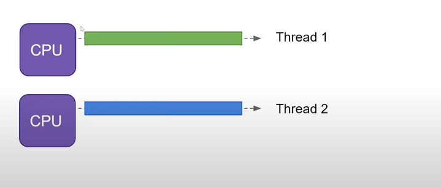
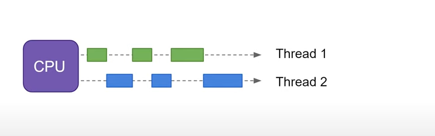
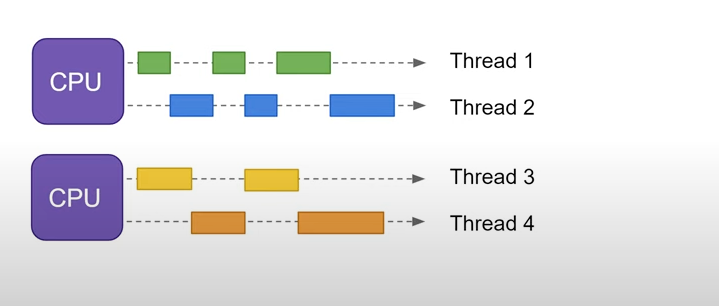

+++
author = "penguinit"
title = "병렬성(Parallelism)과 동시성(Concurrency)에 대해서 알아보기"
date = "2024-05-30"
description = "비동기 프로그래밍을 하다보면 병렬성(Parallelism)과 동시성(Concurrency)에 대해서 자주 듣게 됩니다. 두 개념은 비슷해 보이지만 차이가 있는데요 이번 포스팅에서는 병렬성과 동시성에 대해서 알아보려고 합니다."
tags = [
"parallelism","concurrency"
]
categories = [
"os"
]
+++

## 개요
비동기 프로그래밍을 하다보면 병렬성(Parallelism)과 동시성(Concurrency)에 대해서 자주 듣게 됩니다. 두 개념은 비슷해 보이지만 차이가 있는데요 이번 포스팅에서는 병렬성과 동시성에 대해서 알아보려고 합니다.

## 병렬성(Parallelism)이란?
병렬성은 여러 작업을 동시에 처리하는 것을 의미합니다. 실제로 멀티 쓰레드 환경에서 여러 프로세스들이 처리되는 것을 병렬성이라고 합니다.

### 병렬성 실생활 예시
중국 음식점에서 일하는 요리사을 예로 들어보겠습니다. 요리사는 한명만 있고 요리를 만드는데 10분이 걸립니다. 만약 요리사가 2명이라면 5분만에 요리를 만들 수 있습니다. 이것이 병렬성입니다.

## 동시성(Concurrency)이란?
동시성은 한 작업을 동시에 처리하는 것처럼 보이도록 하는 것을 의미합니다. 실제로는 한 번에 하나의 작업만 처리되지만, 작업들이 빠르게 번갈아가며 처리되는 것을 동시성이라고 합니다.

### 동시성 실생활 예시
요리사를 다시 예시로 들면 한개의 요리를 완성하는데 10분이 걸린다고 했을 때 2명의 요리사가 각각의 일을 분업하여 번갈아가면서 요리를 할 수 있다면 10분 보다는 훨씬 빠르게 요리를 만들 수 있습니다. 이것이 동시성입니다.

## 병렬성과 동시성의 차이
- 병렬성은 여러 작업을 동시에 처리하는 것을 의미합니다.
- 동시성은 한 작업을 동시에 처리하는 것처럼 보이도록 하는 것을 의미합니다.
- 병렬성은 실제로 여러 작업이 동시에 처리되는 것이고, 동시성은 여러 작업이 번갈아가며 처리되는 것입니다.
- 병렬성은 여러 프로세스나 쓰레드가 동시에 처리되는 것이고, 동시성은 하나의 프로세스나 쓰레드가 여러 작업을 번갈아가며 처리하는 것입니다.

병렬성과 동시성은 서로 보완적인 관계이고 서로 개념을 활용해서 더 효율적으로 컴퓨팅 시스템을 구축할 수 있습니다.

## 정리
포스팅을 통해서 병렬성과 동시성에 대해서 실생활 예시와 함께 알아보았습니다. 병렬성과 동시성은 비슷해 보이지만 분명 차이가 있습니다. 두 개념은 상호 보완적이며 현대 컴퓨팅 시스템에서 효율적이고 빠른 작업 처리를 위해 함께 사용됩니다. 동시성은 병렬성을 활용할 수 있고, 병렬성은 동시성을 통해 더 많은 작업을 효율적으로 처리할 수 있습니다.

