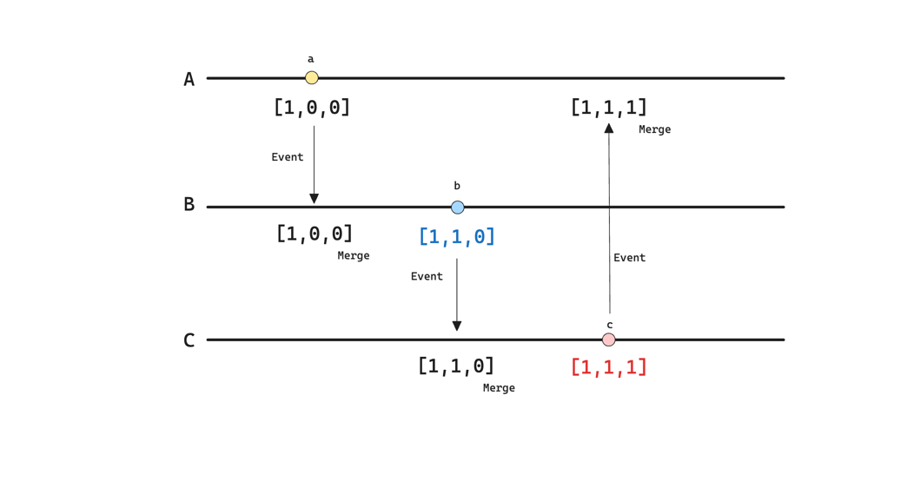
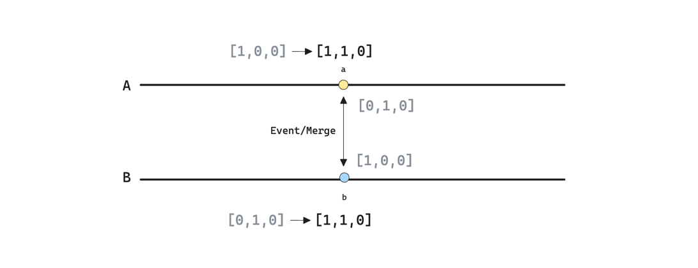

+++
author = "penguinit"
title = "벡터 클락 (Vector Clock) 알아보기"
date = "2024-06-20"
description = "분산 시스템에서 동시성을 판단할 때 벡터 클락 (Vector Clock)을 이용해서 판단한다고 하는데 해당 내용을 몰라서 정리하고자 합니다."
tags = [
"vector-clock",
]
categories = [
"algorithm"
]
+++

## 개요
분산 시스템에서 동시성을 판단할 때 벡터 클락 (Vector Clock)을 이용해서 판단한다고 하는데 해당 내용을 몰라서 정리하고자 합니다.

## 벡터 클락(Vector Clock)이란?
벡터 클락(Vector Clock)은 분산 시스템에서 시간과 이벤트의 순서를 추적하는 데 사용되는 논리적 시계입니다. 이를 통해서 이벤트의 순서를 결정하거나 인과 관계를 파악하는 데 도움을 줍니다.

### 벡터 클락 비교 규칙
벡터 클락을 비교할 때 다음 규칙을 사용합니다

- 동등한 경우: 모든 노드의 벡터 클락 값이 동일하다면 두 이벤트는 동일한 시간에 발생했다고 판단할 수 있습니다.
- 하나가 더 큰 경우: 한 벡터 클락의 모든 값이 다른 벡터 클락의 값보다 크거나 같은 경우, 더 큰 벡터 클락을 가진 이벤트가 더 나중에 발생했다고 판단할 수 있습니다.
- 비교 불가능한 경우: 벡터 클락의 값이 서로 엇갈리면, 두 이벤트는 독립적이거나 동시에 발생했다고 판단할 수 있습니다.

### 벡터 클락 (Vector Clock) 사용 사례
- 분산 데이터 저장소: Amazon DynamoDB, Apache Cassandra 등은 벡터 클락을 사용하여 데이터의 버전을 관리하고 충돌을 해결합니다.

- 버전 관리 시스템: 분산 버전 관리 시스템은 여러 클라이언트가 동일한 파일을 병렬로 수정할 때 벡터 클락을 사용하여 충돌을 감지하고 해결합니다.

- 분산 디버깅: 분산 시스템에서 이벤트의 순서를 추적하고, 인과 관계를 분석하여 디버깅하는 데 사용됩니다.

## 벡터 클락 (Vector Clock) 예시

- A, B, C는 분산 시스템에서의 프로세스를 나타냅니다.
- 이벤트 발생은 A -> B -> C 순서로 발생합니다.

### 분산 시스템에서 순차적인 이벤트 발생

1. 초기 상태:

- A: [0, 0, 0]
- B: [0, 0, 0]
- C: [0, 0, 0]

2. 노드 A에서 이벤트 발생:

- A: [1, 0, 0] (A는 자신의 시계 값을 증가시킴)

3. 노드 A가 노드 B에 메시지 전송:

- A: [1, 0, 0]
- B: [1, 0, 0] (B는 A로부터 벡터 클락을 수신하고 병합함)

4. 노드 B에서 이벤트 발생:

- B: [1, 1, 0] (B는 자신의 시계 값을 증가시킴)

5. 노드 B가 노드 C에 메시지 전송:

- B: [1, 1, 0]
- C: [1, 1, 0] (C는 B로부터 벡터 클락을 수신하고 병합함)

6. 노드 C에서 이벤트 발생:

- C: [1, 1, 1] (C는 자신의 시계 값을 증가시킴)

7. 노드 C가 노드 A에 메시지 전송:

- C: [1, 1, 1]
- A: [1, 1, 1] (A는 C로부터 벡터 클락을 수신하고 병합함)

b[1,1,0] < c[1,1,0] 이므로 c가 더 늦게 발생한 이벤트라고 판단할 수 있습니다.

### 분산 시스템에서 동시 이벤트 발생

동시 발생 이벤트를 확인하는 방법은 다음과 같습니다:

1. 초기 상태

- A: [0, 0, 0]
- B: [0, 0, 0]

2. 노드 A와 노드 B에서 동시에 이벤트 발생

- A: [1, 0, 0]
- B: [0, 1, 0]

3. 노드 A와 B가 서로 메시지 전송

- A: [1, 1, 0] (A는 B의 벡터 클락을 병합)
- B: [1, 1, 0] (B는 A의 벡터 클락을 병합)

a[1,1,0] = b[1,1,0] 이므로 두 이벤트는 동시에 발생했다고 판단할 수 있습니다.

## 정리
벡터 클락(Vector Clock)은 분산 시스템에서 이벤트의 순서를 추적하고 인과 관계를 파악하는 데 사용되는 논리적 시계입니다. 벡터 클락을 사용하면 동시성을 판단하거나 충돌을 해결하는 데 도움을 줄 수 있습니다. 벡터 클락은 분산 데이터 저장소, 버전 관리 시스템, 분산 디버깅 등 다양한 분야에서 사용됩니다.