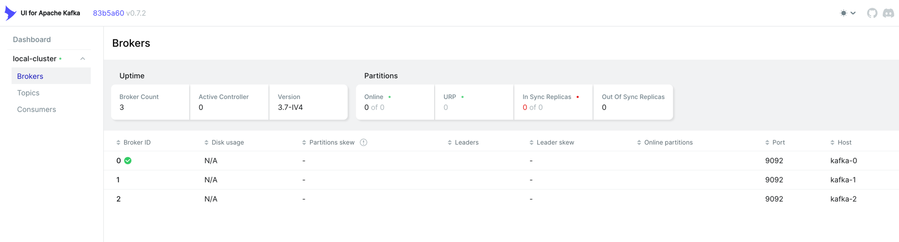
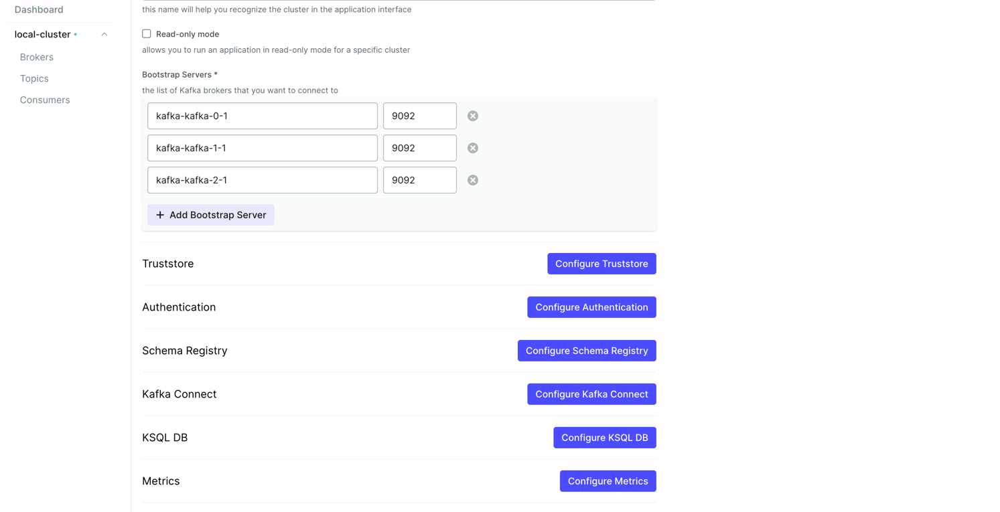

+++
author = "penguinit"
title = "Provectuslabs Kafka UI 사용해보기"
date = "2024-06-23"
description = "Kafka를 사용하다보면 UI가 필요할 때가 있습니다. 이때 Provectuslabs에서 제공하는 Kafka UI를 사용해보고자 합니다"
tags = [
"kafka",
]
categories = [
"infra"
]
+++

## 개요
Kafka를 사용하다보면 UI가 필요할 때가 있습니다. 이때 Provectuslabs에서 제공하는 Kafka UI를 사용해보고자 합니다.

## Kafka UI란?
Kafka UI는 Kafka 클러스터를 모니터링하고 관리하기 위한 웹 인터페이스입니다. 이를 통해 토픽, 컨슈머 그룹, 메시지를 모니터링하고 관리할 수 있습니다.
대표적으로 Confluent Control Center, Burrow, Kafka Manager, Provectuslabs Kafka UI 등이 있습니다.

- [Confluent Control Center](https://www.confluent.io/confluent-control-center/): Confluent에서 제공하는 Kafka 모니터링 및 관리 도구
- [Burrow](https://github.com/linkedin/Burrow): LinkedIn에서 제공하는 Kafka 컨슈머 오프셋 모니터링 도구 
- [Kafka Manager](https://github.com/yahoo/CMAK): Yahoo에서 제공하는 Kafka 클러스터 관리 도구
- [AKHQ](https://akhq.io/): Kafka HQ에서 제공하는 Kafka 클러스터 모니터링 및 관리 도구
- [Provectuslabs Kafka UI](https://github.com/provectus/kafka-ui): Provectuslabs에서 제공하는 Kafka 클러스터 모니터링 및 관리 도구

## Provectuslabs Kafka UI
Provectuslabs에서 제공하는 Kafka UI는 Kafka 클러스터를 모니터링하고 관리하기 위한 웹 인터페이스입니다. 다른 Kafka UI도 비슷한 기능을 제공하지만, Provectuslabs Kafka UI는 다음과 같은 특징을 가지고 있습니다.

- 토픽, 컨슈머 그룹, 메시지를 모니터링하고 관리할 수 있습니다.
- 토픽의 메시지를 검색하고, 메시지를 전송할 수 있습니다.
- 스키마 레지스트리를 관리할 수 있습니다.
- Kafka Connect를 모니터링하고, 커넥터를 관리할 수 있습니다.
- KSQL 쿼리를 실행하고, KSQL 서버를 관리할 수 있습니다.

다양한 Kafka UI들이 있고 각각의 특징이 있지만, Provectuslabs Kafka UI는 다양한 기능을 제공하면서도 사용하기 쉽고 직관적인 UI를 제공한다고 생각하고 있고 문서화도 상대적으로 잘 되어있다고 생각합니다.

[Provectuslabs Kafka UI Docs](https://docs.kafka-ui.provectus.io/)

## Provectuslabs Kafka UI 사용해보기
Provectuslabs Kafka UI를 사용해보기 위해서는 Docker를 통해 간단하게 실행할 수 있습니다. Kafka UI이기 때문에 Kafka 클러스터가 필요하며, Docker를 통해 Kafka 클러스터를 실행하고 Kafka UI를 실행해보겠습니다.

### Kafka 클러스터 실행
Kafka 클러스터를 실행하기 위해서는 Docker-Compose 파일을 작성하겠습니다.

```yaml
version: "2"

services:
  kafka-0:
    image: docker.io/bitnami/kafka:3.7
    ports:
      - "9092:9092"
    environment:
      # KRaft settings
      - KAFKA_CFG_NODE_ID=0
      - KAFKA_CFG_PROCESS_ROLES=controller,broker
      - KAFKA_CFG_CONTROLLER_QUORUM_VOTERS=0@kafka-0:9093,1@kafka-1:9093,2@kafka-2:9093
      - KAFKA_KRAFT_CLUSTER_ID=abcdefghijklmnopqrstuv
      # Listeners
      - KAFKA_CFG_LISTENERS=PLAINTEXT://:9092,CONTROLLER://:9093
      - KAFKA_CFG_ADVERTISED_LISTENERS=PLAINTEXT://kafka-0:9092
      - KAFKA_CFG_LISTENER_SECURITY_PROTOCOL_MAP=PLAINTEXT:PLAINTEXT,CONTROLLER:PLAINTEXT
      - KAFKA_CFG_CONTROLLER_LISTENER_NAMES=CONTROLLER
      - KAFKA_CFG_INTER_BROKER_LISTENER_NAME=PLAINTEXT
      # Clustering
      - KAFKA_CFG_OFFSETS_TOPIC_REPLICATION_FACTOR=3
      - KAFKA_CFG_TRANSACTION_STATE_LOG_REPLICATION_FACTOR=3
      - KAFKA_CFG_TRANSACTION_STATE_LOG_MIN_ISR=2
    volumes:
      - kafka_0_data:/bitnami/kafka
    networks:
      - kafka-network
  kafka-1:
    image: docker.io/bitnami/kafka:3.7
    ports:
      - "9093:9092"
    environment:
      # KRaft settings
      - KAFKA_CFG_NODE_ID=1
      - KAFKA_CFG_PROCESS_ROLES=controller,broker
      - KAFKA_CFG_CONTROLLER_QUORUM_VOTERS=0@kafka-0:9093,1@kafka-1:9093,2@kafka-2:9093
      - KAFKA_KRAFT_CLUSTER_ID=abcdefghijklmnopqrstuv
      # Listeners
      - KAFKA_CFG_LISTENERS=PLAINTEXT://:9092,CONTROLLER://:9093
      - KAFKA_CFG_ADVERTISED_LISTENERS=PLAINTEXT://kafka-1:9092
      - KAFKA_CFG_LISTENER_SECURITY_PROTOCOL_MAP=PLAINTEXT:PLAINTEXT,CONTROLLER:PLAINTEXT
      - KAFKA_CFG_CONTROLLER_LISTENER_NAMES=CONTROLLER
      - KAFKA_CFG_INTER_BROKER_LISTENER_NAME=PLAINTEXT
      # Clustering
      - KAFKA_CFG_OFFSETS_TOPIC_REPLICATION_FACTOR=3
      - KAFKA_CFG_TRANSACTION_STATE_LOG_REPLICATION_FACTOR=3
      - KAFKA_CFG_TRANSACTION_STATE_LOG_MIN_ISR=2
    volumes:
      - kafka_1_data:/bitnami/kafka
    networks:
      - kafka-network
  kafka-2:
    image: docker.io/bitnami/kafka:3.7
    ports:
      - "9094:9092"
    environment:
      # KRaft settings
      - KAFKA_CFG_NODE_ID=2
      - KAFKA_CFG_PROCESS_ROLES=controller,broker
      - KAFKA_CFG_CONTROLLER_QUORUM_VOTERS=0@kafka-0:9093,1@kafka-1:9093,2@kafka-2:9093
      - KAFKA_KRAFT_CLUSTER_ID=abcdefghijklmnopqrstuv
      # Listeners
      - KAFKA_CFG_LISTENERS=PLAINTEXT://:9092,CONTROLLER://:9093
      - KAFKA_CFG_ADVERTISED_LISTENERS=PLAINTEXT://kafka-2:9092
      - KAFKA_CFG_LISTENER_SECURITY_PROTOCOL_MAP=PLAINTEXT:PLAINTEXT,CONTROLLER:PLAINTEXT
      - KAFKA_CFG_CONTROLLER_LISTENER_NAMES=CONTROLLER
      - KAFKA_CFG_INTER_BROKER_LISTENER_NAME=PLAINTEXT
      # Clustering
      - KAFKA_CFG_OFFSETS_TOPIC_REPLICATION_FACTOR=3
      - KAFKA_CFG_TRANSACTION_STATE_LOG_REPLICATION_FACTOR=3
      - KAFKA_CFG_TRANSACTION_STATE_LOG_MIN_ISR=2
    volumes:
      - kafka_2_data:/bitnami/kafka
    networks:
      - kafka-network

volumes:
  kafka_0_data:
    driver: local
  kafka_1_data:
    driver: local
  kafka_2_data:
    driver: local

networks:
  kafka-network:
    driver: bridge
```

### Kafka UI 실행
Kafka UI를 실행하기 위해서 같은 docker network를 공유 해야하기에 --network 옵션을 통해 같은 네트워크에 연결해주겠습니다.

```bash
docker run -d -it --rm --network=kafka_kafka-network --name kafka-ui -p 8080:8080 \
-e DYNAMIC_CONFIG_ENABLED=true \
-e KAFKA_CLUSTERS_0_NAME=local-cluster \
-e KAFKA_CLUSTERS_0_BOOTSTRAPSERVERS=kafka-kafka-0-1:9092,kafka-kafka-1-1:9092,kafka-kafka-2-1:9092 \
provectuslabs/kafka-ui:latest
```
- DYNAMIC_CONFIG_ENABLED: 동적 설정 활성화 여부, 이 설정을 하지 않을 경우에는 UI상에서 기존에 설정한 클러스터 정보를 변경할 수 없습니다.
- KAFKA_CLUSTERS_0_NAME: 클러스터 이름 (임의로 설정)
- KAFKA_CLUSTERS_0_BOOTSTRAPSERVERS: Kafka 클러스터의 부트스트랩 서버 주소, 여러개의 주소를 설정할 경우 콤마(,)로 구분합니다.

### Kafka UI 접속
정상적으로 설정이 된다면 http://localhost:8080 으로 접속해서 broker 탭을 클릭시 아래와 같은 화면을 보실 수 있습니다.



현재는 브로커만 설정하고 실행했기 때문에 브로커만 보이지만, 토픽, 컨슈머 그룹, 메시지, 스키마 레지스트리, Kafka Connect, KSQL, ACL 등 다양한 기능을 사용할 수 있습니다.



## 정리
Provectuslabs Kafka UI를 사용해보았습니다. Kafka 클러스터를 모니터링하고 관리하기 위한 다양한 기능을 제공하고 있으며, 사용하기 쉽고 직관적인 UI를 제공하고 있습니다. 다양한 Kafka UI들이 있지만, Provectuslabs Kafka UI도 사용해보시면 좋을 것 같습니다.