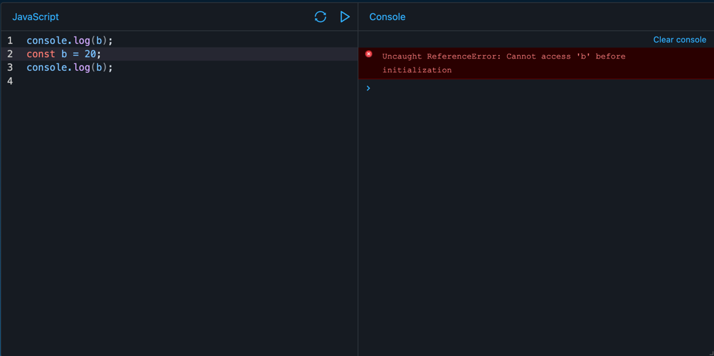

+++
author = "penguinit"
title = "자바스크립트 호이스팅 (Hoisting) 이해하기"
date = "2024-06-24"
description = "요즘 프론트엔드쪽을 다시공부하고 있는데 자바스크립트쪽에서 호이스팅이라는 개념이 있는데 이에 대해 정리해보고자 합니다."
tags = [
"javascript", "hoisting"
]
categories = [
"language"
]
+++

## 개요
요즘 프론트엔드쪽을 다시공부하고 있는데 자바스크립트쪽에서 호이스팅이라는 개념이 있는데 이에 대해 정리해보고자 합니다.

## 호이스팅 (Hoisting)
호이스팅은 변수와 함수의 선언이 해당 스코프의 최상단으로 끌어올려지는 현상을 의미합니다. 호이스팅이 발생하면 변수와 함수가 선언되기 전에 참조될 수 있습니다.

## 자바스크립트 변수에서 호이스팅
ES6 이후에 변수를 선언하기 위해서 `let`, `const` 키워드를 사용할 수 있게 되었는데 기존에 사용되던 `var`를 포함해서 호이스팅이 발생했을 때 어떻게 동작하는지 알아보겠습니다.

### var 키워드
var 키워드를 사용한 변수는 호이스팅됩니다. 하지만, 값의 할당은 호이스팅되지 않습니다. 아래 코드를 예로 들어보겠습니다.

```javascript
console.log(a); // undefined
var a = 10;
console.log(a); // 10
```
위 코드에서 var a 선언이 호이스팅되어 최상단으로 올라가지만, a에 값이 할당되는 부분은 호이스팅되지 않습니다. 따라서 첫 번째 `console.log(a)`는 undefined를 출력합니다.

### let, const 키워드
let 키워드는 블록 스코프를 가지며, 호이스팅되지만 초기화되기 전까지는 TDZ(Temporal Dead Zone)에 놓이게 됩니다.

```javascript
console.log(b); // ReferenceError: Cannot access 'b' before initialization
let b = 20;
console.log(b); // 20
```

위 코드에서 let b 선언이 호이스팅되지만, 초기화되기 전까지 b를 참조하려고 하면 ReferenceError가 발생합니다. 
const 키워드도 마찬가지로 호이스팅되지만 초기화되기 전까지 TDZ에 놓이게 됩니다.



## 함수 호이스팅
함수 선언은 함수 표현식과 함수 선언식으로 나눌 수 있습니다. 함수 선언식은 호이스팅되지만 함수 표현식은 호이스팅되지 않습니다.

### 함수 선언식
함수 선언문은 호이스팅되며, 함수 전체가 스코프 최상단으로 올라갑니다.

```javascript
hoistedFunction(); // "This function has been hoisted"

function hoistedFunction() {
    console.log("This function has been hoisted");
}
```

위 코드에서 hoistedFunction은 선언되기 전에 호출될 수 있습니다.

### 함수 표현식
함수 표현식은 변수 호이스팅처럼 동작합니다.

```javascript
nonHoistedFunction(); // TypeError: nonHoistedFunction is not a function

var nonHoistedFunction = function() {
    console.log("This function has not been hoisted");
};
```
위 코드에서 nonHoistedFunction은 함수가 할당되기 전까지 undefined 상태이기 때문에, 호출 시 TypeError가 발생합니다.

## 정리
오늘 포스팅에서는 호이스팅에 대해서 알아보았습니다. Javascript에서 변수와 함수를 선언하는 데 있어서 호이스팅을 제대로 이해하지 못하면 잘못된 코드가 작성될 수 있으니 주의해야 합니다.
