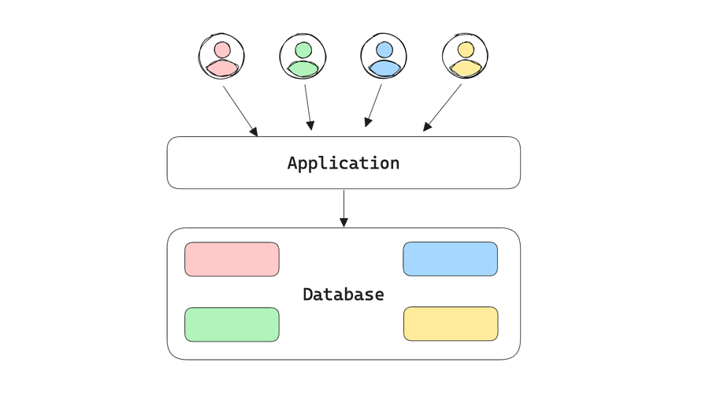

+++
author = "penguinit"
title = "SaaS에서 멀티 테넌시(Multi Tenancy) 알아보기"
date = "2024-06-24"
description = "ChatGPT 출시 이후에 LLM관련 SaaS 서비스들이 많이 나오고 있는데 이에 사용되는 멀티 테넌시(Multi Tenancy) 개념에 대해 알아보고자 합니다."
tags = [
"multi-tenancy",
]
categories = [
"saas"
]
+++

## 개요
ChatGPT 출시 이후에 LLM관련 SaaS 서비스들이 많이 나오고 있는데 이에 사용되는 멀티 테넌시(Multi Tenancy) 개념에 대해 알아보고자 합니다.

## 멀티 테넌시 (Multi Tenancy)
멀티 테넌시(Multi-Tenancy)는 단일 소프트웨어 인스턴스가 여러 고객(테넌트)에 의해 사용되는 소프트웨어 아키텍처를 의미합니다. 이 아키텍처는 하나의 애플리케이션이 여러 사용자나 조직에 의해 공유되지만, 각 사용자나 조직은 자신만의 독립된 데이터와 구성을 유지합니다. 멀티 테넌시는 클라우드 컴퓨팅과 소프트웨어 서비스(Software as a Service, SaaS) 모델에서 중요한 역할을 합니다.

## 멀티 테넌시 (Multi Tenancy) 주요개념

### 테넌트(Tenant)
테넌트는 소프트웨어 애플리케이션을 사용하는 개별 고객이나 조직을 의미합니다. 각 테넌트는 애플리케이션 내에서 독립적인 데이터와 설정을 가집니다.

### 공유 리소스
멀티 테넌시 아키텍처에서는 애플리케이션 인스턴스와 하드웨어 리소스가 공유됩니다.

### 데아터 분리
각 테넌트의 데이터는 논리적으로 분리되어 있어, 하나의 테넌트가 다른 테넌트의 데이터에 접근할 수 없습니다.

### 커스터마이징
테넌트마다 애플리케이션을 커스터마이징할 수 있습니다. 예를 들어서 UI 변경, 기능 활성화/비활성화, 접근 권한 설정 등을 포함할 수 있습니다.

## 멀티 테넌시 (Multi Tenancy) 장단점

### 장점

- 비용 절감

하나의 애플리케이션 인스턴스와 인프라를 여러 테넌트가 공유하기 때문에 비용이 절감됩니다. 운영, 유지 보수, 업데이트 등을 단일 인스턴스에 적용하면 되므로 효율적입니다.

- 스케일링 용이

멀티 테넌시 환경에서는 새로운 테넌트를 추가하는 것이 상대적으로 쉽습니다. 애플리케이션의 확장성을 보장하면서도 효율적으로 리소스를 관리할 수 있습니다.

- 중앙 집중 관리

모든 테넌트가 동일한 애플리케이션 인스턴스를 사용하기 때문에, 업데이트와 패치를 중앙에서 쉽게 관리할 수 있습니다. 이를 통해서 여러가지 문제들을 효율적으로 해결할 수 있습니다.

### 단점

- 데이터 보안

여러 테넌트가 하나의 시스템을 공유하기 때문에, 데이터 보안이 더욱 중요해집니다. 각 테넌트의 데이터를 철저히 분리하고 보호하는 것이 필수이고 이를 위한 리소스들이 들어갈 수 밖에 없습니다.

- 성능 문제

여러 테넌트가 동일한 자원을 공유하기 때문에, 한 테넌트의 높은 사용량이 다른 테넌트의 성능에 영향을 줄 수 있습니다. 이를 방지하기 위한 자원 관리와 모니터링이 필요합니다.

- 복잡성 증가

멀티 테넌시 환경을 구축하고 유지하는 것은 단일 테넌트 환경에 비해 복잡할 수 있습니다. 모든 것을 공유하기 때문에 논리적으로 잘 분리하고 관리해야 하며, 이를 위한 추가적인 노력이 필요합니다.

## 정리
멀티 테넌시는 하나의 소프트웨어 인스턴스가 여러 고객에 의해 사용되는 아키텍처를 의미합니다. 이를 통해 비용 절감, 스케일링 용이성, 중앙 집중 관리 등의 장점을 얻을 수 있지만, 데이터 보안, 성능 문제, 복잡성 증가 등의 단점을 고려해야 합니다. 적절한 상황에서 멀티 테넌시를 적용하면 효율적인 서비스 제공이 가능해집니다.