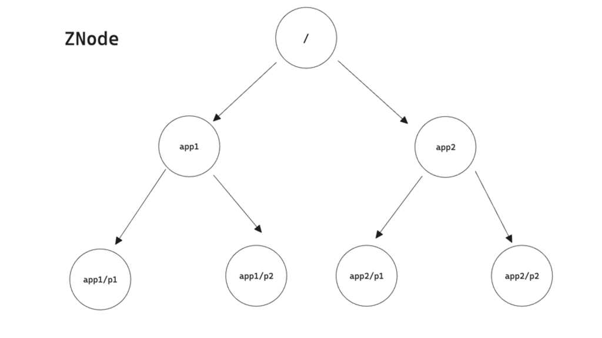

+++
author = "penguinit"
title = "Kafka에서 Zookeeper의 역할과 ZNode에 대해서 상세히 알아보기"
date = "2024-06-28"
description = "내부적으로 Kafka를 다양한 용도로 써봤는데 개발하는 입장에서 사용하다보니 Kafka를 운영할 때 Zookeeper와는 어떻게 상호작용하고 어떤 역할을 하는지에 대해서 좀 더 자세히 알고 싶어서 이번에 정리해보려고 합니다."
tags = [
"kafka","zookeeper"
]
categories = [
"infra"
]
+++

## 개요
내부적으로 Kafka를 다양한 용도로 써봤는데 개발하는 입장에서 사용하다보니 Kafka를 운영할 때 Zookeeper와는 어떻게 상호작용하고 어떤 역할을 하는지에 대해서 좀 더 자세히 알고 싶어서 이번에 정리해보려고 합니다.

## Zookeeper란 무엇인가?
Zookeeper는 분산 시스템에서 필수적인 다양한 기능을 제공합니다. 특히, Kafka와 같은 분산 시스템에서는 다음과 같은 역할을 수행합니다:

- 메타데이터 관리: Kafka의 브로커, 주제, 파티션 정보 등을 관리.
- 리더 선출: Kafka 브로커 중 리더를 선출하여 장애 복구를 지원.
- 구성 관리: 설정 변경 시 이를 분산 시스템의 모든 노드에 전달.

## Zookeeper 설치
Zookeeper 설치는 docker-compose를 이용해서 작성하겠습니다.

```yaml
version: '3'
services:
  zookeeper1:
    image: zookeeper
    hostname: zookeeper1
    container_name: zookeeper1
    ports:
      - "2181:2181"
    environment:
      ZOO_MY_ID: 1
      ZOO_SERVERS: >
        server.1=zookeeper1:2888:3888;2181
        server.2=zookeeper2:2888:3888;2181
        server.3=zookeeper3:2888:3888;2181

  zookeeper2:
    image: zookeeper
    hostname: zookeeper2
    container_name: zookeeper2
    ports:
      - "2182:2181"
    environment:
      ZOO_MY_ID: 2
      ZOO_SERVERS: >
        server.1=zookeeper1:2888:3888;2181
        server.2=zookeeper2:2888:3888;2181
        server.3=zookeeper3:2888:3888;2181

  zookeeper3:
    image: zookeeper
    hostname: zookeeper3
    container_name: zookeeper3
    ports:
      - "2183:2181"
    environment:
      ZOO_MY_ID: 3
      ZOO_SERVERS: >
        server.1=zookeeper1:2888:3888;2181
        server.2=zookeeper2:2888:3888;2181
        server.3=zookeeper3:2888:3888;2181
```

위와 같이 `docker-compose.yml` 파일을 작성하고 `docker-compose up -d` 명령어를 통해 Zookeeper를 실행합니다.

앙상블을 구성하기 위해 3개의 Zookeeper 인스턴스를 실행하였습니다. 각각의 인스턴스는 `ZOO_MY_ID` 환경 변수를 통해 고유한 ID를 부여하고, `ZOO_SERVERS` 환경 변수를 통해 다른 Zookeeper 인스턴스의 주소를 설정합니다.

이를 통해서 Zookeeper 인스턴스들은 서로 연결되어 클러스터를 구성하게 됩니다. 각 서버마다 Follower, Leader 역할을 수항하게 됩니다.

### Leader, Follower 확인 
Zookeeper 쉘을 통해 Leader, Follower를 확인할 수 있습니다.

```bash
docker exec -it zookeeper3 /bin/bash ./bin/zkServer.sh status
```

위와 같이 명령어를 실행하면 현재 Zookeeper3의 상태를 확인할 수 있습니다.

#### 실행결과
```
ZooKeeper JMX enabled by default
Using config: /conf/zoo.cfg
Client port found: 2181. Client address: localhost. Client SSL: false.
Mode: leader
```


### Zookeeper 포트
주키퍼 연동 설정을 보면 여러 포트가 등장합니다. 각 포트는 어떤 용도로 사용되는지 정리해보겠습니다. 

- PEER_PORT (2888)
클러스터 내의 다른 Zookeeper 서버들과 데이터를 주고받는 데 사용됩니다.

- LEADER_ELECTION_PORT (3888)
Zookeeper 클러스터는 리더를 선출하여 클라이언트 요청을 처리합니다. 이 포트는 리더 선출 프로세스에서 통신하는 데 사용됩니다.

- CLIENT_PORT (2181):
Kafka와 같은 클라이언트 애플리케이션이 Zookeeper에 연결하여 메타데이터를 조회하거나 업데이트할 때 사용됩니다.

## Zookeeper ZNode란 무엇인가?
Zookeeper는 데이터를 트리 구조로 관리합니다. 이 트리 구조의 각 노드를 ZNode이라고 합니다. ZNode은 데이터를 저장할 수 있으며, 이 데이터는 최대 1MB까지 저장할 수 있습니다.



- ZNode은 경로로 식별됩니다. 예를 들어, /kafka ZNode을 생성하면 /kafka라는 경로에 ZNode이 생성됩니다.
- ZNode은 자식 ZNode을 가질 수 있습니다. 이를 통해 트리 구조를 형성할 수 있습니다.
- ZNode은 버전을 가집니다. 이를 통해 데이터의 변경 이력을 추적할 수 있습니다.

### Zookeeper ZNode 생성 및 확인

Zookeeper 쉘을 통해 ZNode을 생성하고 확인할 수 있습니다.

- ZNode 생성 (zookeeper1에서)
```bash 
docker exec -it zookeeper1 /bin/bash
bin/zkCli.sh
```

- Zookeeper CLI(zkCli.sh)에서 아래 명령어를 사용하여 ZNode를 생성합니다.

```bash
create /app1 "Hello, app1"
```

- ZNode 확인 (zookeeper2에서)
```bash
docker exec -it zookeeper2 /bin/bash
bin/zkCli.sh
```

- Zookeeper CLI(zkCli.sh)에서 아래 명령어를 사용하여 ZNode를 확인합니다.

```bash
get /app1
```

위와 같이 명령어를 실행하면 /app1 ZNode의 데이터를 확인할 수 있습니다. ("Hello, app1")

추가적으로 ls 명령어를 통해서 현재 ZNode의 구조를 확인할 수 있습니다.

```bash
ls /
```

- 실행결과
```
[app1, zookeeper]
```

## Kafka와 Zookeeper 연동
Kafka와 Zookeeper는 서로 연동되어 동작합니다. Kafka는 Zookeeper를 사용하여 브로커, 주제, 파티션 정보를 관리하며, Zookeeper는 Kafka 브로커의 상태를 관리합니다.

### Kafka 관련 Compose 파일
Kafka와 Zookeeper를 연동하기 위한 docker-compose 파일을 작성하겠습니다.

```yaml
version: '3'
services:
  zookeeper1:
    image: zookeeper
    hostname: zookeeper1
    container_name: zookeeper1
    ports:
      - "2181:2181"
    environment:
      ZOO_MY_ID: 1
      ZOO_SERVERS: >
        server.1=zookeeper1:2888:3888;2181
        server.2=zookeeper2:2888:3888;2181
        server.3:zookeeper3:2888:3888;2181

  zookeeper2:
    image: zookeeper
    hostname: zookeeper2
    container_name: zookeeper2
    ports:
      - "2182:2181"
    environment:
      ZOO_MY_ID: 2
      ZOO_SERVERS: >
        server.1=zookeeper1:2888:3888;2181
        server.2:zookeeper2:2888:3888;2181
        server.3:zookeeper3:2888:3888;2181

  zookeeper3:
    image: zookeeper
    hostname: zookeeper3
    container_name: zookeeper3
    ports:
      - "2183:2181"
    environment:
      ZOO_MY_ID: 3
      ZOO_SERVERS: >
        server.1=zookeeper1:2888:3888;2181
        server.2:zookeeper2:2888:3888;2181
        server.3:zookeeper3:2888:3888;2181

  kafka1:
    image: wurstmeister/kafka
    hostname: kafka1
    container_name: kafka1
    ports:
      - "9092:9092"
    environment:
      KAFKA_BROKER_ID: 1
      KAFKA_ZOOKEEPER_CONNECT: zookeeper1:2181,zookeeper2:2182,zookeeper3:2183
      KAFKA_LISTENERS: INSIDE://0.0.0.0:9092,OUTSIDE://0.0.0.0:19092
      KAFKA_ADVERTISED_LISTENERS: INSIDE://kafka1:9092,OUTSIDE://localhost:9092
      KAFKA_LISTENER_SECURITY_PROTOCOL_MAP: INSIDE:PLAINTEXT,OUTSIDE:PLAINTEXT
      KAFKA_INTER_BROKER_LISTENER_NAME: INSIDE
      KAFKA_LOG_DIRS: /kafka/kafka-logs
    volumes:
      - /var/run/docker.sock:/var/run/docker.sock
    depends_on:
      - zookeeper1
      - zookeeper2
      - zookeeper3

  kafka2:
    image: wurstmeister/kafka
    hostname: kafka2
    container_name: kafka2
    ports:
      - "9093:9092"
    environment:
      KAFKA_BROKER_ID: 2
      KAFKA_ZOOKEEPER_CONNECT: zookeeper1:2181,zookeeper2:2182,zookeeper3:2183
      KAFKA_LISTENERS: INSIDE://0.0.0.0:9092,OUTSIDE://0.0.0.0:19093
      KAFKA_ADVERTISED_LISTENERS: INSIDE://kafka2:9092,OUTSIDE://localhost:9093
      KAFKA_LISTENER_SECURITY_PROTOCOL_MAP: INSIDE:PLAINTEXT,OUTSIDE:PLAINTEXT
      KAFKA_INTER_BROKER_LISTENER_NAME: INSIDE
      KAFKA_LOG_DIRS: /kafka/kafka-logs
    volumes:
      - /var/run/docker.sock:/var/run/docker.sock
    depends_on:
      - zookeeper1
      - zookeeper2
      - zookeeper3

  kafka3:
    image: wurstmeister/kafka
    hostname: kafka3
    container_name: kafka3
    ports:
      - "9094:9092"
    environment:
      KAFKA_BROKER_ID: 3
      KAFKA_ZOOKEEPER_CONNECT: zookeeper1:2181,zookeeper2:2182,zookeeper3:2183
      KAFKA_LISTENERS: INSIDE://0.0.0.0:9092,OUTSIDE://0.0.0.0:19094
      KAFKA_ADVERTISED_LISTENERS: INSIDE://kafka3:9092,OUTSIDE://localhost:9094
      KAFKA_LISTENER_SECURITY_PROTOCOL_MAP: INSIDE:PLAINTEXT,OUTSIDE:PLAINTEXT
      KAFKA_INTER_BROKER_LISTENER_NAME: INSIDE
      KAFKA_LOG_DIRS: /kafka/kafka-logs
    volumes:
      - /var/run/docker.sock:/var/run/docker.sock
```
kafka1, kafka2, kafka3는 Kafka 브로커를 구성합니다. 각 브로커는 고유의 ID를 가지고 있으며, 9092, 9093, 9094 포트를 각각 사용합니다. 각 kafka는 `KAFKA_ZOOKEEPER_CONNECT` 환경 변수를 통해 Zookeeper 클러스터에 연결합니다.

### Kafka 토픽생성

- kafka1 컨테이너에 접속
```bash
docker exec -it kafka1 /bin/bash
```

- kafka-topics.sh를 통해 토픽을 생성합니다.
```bash
kafka-topics.sh --create --topic example_topic --zookeeper zookeeper1:2181 --partitions 3 --replication-factor 2
```

- kafka 토픽에 메세지 전송
```bash
kafka-console-producer.sh --broker-list kafka1:9092 --topic example_topic
```

- kafka 토픽에서 메세지 수신 (kafka-2에서 수행)
```bash
kafka-console-consumer.sh --bootstrap-server kafka2:9092 --topic example_topic --from-beginning
```

### Zookeeper ZNode를 통해서 Kafka 토픽 확인

- Zookeeper 쉘을 통해 ZNode을 확인합니다.
```bash
docker exec -it zookeeper1 /bin/bash
bin/zkCli.sh
```

- 아래 명령어를 통해 /brokers/topics 경로에 생성된 토픽을 확인할 수 있습니다.
```bash
ls /brokers/topics
```

- 실행결과
```
[__consumer_offsets, example_topic]
```

- 토픽의 상세 정보를 확인할 수 있습니다.
```bash
get /brokers/topics/example_topic
```

- 실행결과
```
{"partitions":{"0":[2,1],"1":[3,2],"2":[1,3]},"topic_id":"x_oECR_rT6uGoWuuHulV7A","adding_replicas":{},"removing_replicas":{},"version":3}
```

## 정리
이번에는 포스팅에서는 Zookeeper의 역할과 Kafka와 상호작용에 대해서 알아보았습니다. Zookeeper는 Kafka의 메타데이터 관리, 리더 선출, 구성 관리 등 다양한 역할을 수행합니다. 또한, Zookeeper는 데이터를 트리 구조로 관리하는데, 이 트리 구조의 각 노드를 ZNode이라고 합니다.
직접 Zookeeper를 실행해서 어떻게 Znode가 구성되고 Kafka와 연동되는지 확인해보았습니다. 해당 글을 통해서 Kafka와 Zookeeper의 상호작용에 대해서 좀 더 이해할 수 있었으면 좋겠습니다.