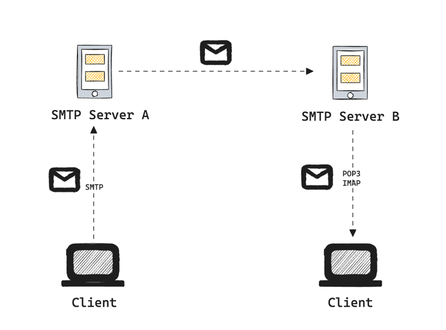

+++
author = "penguinit"
title = "SMTP란 무엇인가?"
date = "2024-06-09"
description = "SMTP는 이메일을 전송하기 위한 프로토콜로써 어떻게 동작하는지에 대해서 알아보려고 합니다."
tags = [
"smtp"
]
categories = [
"web"
]
+++

## 개요
SMTP는 이메일을 전송하기 위한 프로토콜로써 어떻게 동작하는지에 대해서 알아보려고 합니다.

## SMTP란?
SMTP(Simple Mail Transfer Protocol)는 인터넷에서 이메일을 전송하는 데 사용되는 기본 통신 프로토콜입니다. 1982년에 처음 정의되었으며, 현재도 전 세계적으로 널리 사용되고 있습니다. SMTP는 클라이언트와 서버 간의 메시지 전송을 가능하게 하며, 일반적으로 포트 25, 587, 465를 사용합니다.

## SMTP 동작방식
SMTP는 클라이언트-서버 모델을 기반으로 작동합니다. 이메일 클라이언트(보통 이메일 프로그램 또는 앱)가 서버에 연결하여 메일을 보내는 과정을 다음과 같이 요약할 수 있습니다.

- 연결 수립: 클라이언트가 SMTP 서버와 TCP 연결을 설정합니다.
- 송신자 지정: 클라이언트는 MAIL FROM 명령어를 사용해 송신자의 이메일 주소를 서버에 전달합니다.
- 수신자 지정: 클라이언트는 RCPT TO 명령어를 사용해 수신자의 이메일 주소를 서버에 전달합니다.
- 메시지 전송: DATA 명령어를 통해 실제 이메일 내용을 서버에 전달합니다.
- 종료: QUIT 명령어를 사용해 연결을 종료합니다.



이러한 과정을 통해 SMTP는 이메일을 안전하고 신속하게 전송할 수 있습니다.

### 주요 SMTP 명령어
- HELO/EHLO: 서버에 인사하는 명령어로, EHLO는 확장 SMTP를 의미합니다.
- MAIL FROM: 발신자의 이메일 주소를 지정합니다.
- RCPT TO: 수신자의 이메일 주소를 지정합니다.
- DATA: 메시지 본문을 전송합니다.
- QUIT: 세션을 종료합니다.
- RSET: 세션을 재설정합니다.


### SMTP 커맨드 예시

```
> openssl s_client -connect smtp.gmail.com:465 -crlf -ign_eof
[... lots of openssl output ...]
220 mx.google.com ESMTP m46sm11546481eeh.9
> EHLO localhost
250-mx.google.com at your service, [1.2.3.4]
250-SIZE 35882577
250-8BITMIME
250-AUTH LOGIN PLAIN XOAUTH
250 ENHANCEDSTATUSCODES
> AUTH PLAIN AG5pY2UudHJ5QGdtYWlsLmNvbQBub2l0c25vdG15cGFzc3dvcmQ=
235 2.7.0 Accepted
> MAIL FROM: <gryphius-demo@gmail.com>
250 2.1.0 OK m46sm11546481eeh.9
RCPT TO: <somepoorguy@example.com>
250 2.1.5 OK m46sm11546481eeh.9
> DATA
354  Go ahead m46sm11546481eeh.9
Subject: it works

yay!
.
250 2.0.0 OK 1339757532 m46sm11546481eeh.9
> QUIT
221 2.0.0 closing connection m46sm11546481eeh.9
read:errno=0
```

- openssl 명령어를 통해 SMTP 서버에 접속합니다.
- EHLO 명령어를 통해 서버에 인사합니다.
- AUTH PLAIN 명령어를 통해 인증을 수행합니다.
- MAIL FROM 명령어를 통해 발신자 이메일 주소를 지정합니다.
- RCPT TO 명령어를 통해 수신자 이메일 주소를 지정합니다.
- DATA 명령어를 통해 메시지 본문을 전송합니다. (. 입력시 전송 완료)
- QUIT 명령어를 통해 세션을 종료합니다.

## 메일박스 IMAP/POP3
SMTP와 함께 사용되는 프로토콜로는 IMAP(Internet Message Access Protocol)과 POP3(Post Office Protocol 3)이 있습니다.
SMTP로 전달된 메일은 메일박스에 저장되며, 이를 클라이언트가 읽기 위해 IMAP 또는 POP3를 사용합니다.

- IMAP: 서버에 저장된 메일을 클라이언트에게 전달하는 프로토콜로, 메일을 서버에 유지하며 여러 기기에서 동기화할 수 있습니다. (읽음 표시, 폴더 관리 등)
- POP3: 서버에 저장된 메일을 클라이언트로 전달하는 프로토콜로, 메일을 클라이언트로 다운로드하여 서버에서 삭제합니다.

SMTP 서버는 이메일을 발신 서버에서 수신 서버로 전송합니다.
수신 서버의 SMTP는 이메일을 수신자의 메일박스(보통 IMAP/POP3 서버가 관리하는)에 저장합니다.
IMAP/POP3 서버는 수신자의 메일박스에 저장된 이메일을 관리하고, 수신자의 이메일 클라이언트가 이를 확인할 수 있도록 합니다.
이메일 전송과 수신은 SMTP 서버를 통해 이루어지지만, 이메일 확인과 관리는 IMAP 또는 POP3 서버를 통해 이루어집니다.

## 정리
SMTP는 이메일을 전송하기 위한 프로토콜로, 클라이언트와 서버 간의 메시지 전송을 가능하게 합니다. SMTP는 클라이언트-서버 모델을 기반으로 작동하며, 메일 전송 과정은 EHLO, MAIL FROM, RCPT TO, DATA, QUIT 등의 명령어를 사용합니다. 이메일 전송과 수신은 SMTP 서버를 통해 이루어지지만, 이메일 확인과 관리는 IMAP 또는 POP3 서버를 통해 이루어집니다.