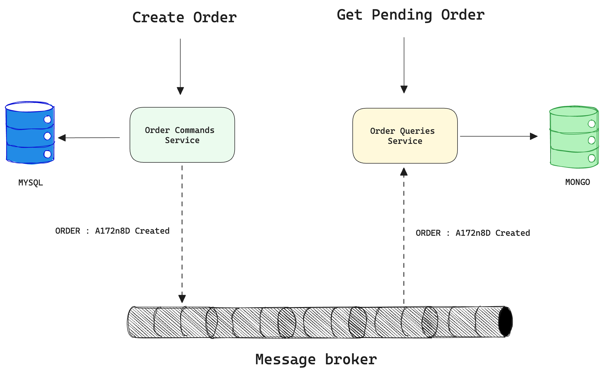

+++
author = "penguinit"
title = "CQRS패턴에 대해서 알아보기"
date = "2024-06-11"
description = "MSA를 공부하다 보면 CQRS패턴에 대해서 자주 듣게 되는데 CQRS패턴이란 무엇인지에 대해서 알아보려고 합니다."
tags = [
"cqrs"
]
categories = [
"database"
]
+++

## 개요
MSA를 공부하다 보면 CQRS패턴에 대해서 자주 듣게 되는데 CQRS패턴이란 무엇인지에 대해서 알아보려고 합니다.

## CQRS패턴이란?
CQRS(Command Query Responsibility Segregation)는 명령(Command)과 조회(Query)를 분리하는 패턴입니다. 이 패턴은 데이터를 읽기 위한 모델과 쓰기 위한 모델을 분리함으로써 시스템의 복잡성을 줄이고 유지보수성을 높일 수 있습니다.

- 위와 같이 CQRS패턴을 적용하면 읽기 전용 서비스와 쓰기 전용 서비스를 분리할 수 있습니다.
- 읽기 전용 서비스는 데이터를 조회하는데 최적화되어 있고, 쓰기 전용 서비스는 데이터를 변경하는데 최적화되어 있습니다.
- 위에 예시처럼 최적화를 위해 쓰기 전용에는 RDB를 채택하고 읽기에는 NoSQL을 채택할수도 있습니다. 반대혹은 같은 유형의 DB를 사용할 수도 있습니다.
- 쓰기 전용 서비스에서 데이터를 생성/수정/삭제하면 이벤트를 발생시켜 읽기 전용 서비스에 변경 사항을 전달합니다.

## CQRS패턴의 장단점
컨셉자체는 간단하지만 실제로 적용하는 것은 쉽지 않습니다. CQRS패턴을 적용하면 다음과 같은 장단점이 있습니다.

### 장점
- 읽기와 쓰기의 부하를 분리할 수 있어 시스템의 확장성을 높일 수 있습니다.
- 명령과 조회를 분리하면 복잡한 도메인을 단순화할 수 있습니다. 예를 들어서 도메인에 따라 여러 테이블에 대한 조회가 필요할 때, JOIN을 사용하지 않고 각 테이블에 대한 조회를 별도로 수행할 수 있습니다.
- 명령과 조회를 각각 다른 데이터 저장소에 저장할 수 있습니다. 예를 들어, 명령은 관계형 데이터베이스에, 조회는 NoSQL 데이터베이스에 저장하여 각 작업의 특성에 맞는 저장소를 사용할 수 있습니다. 

### 단점
- CQRS패턴을 적용하면 시스템의 복잡성이 증가할 수 있습니다. 명령과 조회를 분리하면 두 시스템 간의 데이터 일관성을 유지하기 위해 위에 예시처럼 이벤트소싱을 위한 인프라가 필요로하게 됩니다.
- 이벤트소싱을 이용해서 데이터의 동기화가 이루어지기 때문에 잘못 구현하면 데이터 불일치 문제가 발생할 수 있습니다.
- CQRS패턴을 적용하면 개발자들이 새로운 패턴을 학습해야 하기 때문에 초기에는 생산성이 저하될 수 있습니다.

## MSA와의 관계
CQRS(Command Query Responsibility Segregation) 패턴이 MSA(Microservices Architecture)에서 자주 인용되는 이유는 여러 가지가 있습니다. MSA가 가지고 있는 특성들이 CQRS 패턴을 적용하는데 유리한 환경을 제공하기 때문입니다.

1. `서비스 분리 및 책임 명확화`: MSA의 핵심 원칙 중 하나는 서비스의 책임을 명확히 분리하는 것입니다. CQRS는 더 나아가서 명령과 조회 작업을 분리하게 되는데 이는 서비스의 책임을 더욱 명확하게 정의할 수 있도록 도와줍니다.

2. `데이터베이스 분리`: MSA에서는 각 마이크로서비스가 자체 데이터베이스를 가질 수 있도록 권장합니다. 이러한 특성이 CQRS를 적용하는데 있어서 많은 허들을 줄여줍니다. 명령과 조회 작업을 분리할 때 자연스럽게 데이터베이스도 분리하게 되는데, 이는 MSA의 데이터베이스 분리 원칙과 잘 어울립니다.

3. `이벤트 소싱과의 시너지`: 이벤트 소싱은 MSA 환경에서 데이터 변경을 추적하고 서비스 간 통신을 관리하는 데 유용합니다. 이벤트 소싱은 각 서비스가 이벤트 로그를 통해 상태를 일관되게 유지하고, 필요한 경우 상태를 복원할 수 있게 합니다. 이러한 특성들은 CQRS에서도 그래도 적용이 되고 있기 때문에 MSA 환경에서 CQRS를 적용하는 것이 자연스럽습니다.

## 정리
이번 포스팅에서는 CQRS패턴이 무엇이고 어떤 장단점이 있으며 왜 MSA에서 CQRS패턴이 자주 인용되는지에 대해서 알아보았습니다. 개인적인 의견에는 장점보다는 단점이 더 부각될 수 있는 패턴이라고 생각이 들고 구성원들의 CQRS패턴에 대한 이해도나 성숙도가 높지 않다면 적용이 쉽지 않다고 생각이 듭니다.
