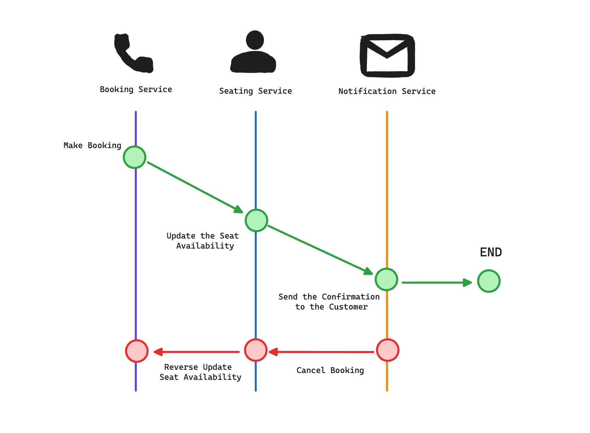

+++
author = "penguinit"
title = "보상 트랜잭션(Compensating Transaction)에 대해서 알아보기"
date = "2024-06-11"
description = "MSA환경에서는 다양한 서비스들이 상호작용하게 됩니다. 이때 모종의 문제로 특정 서비스가 문제가 생기면 트랜잭션을 처리할 때 기존 모노리식 서비스와는 다른 형태의 처리가 필요합니다. 왜냐하면 DB도 다르고 서비스도 다르기 때문입니다. 이번 포스팅에서는 이런 문제들을 어떻게 해결할 수 있는지에 대해서 알아보려고 합니다."
tags = [
"transation"
]
categories = [
"msa"
]
+++

## 개요
MSA환경에서는 다양한 서비스들이 상호작용하게 됩니다. 이때 모종의 문제로 특정 서비스가 문제가 생기면 트랜잭션을 처리할 때 기존 모노리식 서비스와는 다른 형태의 처리가 필요합니다. 왜냐하면 DB도 다르고 서비스도 다르기 때문입니다. 이번 포스팅에서는 이런 문제들을 어떻게 해결할 수 있는지에 대해서 알아보려고 합니다.

## 보상 트랜잭션(Compensating Transaction)이란?
보상 트랜잭션(Compensating Transaction)은 트랜잭션 처리 중에 문제가 발생했을 때 이전에 수행한 작업을 취소하거나 복구하는 작업을 말합니다. 이전에 수행한 작업을 취소하거나 복구하는 작업을 보상 트랜잭션이라고 합니다.

예를 들어서 B서비스로 데이터를 전송하는 트랜잭션을 수행했을 때, B서비스에서 문제가 발생하면 A서비스에서 전송한 데이터를 롤백하는 작업을 수행해야 합니다. 이때 B서비스에서 A서비스로 데이터를 전송하는(복구를 위한) 트랜잭션을 보상 트랜잭션이라고 합니다.

## SAGA 패턴
SAGA는 아이슬란드어로 '이야기'를 의미합니다. 즉 여러 서비스를 이야기처럼 순차대로 실행하는 패턴이라고 유추할 수 있습니다. 좀 더 구체적으로는 SAGA 패턴은 각 서비스 간의 트랜잭션을 개별로 처리하고, 문제가 발생했을 때 보상 트랜잭션을 통해 이전에 수행한 작업을 취소하거나 복구하는 방식으로 처리합니다.

### 예시
예를 들어서 온라인 예약 서비스에서 좌석 예약을 하는 과정을 생각해보겠습니다. 좌석 예약 서비스에서는 좌석을 예약하고, 예약 서비스에서는 예약을 생성하고, 고객에게 예약을 알림하는 과정을 거칩니다.

- 예약 서비스에서 예약 생성
- 좌석 서비스에서 좌석 상태를 업데이트
- 고객에게 좌석확정을 메세지로 알림

위에 과정은 SAGA 패턴을 이용해서 서비스별로 단일 트랜잭션으로 처리를 하게 됩니다. 만약에 특정 단계에서 실패를 하게 되면 이전에 수행한 작업을 취소하거나 복구하는 보상 트랜잭션을 수행하게 됩니다. 예를 들어서 고객에게 알림을 보내는 과정에서 실패가 발생하면 다음과 같은 작업을 수행하게 됩니다.

- 예약 서비스에서 예약을 제거
- 좌석 서비스에서 좌석 정보를 이전 상태로 변경

이렇게 보상 트랜잭션을 통해 이전에 수행한 작업을 취소하거나 복구하는 방식으로 SAGA 패턴을 이용해서 트랜잭션을 처리할 수 있습니다.

## 이벤트 소싱
이벤트 소싱은 시스템의 상태 변화를 이벤트 형태로 저장하는 방식입니다. 이 접근 방식에서는 각 상태 변화 이벤트를 기록하고, 실패 시 이를 역 이벤트(reverse event)로 처리하여 원래 상태로 복원합니다.

### 예시

위에 예시로 들었던 온리안 예약 서비스를 이벤트 소싱으로 재구성을 해보겠습니다. 예약 주문이 들어오게 되면 다음과 같은 이벤트를 저장하게 됩니다.

- 예약 생성 이벤트 저장
- 좌석 상태 변경 이벤트 저장
- 알림 이벤트 저장

이렇게 저장된 이벤트들은 각 서비스에서 처리하게 되고 만약에 특정 단계에서 실패가 발생하면 이벤트를 역으로 처리하여 이전 상태로 복원하게 됩니다.

SAGA 패턴과 유사해보이지만 단일 트랜잭션을 통해 처리하는 SAGA 패턴과 달리 이벤트 소싱은 이벤트를 저장하고, 이를 각 서비스에서 소비하여 상태를 변경하는 방식으로 동작합니다. 실패했을 때도 이 이벤트를 역으로 읽어서 이전 상태로 복원하는 방식으로 동작합니다.

## 정리
이번 포스팅에서는 보상 트랜잭션(Compensating Transaction)이 무엇인지에 대해서 알아보았습니다. MSA환경에서 다양한 서비스들간 상호작용시 실패가 발생하면 이를 처리하는데 훨씬 복잡한 고려사항들이 있습니다. 이를 해결하기 위한 방법으로 SAGA패턴과 이벤트 소싱을 통한 보상 트랜잭션 처리에 대해서도 알아보았습니다. 
