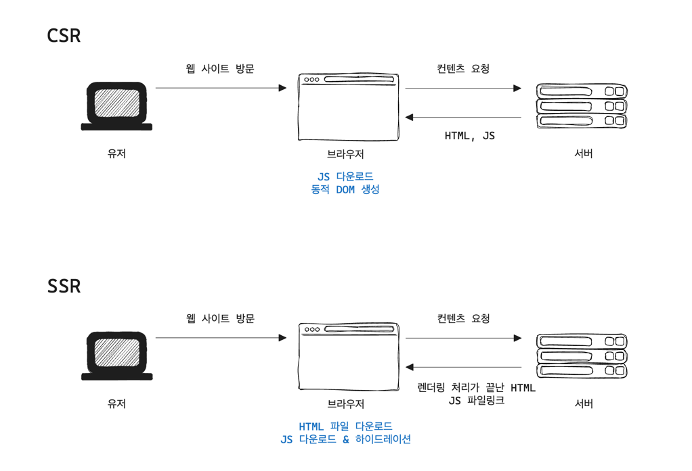

+++
author = "penguinit"
title = "서버사이드 렌더링(SSR) vs 클라이언트사이드 렌더링(CSR) 장단점 비교"
date = "2024-07-02"
description = "최근에 next.js를 공부하면서 필요에 따라서 특정 페이지를 서버사이드 렌더링(SSR)으로 구현하거나 클라이언트사이드 렌더링(CSR)으로 구현하는 경우가 있는데, 이번에 두 방식의 장단점을 비교해보려고 합니다."
tags = [
"ssr", "csr"
]
categories = [
"web"
]
+++

## 개요
최근에 next.js를 공부하면서 필요에 따라서 특정 페이지를 서버사이드 렌더링(SSR)으로 구현하거나 클라이언트사이드 렌더링(CSR)으로 구현하는 경우가 있는데, 이번에 두 방식의 장단점을 비교해보려고 합니다.



## 클라이언트 사이드 렌더링 (CSR)이란?
클라이언트 사이드 렌더링은 서버에서 받은 HTML에 포함된 JavaScript를 실행하여 동적으로 화면을 구성하는 방식입니다. 클라이언트는 서버에서 받은 HTML을 렌더링한 후 JavaScript를 실행해야 하므로 초기 로딩 속도가 느리고 SEO에 불리합니다.

### SEO란?
SEO(Search Engine Optimization)는 검색 엔진에서 웹 사이트를 검색할 때 웹 사이트가 노출되는 순서를 조정하는 작업을 말합니다. 검색 엔진은 웹 사이트의 HTML을 분석하여 검색 결과에 반영하는데, 클라이언트 사이드 렌더링은 동적 DOM을 생성하기 때문에 검색 엔진이 HTML을 분석하기 어렵습니다.

## 서버 사이드 렌더링 (SSR)이란?
서버 사이드 렌더링은 서버에서 HTML을 생성하여 클라이언트에게 전달하는 방식입니다. 클라이언트는 서버에서 받은 HTML을 렌더링하기만 하면 되므로 초기 로딩 속도가 빠르고 SEO에 유리합니다.

### 하이드레이션이란?
하이드레이션은 서버사이드 렌더링(SSR)에서 서버에서 미리 렌더링된 HTML을 브라우저가 받아서, 그 위에 클라이언트 사이드 자바스크립트를 실행하여 동적 기능을 추가하는 과정입니다. 

서버에서 이미 HTML을 렌더링하여 전달했기에 클라이언트에서는 이 HTML을 재사용하면서 동적 기능만 추가하면 되기 때문에 브라우저의 초기 작업량이 현저하게 줄어듭니다.

## 언제 사용하면 좋을까?
실제로 웹사이트에서 기능이나 요구사항에 따라 CSR과 SSR을 혼합해서 사용하는 경우가 많습니다. next.js에서도 특정 컴포넌트는 React 컴포넌트를 사용하고 나머지 컴포넌트들은 getServerSideProps를 이용하여 페이지를 SSR로 구현할 수 있습니다.

- CSR: 사용자 경험을 중요시하는 페이지
- SSR: SEO가 중요한 페이지

**특정 컴포넌트를 SSR로 구현 (next.js & typescript)**

```typescript
// pages/index.tsx
import React from 'react';
import { GetServerSideProps } from 'next';

interface Props {
    data: any;
}

const SSRPage: React.FC<Props> = ({ data }) => {
    return (
        <div>
            <h1>Server-Side Rendered Page</h1>
            <pre>{JSON.stringify(data, null, 2)}</pre>
        </div>
    );
};

export const getServerSideProps: GetServerSideProps = async () => {
    const res = await fetch('https://httpbin.org/get');
    const data = await res.json();

    return {
        props: {
            data,
        },
    };
};

export default SSRPage;
```

## 정리
오늘 포스팅에서는 CSR과 SSR이 무엇이고 각각의 장단점을 비교해보았습니다. 실제로 웹사이트에서는 CSR과 SSR을 혼합해서 사용하는 경우가 많습니다. 각 페이지에서 중요하게 생각하는 요소에 따라 CSR과 SSR을 적절하게 선택하여 사용하면 좋을 것 같습니다.