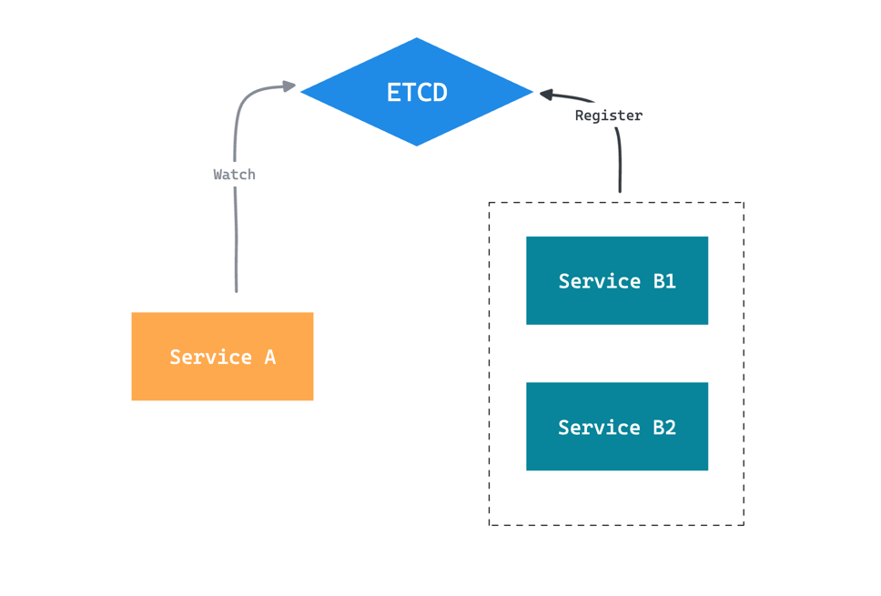

+++
author = "penguinit"
title = "Golang을 통해서 etcd 간단하게 알아보기"
date = "2024-07-02"
description = "쿠버네티스에서 사용하는 etcd에 대해서 간단하게 알아보고, Golang을 통해서 etcd를 사용하는 방법에 대해서 알아보려고 합니다."
tags = [
"etcd"
]
categories = [
"infra"
]
+++

## 개요
쿠버네티스에서 사용하는 etcd에 대해서 간단하게 알아보고, Golang을 통해서 etcd를 사용하는 방법에 대해서 알아보려고 합니다.

## etcd란 무엇인가?
etcd는 분산 시스템에서 데이터를 일관되고 신뢰성 있게 저장하기 위해 설계된 고가용성 분산 키-값 저장소입니다. Raft 합의 알고리즘을 통해 데이터의 일관성을 보장하고 Kubernetes와 같은 시스템의 핵심 구성 요소로 활용됩니다. 주로 쿠버네티스 상에서의 구성(Configuration) 관리와 서비스 발견(Service Discovery)에 사용됩니다.



쿠버네티스에서 Service B1, B2가 등록이 되면 etcd에 해당 정보를 저장하고 Service A는 etcd를 Watch 하면서 Service B1, B2의 정보를 받아올 수 있습니다.


### Raft 합의 알고리즘
Raft는 분산 시스템에서 노드 간의 합의를 도와주는 알고리즘으로, etcd는 이 Raft 알고리즘을 통해 데이터의 일관성을 보장합니다. Raft는 Leader, Follower, Candidate 세 가지 역할로 구성되어 있으며, Leader가 클라이언트의 요청을 받아서 데이터를 저장하고, Follower와 Candidate는 Leader의 상태를 확인하고 Leader가 장애가 발생하면 새로운 Leader를 선출합니다.

특정 데이터가 업데이트 되면 Leader는 Follower와 Candidate에게 해당 데이터를 전파하고, Follower와 Candidate는 Leader의 데이터를 확인하여 일관성을 유지합니다.
만약 하나의 노드가 장애가 발생하면, 다른 노드가 Leader로 선출되어 데이터의 일관성을 유지합니다.

## etcd 설치
etcd 설치는 docker-compose를 이용해서 작성하겠습니다.

```yaml
version: '3.7'

services:
  etcd-node1:
    image: quay.io/coreos/etcd:v3.4.13
    ports:
      - "2379:2379"
    container_name: etcd-node1
    platform: linux/amd64
    environment:
      - ETCD_NAME=node1
      - ETCD_INITIAL_ADVERTISE_PEER_URLS=http://etcd-node1:2380
      - ETCD_LISTEN_PEER_URLS=http://0.0.0.0:2380
      - ETCD_LISTEN_CLIENT_URLS=http://0.0.0.0:2379
      - ETCD_ADVERTISE_CLIENT_URLS=http://etcd-node1:2379
      - ETCD_INITIAL_CLUSTER=node1=http://etcd-node1:2380,node2=http://etcd-node2:2380,node3=http://etcd-node3:2380
      - ETCD_INITIAL_CLUSTER_TOKEN=etcd-cluster-1
      - ETCD_INITIAL_CLUSTER_STATE=new

  etcd-node2:
    image: quay.io/coreos/etcd:v3.4.13
    ports:
      - "2380:2379"
    container_name: etcd-node2
    platform: linux/amd64
    environment:
      - ETCD_NAME=node2
      - ETCD_INITIAL_ADVERTISE_PEER_URLS=http://etcd-node2:2380
      - ETCD_LISTEN_PEER_URLS=http://0.0.0.0:2380
      - ETCD_LISTEN_CLIENT_URLS=http://0.0.0.0:2379
      - ETCD_ADVERTISE_CLIENT_URLS=http://etcd-node2:2379
      - ETCD_INITIAL_CLUSTER=node1=http://etcd-node1:2380,node2=http://etcd-node2:2380,node3=http://etcd-node3:2380
      - ETCD_INITIAL_CLUSTER_TOKEN=etcd-cluster-1
      - ETCD_INITIAL_CLUSTER_STATE=new

  etcd-node3:
    image: quay.io/coreos/etcd:v3.4.13
    ports:
      - "2381:2379"
    container_name: etcd-node3
    platform: linux/amd64
    environment:
      - ETCD_NAME=node3
      - ETCD_INITIAL_ADVERTISE_PEER_URLS=http://etcd-node3:2380
      - ETCD_LISTEN_PEER_URLS=http://0.0.0.0:2380
      - ETCD_LISTEN_CLIENT_URLS=http://0.0.0.0:2379
      - ETCD_ADVERTISE_CLIENT_URLS=http://etcd-node3:2379
      - ETCD_INITIAL_CLUSTER=node1=http://etcd-node1:2380,node2=http://etcd-node2:2380,node3=http://etcd-node3:2380
      - ETCD_INITIAL_CLUSTER_TOKEN=etcd-cluster-1
      - ETCD_INITIAL_CLUSTER_STATE=new
```

## Golang을 통해서 etcd 사용하기
Golang을 통해서 etcd를 사용하기 위해서는 `go.etcd.io/etcd/clientv3` 패키지를 사용하면 됩니다. 이 패키지를 통해서 etcd 클러스터에 연결하고, 데이터를 저장하거나 조회할 수 있습니다.

### 데이터 저장 및 조회

```go
package main

import (
	"context"
	"fmt"
	"log"
	
	clientv3 "go.etcd.io/etcd/client/v3"
)

func main() {
    cli, err := createClient()
    if err != nil {
        log.Fatal(err)
    }
    defer cli.Close()

    err = putKey(cli, "key", "value")
    if err != nil {
        log.Fatal(err)
    }
}

func createClient() (*clientv3.Client, error) {
	cli, err := clientv3.New(clientv3.Config{
		Endpoints:   []string{"http://localhost:2379", "http://localhost:2380", "http://localhost:2381"},
		DialTimeout: 5 * time.Second,
	})
	if err != nil {
		return nil, err
	}
	return cli, nil
}

func putKey(cli *clientv3.Client, key, value string) error {
    ctx, cancel := context.WithTimeout(context.Background(), 5*time.Second)
    defer cancel()
    
	_, err := cli.Put(ctx, key, value)
    return err
}


```

- etcd cli를 통해서 데이터를 조회하면 다음과 같이 조회할 수 있습니다.

```bash
docker exec -it etcd-node1 etcdctl get key
```

- 조회결과
```
key
value
```

위에 결과는 etcd-node1가 아니라 etcd-node2, etcd-node3에서 조회해도 동일한 결과가 나옵니다.

### Watch를 통해서 데이터의 모니터링
etcd에서 데이터가 변경되면 Watch를 통해서 변경된 데이터를 모니터링할 수 있습니다. 아래 예제는 고루틴을 통해서 Watch를 실행하고 데이터가 변경되면 Watch 이벤트를 출력합니다.

**이벤트 순서**

1. PUT key value
2. PUT key new_value
3. DELETE key

```go
package main

import (
	"context"
	"fmt"
	"log"
	"time"

	clientv3 "go.etcd.io/etcd/client/v3"
)

func main() {
	cli, err := createClient()
	if err != nil {
		log.Fatal(err)
	}
	defer cli.Close()

	// Watch
	go watchKey(cli, "key")

	// Simulate Create, Update, Delete operations
	time.Sleep(1 * time.Second)
	err = putKey(cli, "key", "value")
	if err != nil {
		log.Fatal(err)
	}
	time.Sleep(1 * time.Second)

	err = putKey(cli, "key", "new_value")
	if err != nil {
		log.Fatal(err)
	}
	time.Sleep(1 * time.Second)

	err = deleteKey(cli, "key")
	if err != nil {
		log.Fatal(err)
	}

	// Wait to observe the watch output
	time.Sleep(3 * time.Second)
}

func createClient() (*clientv3.Client, error) {
	cli, err := clientv3.New(clientv3.Config{
		Endpoints:   []string{"http://localhost:2379", "http://localhost:2380", "http://localhost:2381"},
		DialTimeout: 5 * time.Second,
	})
	if err != nil {
		return nil, err
	}
	return cli, nil
}

func putKey(cli *clientv3.Client, key, value string) error {
	ctx, cancel := context.WithTimeout(context.Background(), 5*time.Second)
	defer cancel()
	_, err := cli.Put(ctx, key, value)
	return err
}

func deleteKey(cli *clientv3.Client, key string) error {
	ctx, cancel := context.WithTimeout(context.Background(), 5*time.Second)
	defer cancel()
	_, err := cli.Delete(ctx, key)
	return err
}

func watchKey(cli *clientv3.Client, key string) {
	rch := cli.Watch(context.Background(), key)
	for wresp := range rch {
		for _, ev := range wresp.Events {
			fmt.Printf("Watch: %s %q : %q\n", ev.Type, ev.Kv.Key, ev.Kv.Value)
		}
	}
}
```

- 출력 결과 
```
Watch: PUT "key" : "value"
Watch: PUT "key" : "new_value"
Watch: DELETE "key" : ""
```

## 정리
etcd는 쿠버네티스와 같은 분산 시스템에서 데이터를 일관되고 신뢰성 있게 저장하기 위해 사용되는 고가용성 분산 키-값 저장소입니다. Raft 합의 알고리즘을 통해 데이터의 일관성을 보장합니다. 해당 포스팅에서는 Golang을 통해서 etcd의 데이터를 저장 및 조회하고, Watch를 통해서 데이터의 변경을 모니터링하는 예제를 작성해보았습니다.

