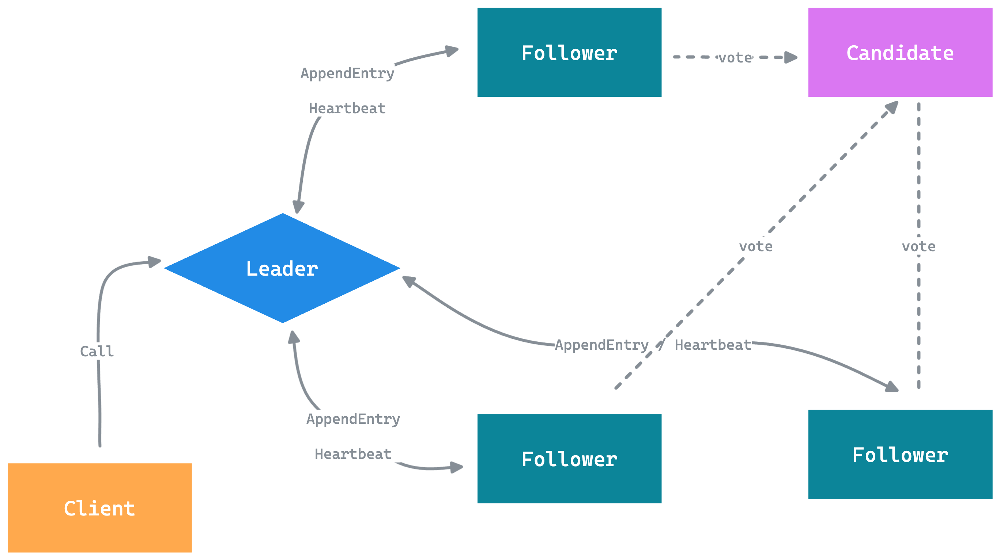

+++
author = "penguinit"
title = "땟목 합의 알고리즘(Raft Consensus Algorithm)에 대해서 알아보기"
date = "2024-07-12"
description = "분산 시스템에서 노드의 고가용성과 데이터 일관성을 보장하기 위해 설계된 Raft 합의 알고리즘에 대해서 알아보려고 합니다."
tags = [
"kafka", "raft"
]
categories = [
"algorithm"
]
+++

## 개요
분산 시스템에서 노드의 고가용성과 데이터 일관성을 보장하기 위해 설계된 Raft 합의 알고리즘에 대해서 알아보려고 합니다.

## 땟목 합의 알고리즘이란?
땟목 합의 알고리즘은 분산시스템에서 자주 등장하는 알고리즘입니다.
분산 시스템에서는 각 노드의 상태가 동일하게 유지하게 하는게 중요합니다. 왜냐하면 특정 노드에 질의를 했을 때 데이터의 정합성에 문제가 있거나 하면 안되고 고가용성을 보장해야합니다.

기존에 Paxos 합의 알고리즘이 있었으나 복잡하고 좀 더 간단하고 이해하기 쉬운형태로 새롭게 제안된 것이 땟목 합의 알고리즘이입니다.

### 동작원리

우선 각 노드들은 아래와 같은 역할을 가지고 있습니다.

- 리더 : 클러스터를 대표하는 노드로 모든 요청은 리더로 부터 시작되고 팔로워로 전파됩니다. AppendEntry라는 메세지를 받아서 팔로워들을 상태를 동기화합니다.
  꼭 변경이력이 없다라도 하트비트 형태로 리더는 팔로워에게 빈 AppendEntry 메세지를 보낼 수 도 있습니다.
- 팔로워 : 팔로워는 단순히 리더로 부터 AppendEntry 메세지를 받아서 상태를 계속해서 동기화합니다. 만약에 리더로부터 일정시간동안 AppendEntry 메세지를 받지 못하면 팔로워들은 자신의 상태를 후보자(Candidate)로 변경합니다.
- 후보자 : 일정 시간내에 AppendEntry 메세지를 받지 못하면 팔로워에서 전환되는 상태를 의미하고 리더가 없는 상황에서 리더를 선출할 수 있습니다.

## 리더선출과정

모든 요청과 상태동기화가 리더를 통해서 시작됨으로 리더가 어떻게 선출되고 유지되는지에 대해서 아는 것이 땟목 알고리즘의 핵심이라고 할 수 있습니다. 해당 과정에 대해서 상세하기 설명하기 전에 알고 가야할 개념들에 대해서 먼저 설명하고자 합니다.

- 임기(Term) : 투표의 이력을 얘기하는 것으로 리더를 뽑기 위한 선거가 시작해서 실제로 리더가 선출되기까지의 과정을 하나의 값으로 봅니다. 예를들어 최초로 리더가 선출되었으면 Term 값은 1이고 다음 리더를 뽑기 시작하였다면 해당 값은 2가 됩니다.
- 선거 타임아웃 : 팔로워 상태의 노드가 리더로부터 후보자로 변환되기 까지 기다리는 시간을 의미합니다.
- 하트비트 : 리더가 모든 팔로워에게 보내는 반복 전달 메세지로 위에서 언급한 비어있는 AppendEntry 값을 보내는 행위를 하트비트라고 합니다.

리더가 선출되는 과정을 가정을 통해서 설명하려고합니다. 우선 5개의 노드가 있는 상황에서 1개의 노드가 리더로 선출되어있는 상황을 가정하겠습니다.

1. 팔로워 노드중 한개의 노드가 네트워크 이슈로 리더 노드의 응답을 받지 못합니다.
2. 선거 타임아웃에 따라서 해당노드는 후보자 노드로 전환되고 새로움 임기(Term)가 시작됩니다. 해당 노드는 자신에게 한표를 준 뒤에 다른 노드들에게 투표요청을 합니다.
3. 투표요청을 받은 노드가 해당임기에 투표한 이력이 없다면 메세지를 전달한 노드에게 투표메세지를 보내고 다시 선거 타임아웃을 초기화 합니다.
4. 이때 기존에 있던 리더노드는 계속해서 AppendEntry를 보내지만 팔로워 노드들은 리더의 임기(Term)는 1로 되어있기 때문에 현재 Term보다 낮은 메세지는 무시가 됩니다.
5. 투표요청을 받은 팔로워들이 과반이 넘으면 후보자 노드는 리더노드로 승격됩니다.
6. 이전 리더노드는 일정시간 본인의 임기와 현재 클러스터의 임기가 다르다면 팔로워로 전환됩니다.

### 만약 투표결과가 동일한 경우가 생긴다면

만약 죽어버린 노드들이 너무 많아서 투표 과정에서 결과가 동일 값이 나오면 그대로 해당 임기를 종료하고 재투표를 진행하게 됩니다. 만약 이런 상황이 지속된다면 클러스트는 정상적으로 동작하지 못하게 됩니다.

막연하게 카프카 클러스터는 홀수개로 운영해야 한다는 말을 들었었는데 이러한 투표 과정이 있고 과반 수를 만족하기 위해서 홀수개의 노드를 유지해야한다는 것을 알 수 있습니다.

## 정리
분산 시스템을 여럿 사용하고 있지만 실제로 어떻게 동작하는지에 대해서는 자세하게 알지 못하였는데 이번 포스팅을 통해서 분산 시스템에서 어떻게 노드들이 합의를 이루는지에 대해서 알 수 있었고 이를 통해서 데이터의 일관성과 고가용성을 어떻게 보장하는지에 대해서 알 수 있었습니다. 해당 포스팅이 땟목 합의 알고리즘을 이해하는데 많은 도움이 되었으면 좋겠습니다. 

---

> 참고 문서

- [분산 시스템의 내결함성을 높이는 뗏목 합의 알고리즘(Raft Consensus Algorithm)과 정족수(Quorum) 개념 알아보기](https://seongjin.me/raft-consensus-algorithm/)
- [Raft 분산 합의 알고리즘과 Python에서의 활용](https://d2.naver.com/helloworld/5663184)