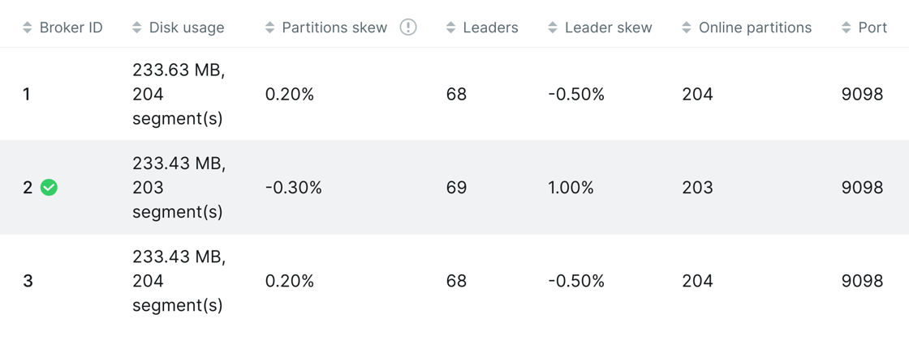
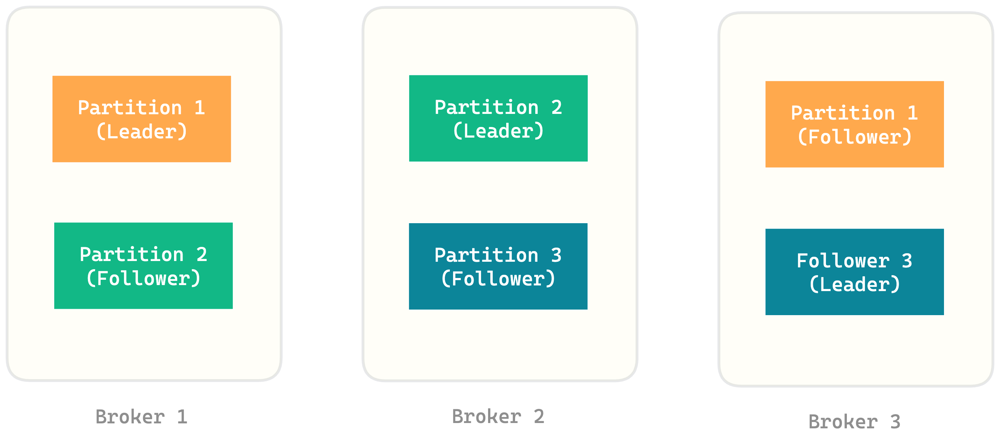
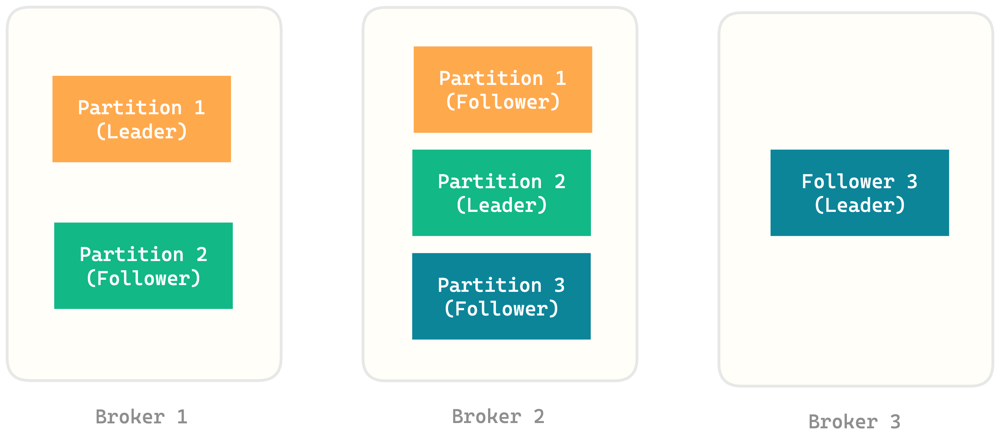
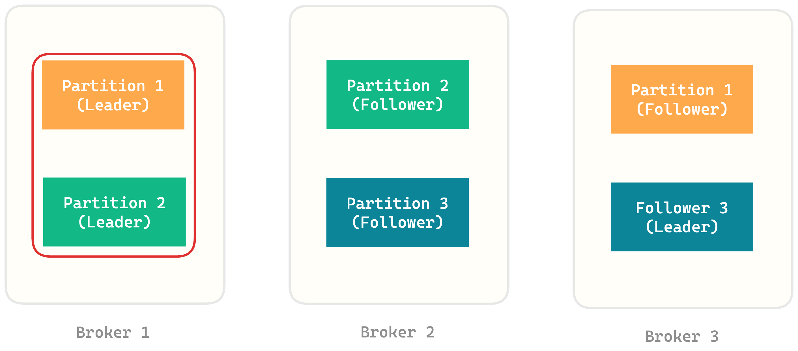

+++
author = "penguinit"
title = "Kafka Skew란 무엇인가?"
date = "2024-07-12"
description = "Kafka UI를 보다가 Leader, Partitions Skew를 보게되었는데 해당 값이 무엇을 의미하는지에 대해서 정리하려고 합니다."
tags = [
"kafka", "skew"
]
categories = [
"infra"
]
+++

## 개요
Kafka UI를 보다가 Leader, Partitions Skew를 보게되었는데 해당 값이 무엇을 의미하는지에 대해서 정리하려고 합니다.

## Skew란

Kafka 브로커 별로 파티션을 균등하게 나누어지는게 아니라 특정 브로커에 몰리는 현상을 Skew라고 합니다. 카프카에서 Skew는 크게 두가지로 나뉘어 지는데 브로커별로 파티션이 균등하게 나누어지지 않으면 `Partitions Skew` 라고하고 Leader 파티션이 브로커별로 균등하게 있지 않으면 `Leader Skew` 라고 합니다.

Skew가 발생하면 특정 브로커에 파티션이 몰리는 현상으로 인해서 균등하게 파티션이 있을 때 보다 처리량이 감소할 수 있습니다.

정상적인 파티션이라면 아래처럼 파티션들이 브로커별로 균등하게 분배가 되어있어야 합니다.

하지만 모종의 이유로 파티션이 특정 브로커에 몰릴 수 있습니다. 아래와 같은 형태로 파티션의 불균형이 생기면 그것을 `Partitions Skew`라고 합니다. 

하지만 `Leader Skew`는 정상이라고 볼 수 있습니다.

아래의 그림은 `Leader Skew`가 특정 브로커에 몰려 있습니다. 이 경우에는 `Partitions Skew`는 정상 범위에 있고 `Leader Skew`가 발생했다고 볼 수 있습니다.

## Skew를 해결하는 방법
이렇게 파티션이 불균형하게 배치가 되었을 때 kafka 차원에서 파티션 재할당(Partition Reassign)을 지원합니다. 카프카에서 기본적으로 제공하는 스크립트 중 `kafka-reassign-partitions.sh` 라는 스크립트를 실행하게 되면 Skew가 있는 파티션들을 재할당을 하게 됩니다.

## 정리
오늘 포스팅에서는 Kafka에서 Skew란 무엇을 의마히는지와 Skew가 발생했을 때 어떻게 해결하는지에 대해서 알아보았습니다. Skew가 발생하면 처리량이 감소할 수 있기 때문에 주기적으로 모니터링을 해서 Skew가 발생하지 않도록 관리하는 것이 중요합니다. 해당 내용이 도움이 되었으면 좋겠습니다.